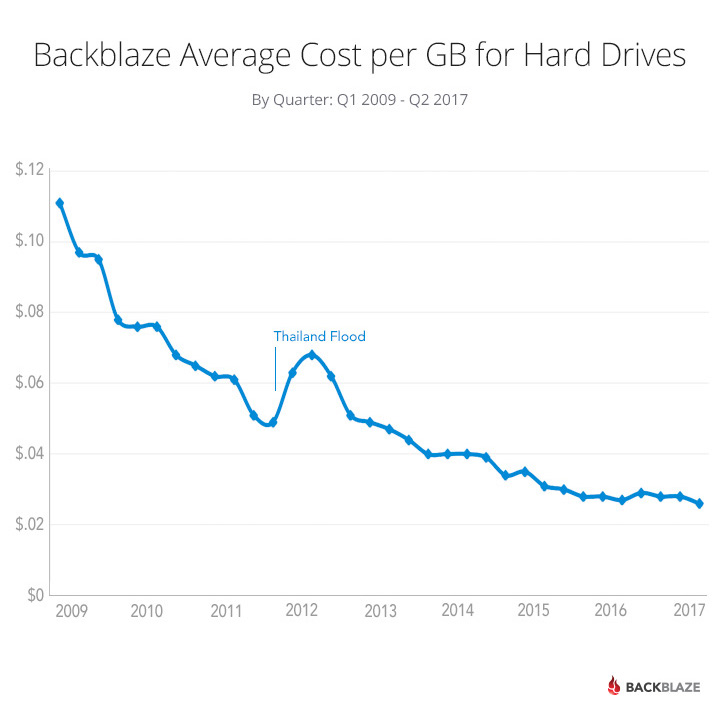
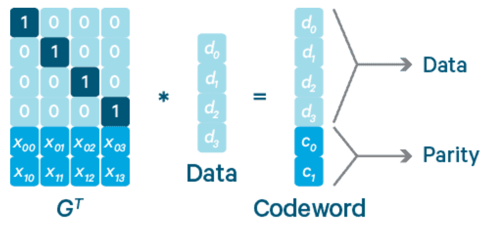

# Plan of Attack

* Week 10: Hadoop HDFS, Data Parallelism, MapReduce
* Week 11: Spark RDD, Spark Dataframe
* Week 12: Spark Scheduling, YARN

# Big Data

* It is a technology? 
   * Or a business problem?
* Core of the modern technology stack, because of business analytics, AI, cloud computing
* 3 Vs definition : (Volume, Velocity, Variety)
  * 2 more Vs 
    * V _ _ _ _ 
    * V _ _ _ _ _ _ _


# Hadoop Distributed File System

By the end of this lesson, you are able to

* Explain the file system model of HDFS
* Explain the architecture of HDFS
* Explain the replication placement strategy
* Explain the operation of HDFS client
* Explain the use of erasure coding

# History of Hadoop

* Created in 2005
* in Yahoo! to support Nutch seach feature
* Became the industry standard for Big Data System


# High level of Architecture of Hadoop


* MapReduce - Data Processing Layer
* Hadoop Distributed File System - Data Storage Layer
* YARN - Resource Management Layer


# Hadoop Distributed File System

* An open source implementation of the the Google File System
   * The Google file system, *Sanjay Ghemawat, Howard Bradley Gobioff  and Shun-Tak Leung*, ACM SIGOPS 2005

 
# Why a Distributed File System

* Challenges Google faced (then, in 2003)
    * Databases were expensive
    * They have a lot of non-table data (one of the V of Big Data)
	* 10s/PB
	* slow disk throughput 100-200MB/s

* But disks were cheap

{width=240}

# Why Google FS 

* Network File System has the following limitation
   * A file must reside on one and only one machine
   * No reliability guarantee
   * Not scalable!
   * 1 disk has 0.001 fail rate, what if we have 1000 disks in the NFS, which has no replica?
   * Network I/O will be  high


#  Why Google FS 

The list of features we want

1. Support many clients
1. Support many disks
1. Support many PBs
1. Fault tolerant
1. Read/write like normal files

No system can achieve all. Something must be let go.

#  Why Google FS 

The list of features we want

1. Support many clients
1. Support many disks
1. Support many PBs
1. Fault tolerant
1. **Read/write like normal files**

No system can achieve all. Something must be let go.


# How Google FS differs from normal files?

Normal file

* Read randomly
* Write/update randomly

Google FS

* Read sequentially
* Append only

Can you think of some applications operating like this?


# A quick summary

* Google FS is designed to simplify distributed file system by *throwing* away
random read and write
* HDFS is strongly influenced by Google FS


# HDFS File System Model

Most of the file systems adopt a model with a hierarchical name space,

```
|- A
|  |- B
|     |- mydoc.txt
|  |- B'
|  |- B''
|
|- A'
|- A''

```

# File System Model


e.g. `/A/B/mydoc.txt`

\begin{tikzpicture}[
  quad/.style={draw, rectangle split,rectangle split parts=4},
  file/.style={draw, rectangle split, rectangle split parts=1, fill={gray!50}}
  ]
  
  \node[quad,align=center] (Block0) at (0,0) {Block 0
  \nodepart{second}
  A
  \nodepart{third}
  A'
  \nodepart{fourth}
  A''
  };
  \node[quad] (Block1) at (2,0) { Block 1
  \nodepart{second}
  B
  \nodepart{third}
  B'
  \nodepart{fourth}
  B''
  };

  \node[quad] (Block2) at (4.5,0) { Block 2
  \nodepart{second}
  mydoc.txt
  \nodepart{third}
  mypic.jpg
  \nodepart{fourth}
  mymov.mov
  };

\node[file] (mydoc1) at (7,1) { file data };
\node[file] (mydoc2) at (7,0) { file data };
\node[file] (mydoc3) at (7,-1) { file data };


\draw[->] 
(Block0.second east) edge (Block1)
(Block1.second east) edge (Block2)
(Block2.second east) edge (mydoc1)
(Block2.second east) edge (mydoc2)
(Block2.second east) edge (mydoc3)
;

\end{tikzpicture}

 \ \ \ \ \ \ \ \ \  \ \ \ \ \ \ \ \ \ meta data  \ \ \ \ \ \ \ \ \ \ \ \ \ \ \ \ \ \ \ \ \ real data


# File System Model

A file consists of blocks of data

* Good design, simple abstraction
* A file might be larger than a physical disk
* We can distribute blocks belonging to a file into multiple disks/hosts (distributed)


# Block Size

* Normal file system 4KB
* RDBMS 4-32KB
* HDFS 64MB (configurable)


# HDFS Architecture

{width=100%}

* A Master-worker architecture
* Why not a peer to peer?


# HDFS Architecture

{width=100%}

* Block Size (default 64MB v1, 128MB v2+)
* Each block is replicated (Recommended 3 or any odd number > 3). But why?

# HDFS Architecture

{width=100%}
Given a file request, Namenode

1. file (full path name) -> block IDs
1.  block IDs -> actual data


# Replica Placement Strategy

* HDFS is a logical cluster
* Some physical location info will help, e.g. Rack
* Goals:
    * Maximize chance of survival
    * Maximize load balance


# Replica Placement Strategy

* Max 1 replica per datanode
* Max 2 replicas per rack
* Num of racks for replication < RF

# Replica Placement Strategy

{width=80%}

* Replica 1: rack 1 (first datanode contacted during write)
* Replica 2: different rack than rack 1, let's say rack 2
* Replica 3: rack 2, min
* Replica >=4: random


# HDFS client operation - Read


\begin{tikzpicture}[node distance=4cm, on grid, auto,
client/.style={draw, rectangle split, rectangle split parts=1,  fill={gray!50}},
namenode/.style={draw, rectangle split, rectangle split parts=1},
datanode/.style={draw, rectangle split, rectangle split parts=1}
]
\node[client] (client) {client};
\node[namenode] (namenode) [right=of client] {name node};
\node[datanode] (datanode2) [below=of namenode] {data node 2};
\node[datanode] (datanode1) [left=of datanode2] {data node 1};
\node[datanode] (datanode3) [right=of datanode2] {data node 3};

\path[->]
(client) edge[bend left] node{1.file path} (namenode)
(namenode) edge node{2.block locations} (client)
(datanode1) edge node{3. data} (client)
(datanode2) edge node{3. data} (client)
(datanode3) edge node{3. data} (client)
;

\end{tikzpicture}


# HDFS client operation - Write


\begin{tikzpicture}[node distance=4cm, on grid, auto,
client/.style={draw, rectangle split, rectangle split parts=1,  fill={gray!50}},
namenode/.style={draw, rectangle split, rectangle split parts=1},
datanode/.style={draw, rectangle split, rectangle split parts=1}
]
\node[client] (client) {client};
\node[namenode] (namenode) [right=of client] {name node};
\node[datanode] (datanode2) [below=of namenode] {data node 2};
\node[datanode] (datanode1) [left=of datanode2] {data node 1};
\node[datanode] (datanode3) [right=of datanode2] {data node 3};

\path[->]
(client) edge[bend left] node{1.create} (namenode)
(namenode) edge node{2.first block locs} (client)
(client) edge node{3. organizes pipeline; 4. send data} (datanode1)
(datanode1) edge node{3. 4.} (datanode2)
(datanode2) edge node{3. 4.} (datanode3)
(datanode3) edge[bend left] node{5. ack} (datanode2)
(datanode2) edge[bend left] node{5. ack} (datanode1)
(datanode1) edge[bend left] node{5. ack} (client)
;
\end{tikzpicture}

* If it is an append, the last block loc is returned.
* Repeat steps 2 - 5 if there are more blocks
* ~~Retry steps 3 - 5 if fail~~


# HDFS client operation - Write


\begin{tikzpicture}[node distance=4cm, on grid, auto,
client/.style={draw, rectangle split, rectangle split parts=1,  fill={gray!50}},
namenode/.style={draw, rectangle split, rectangle split parts=1},
datanode/.style={draw, rectangle split, rectangle split parts=1}
]
\node[client] (client) {client};
\node[namenode] (namenode) [right=of client] {name node};
\node[datanode] (datanode2) [below=of namenode] {data node 2};
\node[datanode] (datanode1) [left=of datanode2] {data node 1};
\node[datanode] (datanode3) [right=of datanode2] {data node 3};

\path[->]
(client) edge[bend left] node{1.create} (namenode)
(namenode) edge node{2.first block locs} (client)
(client) edge node{3. organizes pipeline; 4. send data} (datanode1)
(datanode1) edge node{3. 4.} (datanode2)
(datanode2) edge node{3. 4.} (datanode3)
(datanode3) edge[bend left] node{5. ack} (datanode2)
(datanode2) edge[bend left] node{5. ack} (datanode1)
(datanode1) edge[bend left] node{5. ack} (client)
;
\end{tikzpicture}

If some data node fails during the write of a data block (a) The written ones are retained;
(b) The namenode will be informed that the data block is under replication; (c)The pipeline will re-initialized for the next data block


# HDFS client operation - Write


\begin{tikzpicture}[node distance=4cm, on grid, auto,
client/.style={draw, rectangle split, rectangle split parts=1,  fill={gray!50}},
namenode/.style={draw, rectangle split, rectangle split parts=1},
datanode/.style={draw, rectangle split, rectangle split parts=1}
]
\node[client] (client) {client};
\node[namenode] (namenode) [right=of client] {name node};
\node[datanode] (datanode2) [below=of namenode] {data node 2};
\node[datanode] (datanode1) [left=of datanode2] {data node 1};
\node[datanode] (datanode3) [right=of datanode2] {data node 3};

\path[->]
(client) edge[above, bend left] node{6.close} (namenode)
(datanode1) edge node{7. check min replica} (namenode)
(datanode2) edge node{7. check min replica} (namenode)
(datanode3) edge[right] node{7. check min replica} (namenode)
(namenode) edge node{8.ack} (client)

;
\end{tikzpicture}


# HDFS Erasure Coding

One issue with the replication is that given Replication Factor = N,

* we have (N - 1)*100% storage overhead
* (1/N) storage efficiency
* N - 1 as fault tolerance. 

In Hadoop v3, besides replicas, we have another option - Erasure Coding.


# HDFS Erasure Coding

Recall that XOR operation $\bigoplus$ on bits

| IN | IN | XOR |
|---|---|---|
| 0 | 0 | 0 |
| 1 | 0 | 1 |
| 0 | 1 | 1 |
| 1 | 1 | 0 |
having some nice properties

$$ X \bigoplus Y = Y \bigoplus X $$
$$ (X \bigoplus Y) \bigoplus Z = X \bigoplus (Y \bigoplus Z) $$
$$ X \bigoplus Y = Z \Rightarrow X \bigoplus Z = Y $$

We can use the result of XOR to recover if one of the inputs is lost.

# HDFS Erasure Coding

What if we lose more than one input?

* Reed-Solomon EC

{width=100%}

$G^T$ is called a *Generator Matrix*.

# HDFS Erasure Coding - A Concreate example


$$
\begin{bmatrix}
1 & 0 & 0 & 0 \\
0 & 1 & 0 & 0 \\
0 & 0 & 1 & 0 \\ 
0 & 0 & 0 & 1 \\
0 & 1 & 1 & 0 \\
1 & 0 & 1 & 1 
\end{bmatrix} 
\times
\begin{bmatrix}
1 \\ 0 \\ 1 \\ 0
\end{bmatrix} 
= 
\begin{bmatrix}
1 \\ 0 \\ 1 \\ 0 \\ 1 \\ 2
\end{bmatrix} 
$$

\ \ \ \ \ \ \ \ \ \ \ \ \ \ \ \ \ \ \ \ \ \ \ \ \ \ \ \ \ \ \ $G^T$  \ \ \ \ \ \ \ \  Data \ \  Codeword


* A property of $G^T$: all $k \times k$ sub matrices must be non-singular (an
inverse exists), where $k$ is the size of the data.
* Note it is a bad idea to use binary data
here. However for demonstration purposes, we stick with binary data and
hand pick a sub-matrix that is non-singular

# HDFS Erasure Coding - A Concreate example

Let's say we lose the 2nd and 4th cells in the Codeword, and want to recover the data,
We remove the correspondent rows from the $G^T$, the following equation still holds
$$
\begin{bmatrix}
1 & 0 & 0 & 0 \\
0 & 0 & 1 & 0 \\ 
0 & 1 & 1 & 0 \\
1 & 0 & 1 & 1 
\end{bmatrix} 
\times
\begin{bmatrix}
1 \\ 0 \\ 1 \\ 0
\end{bmatrix} 
= 
\begin{bmatrix}
1 \\ 1 \\ 1 \\ 2
\end{bmatrix} 
$$

\ \ \ \ \ \ \ \ \ \ \ \ \ \ \ \ \ \ \ \ \ \ \ \ \ \ \ \ \ \ \ $G^T_{\neg{(1,3)}}$  \ \ \ \ \ \ \ \  Data \ \  Codeword


# HDFS Erasure Coding - A Concreate example

We find the inverse of $G^T_{\neg{(1,3)}}$ and multiply it to both sides
$$
\begin{bmatrix}
1 & 0 & 0 & 0 \\
0 & -1 & 1 & 0 \\
0 & 1 & 0 & 0 \\
-1 & -1 & 0 & 1 
\end{bmatrix}
\times
\begin{bmatrix}
1 & 0 & 0 & 0 \\
0 & 0 & 1 & 0 \\ 
0 & 1 & 1 & 0 \\
1 & 0 & 1 & 1 
\end{bmatrix} 
\times
\begin{bmatrix}
1 \\ 0 \\ 1 \\ 0
\end{bmatrix} 
= 
\begin{bmatrix}
1 & 0 & 0 & 0 \\
0 & -1 & 1 & 0 \\
0 & 1 & 0 & 0 \\
-1 & -1 & 0 & 1 
\end{bmatrix}
\times
\begin{bmatrix}
1 \\ 1 \\ 1 \\ 2
\end{bmatrix} 
$$

\ \ \ \ \ \ \ \ \ \ $G^{T^{-1}}_{\neg{(1,3)}}$ \ \ \ \ \ \ \ \ \ \ \ \ \ \ $G^T_{\neg{(1,3)}}$  \ \ \ \ \ \ \ \  Data \ \ \ \ \  $G^{T^{-1}}_{\neg{(1,3)}}$ \ \ Codeword


# HDFS Erasure Coding - A Concrete example

We cancel $G^{T^{-1}}_{\neg{(1,3)}} \times G^T_{\neg{(1,3)}}$ from the LHS
$$
\begin{bmatrix}
1 \\ 0 \\ 1 \\ 0
\end{bmatrix} 
= 
\begin{bmatrix}
1 & 0 & 0 & 0 \\
0 & -1 & 1 & 0 \\
0 & 1 & 0 & 0 \\
-1 & -1 & 0 & 1 
\end{bmatrix}
\times
\begin{bmatrix}
1 \\ 1 \\ 1 \\ 2
\end{bmatrix} 
$$
\ \ \ \ \ \ \ \ \ \ \ \ \ \ \ \ \ \ \ \ \ \ \ \  Data \ \ \ \ \  $G^{T^{-1}}_{\neg{(1,3)}}$ \ \ Codeword


# HDFS Erasure Coding 


* Note that $G^T$ is fixed for all data.
* For RS(k,m) we have m/k storage overhead and k / (k + m) storage
efficiency, where k is the data 
size and m is the parity size.
* Some popular choices of k and m for HDFS are (6,3) and (10,4)
    * RS(6,3) we have
        * 3 / 6 = 50% storage overhead
        * 6 / 9 = 66.6% storage efficiency
		* Fault tolerance (can afford losing 3 rows from the codeword out of 9).
	* RS(10,4) we have
	    * 4 / 10 = 40% storage overhead	
		* 10 / 14 = 71.4% storage efficiency
		* Fault tolerance (can afford losing 4 rows from the codeword out of 14).


# HDFS Erasure Coding references

* https://blog.cloudera.com/introduction-to-hdfs-erasure-coding-in-apache-hadoop/
* https://www.backblaze.com/blog/reed-solomon/

# Summary

* Google File System hugely influential
     * Scalable, fault-tolerant
    * Designed for specific workloads
* HDFS implements GFS
* HDFS de-facto distributed file system in the cloud
    * All cloud-based data analytics systems support reading from HDFS


# In class discussion 1 

1. Consider HDFS append operation, it doesn’t provide correctness! Give an example of how incorrect append could happen.
2. Why do you think it’s difficult to guarantee correctness for append?


# In class discussion 2 

In an hadoop setup, the erasure coding configuration is RS(12,6)

1. What is the storage overhead?
1. What is the storage efficiency?
1. What is the fault tolerance level?
1. What is the dimension of the Generator Matrix?

# In class discussion 3

Suppose you are engaged by a client to setup a HDFS for data
computation. Here is the user requirement

* Existing active data size 5TB
* Estimated year-over-year data growth rate 80%
* 50% buffer space for intermediate/temp data file
* HDFS replication factor 3

1. What is the projected disk space requirement for HDFS in 3 years time?
1. What is the projected disk space requirement for HDFS in 3 years
   time, if we replace RF=3 by RS(10,4)?
