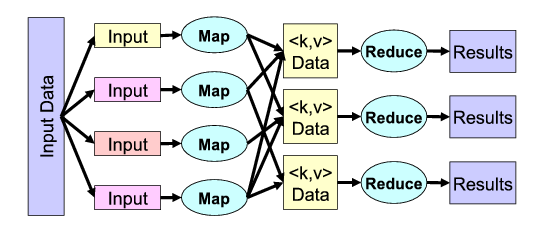
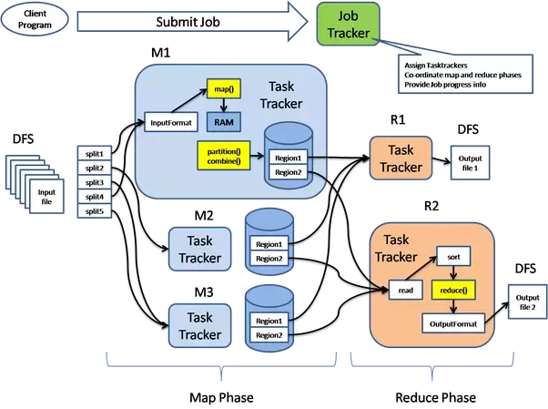

# MapReduce

By the end of this lesson, you are able to

* Differentiate Parallelism and Concurrency
* Differentiate Data Parallelism and Task Parallelism
* Explain map and reduce
* Explain Hadoop MapReduce


# Recall the Big data challenges

* Huge volume, high speed and different data format
* Moore's law is not equal
* HDFS is a distributed file system that supports sequential read and write by append


# Why not Data Query Language?

* It requires a robust and scalable indexing mechanism, 
  * Efficient B-tree Based Indexing for Cloud Data Processing, Sai Wu, Dawei Jiang, Beng Chin Ooi and  Kun-Lung Wu, VLDB 2010
* Back in 2003 in Google, the data stored in the  GFS were not meant for querying, 
rather for batch processing, i.e. you need to process them all, not returning just a subset
* Hence Google looked into how to parallelize these batch jobs.

# What is Parallelism?

A parallel program is one that uses a **multiplicity of computational hardware** 
(e.g., several processor cores or several server nodes) to
**perform a computation more quickly**.
The aim is to arrive at the answer earlier, by
delegating different parts of the computation to different processors
that execute at the same time.


# Parallelism vs Concurrency

* People often compare and confuse parallelism with concurrency.
* What is a concurrent program?
   * By contrast, concurrency is a **program-structuring technique** in which there are multiple threads of control. Conceptually, the threads of control execute "at the same time"; that is, the user sees **their effects interleaved**. Whether they actually execute at the same time or not is an implementation detail; a concurrent program can execute on a single processor through interleaved execution or  on multiple physical processors.


# Parallelism vs Concurrency


|   |  Parallelism | Concurrency |
|---|---|---|
|Area of Focus | Efficiency | Structural and Modularity |
|Number of Goals | One | One or more |
|Program Semantic | Deterministic | Non-deterministic |
| Single processor Exec | Sequential | Interleaving | 

# Examples of Parallelism

* A sodoku solver uses multiple CPU cores
* A parallelized database query that retrieves and aggregates records from a cluster of replica of database.
* A K-means analyses running over a Hadoop cluster


# Examples of Concurrency

* A web application that handles multiple clients HTTP requests  and interacting with the databases.
* A User Interface of the a mobile phone handles user's touch screen input    and exchanging data via the 4G network


# Hardware Parallelism


* Single processor, e.g. 
   * Bit-level parallelism, executing 32 bit operations in a 64 bit processor.
   * Instruction pipelining
* GPU, e.g. 
  * Matrix operations parallelisation, 
* Multiple processors in a single machine
  * Shared Memory
  * Distributed Memory
* Multiple hosts (machines)
  * A grid computing
  * P2P system


# Software Parallelism

* Task Parallelism (Dataflow parallelism)
* Data Parallelism 


# Task Parallelism

```python
def cook_beef_bolognese(beef,spaghetti):
  sauce = cook_sauce(beef) # task A
  pasta = cook_pasta(spaghetti) # task B
  return mix(sauce,pasta)
```


Note that task A and task B can be executed in parallel, e.g. 
`cook_sauce(beef)` is executed in Core 1, 
`cook_pasta(spaghetti)` is executed in Core 2.

Different sets of instructions are given to different processors.

# Data Parallelism

```python
def fib(n): ... 
def main():
    inputs = [ 10, 100, 200, ...]
    results = []
    for i in inputs: 
        results.append(fib(i))
    return results
```

# Data Parallelism

Recall the function `map` in Python 
```python
def map(f,l):
    if len(l) == 0:
	    return []
    else:
	    hd = l[0]
		tl = l[1:]
		return [f(hd)] + map(f,tl)
```

Note: since Python 3, the `map` is implemented in iterator style. However, we still use the above version for the ease of reasoning

# Data Parallelism

```python
def fib(n): ... 
def main():
   inputs = [ 10, 100, 200, ...]
   # task C 
   results = map(fib, inputs) 
   return results
```
For ease of reasoning, we assume `map` takes a higher order function
and a list as input and return a list. 
Silently we assume that the list is a parallel data structure. 
Each task C can be executed in parallel, e.g.
`fib(10)` is executed in Core 1,
`fib(100)` is executed in Core 2,
`fib(200)` is executed in Core 3, ...

Note: the same set of instructions is given to all processors.

# Data Parallelism

Let's have a demo. Instead of Python, we would use Scala. The idea of the demo is to show that by using higher order combinators like `map`, we can achieve data parallelism with little modification to the code.

```scala
object DataParMap {
  def fib(n:Int):Int = if (n < 2) {1} 
                       else {fib(n-1)+fib(n-2)}
  def main(args:Array[String]) = {
    val n = args(0).toInt
    val nums = (1 to n).toList
    // val fibs = nums.map(x => fib(x))  // sequential
	val fibs = nums.par.map(x => fib(x)) // parallel
    println(fibs)
  }
}
```
`par` method in Scala converts a list into a parallelled sequence.

Note: you don't need to understand Scala code to pass the exam.

# Data Parallelism

* Sequential 
```bash
$ time scala examples/DataParMap.scala 45
real	0m14.235s
user	0m11.858s
sys	0m0.059s

```
* Parallel

```bash
real	0m6.672s
user	0m12.771s
sys	0m0.052s
```

# Data Parallelism and Deterministic Semantics

Given a language $L$, we say $L$'s semantics are **deterministic** iff for any program $P$ written in $L$,
for all input $i_1$ and $i_2$ such that $i_1 \equiv i_2$ then $P(i_1) \equiv P(i_2)$.


When we have parallelism and concurrency, it is very tricky to ensure **deterministic**. 
Recalled what we learned in transaction.

For data parallelism with `map`, all we need is a side condition to ensure **deterministic** semantics. 


# Data Parallelism and Deterministic Semantics

Given that `f` is a *pure* function, (i.e. it
does not modify its external state when it is executed,)
it is guaranteed that `map(f,l)` can be parallelized by applying
`f` to every element in `l` in parallel. The results will be the same as it 
is executed sequentially.


# Data Parallelism with Aggregation


```python
def main():
    inputs = [10, 100, 200, 400]
	result = 0
	for i in inputs:
		result += i
	return result
```
# Data Parallelism with Aggregation

```python
def reduce(f,l,acc):
    if len(l) == 0: 
	    return acc
	else:
	    hd = l[0]
		tl = l[1:]
		return reduce(f, tl, f(acc,hd))

def reduce(f,l):
    return reduce(f,l[1:], l[0])
```

# Data Parallelism with Aggregation


```python
def main():
    inputs = [10, 100, 200, 400]
	result = reduce(lambda x,y:x+y,inputs,0)
	return result
```

Effectively this is evaluating

(0 + 10 + 100 + 200 + 400)

We could evaluate (0 + 10 + 100) in Core 1, (200 + 400) in Core 2.
Then (110 + 600) in Core 1. 

It looks good on paper, what about in practice? 

* In practice, it won't scale well with each map or reduce task being teeny tiny. 
* It is better to partition data into chunks so that each map or reduce task is reasonably large enough.

# Data Parallelism with Aggregation

Let's try par reduce in Scala
```scala
object DataParReduce
{
  def add(x:Int,y:Int) =
    // purposely make it expensive
    if (fib(x) > fib(y)) { x + y } else { x + y }

  def main(args:Array[String]) =
  {
    val n = args(0).toInt
    val nums = (1 to n).toList
    // val result = nums.par.reduce(add) 
    val result = nums.par.reduce(add)	
    println(result)
  }
}
```


# Data Parallelism with Aggregation

* Sequential
```bash
time scala examples/DataParReduce.scala 10
55

real	0m21.145s
user	0m21.980s
sys	0m0.176s

```

* Parallel
```bash
real	0m3.768s
user	0m4.360s
sys	0m0.192s
```


# Data Parallelism and Deterministic Semantics

Given that a binary function `f` is *pure*, *commutative* and *associative*
it is guaranteed that `reduce(f,l,a)` can be parallelized by partitioning
`l` into segments, aggregating each segment with `f`, and finally 
aggregating the intermediate result into the final result.
The results will be the same as it is executed sequentially.

A binary function `f` is commutative iff `f(x,y) = f(y,x)`.

A binary function `f` is associative iff `f(x,f(y,z)) = f(f(x,y),z)`.


# MapReduce is a general computation pattern


* Python
* Scala
* Excel, Let's do it in Excel!
* ...


# More Combinators

We define the following combinators using `map` and `reduce`, 

* `flatMap`
* `filter`
* `shuffle`
* `reduceByKey`


As a result, these combinators are also data-parallelizable.

# More Combinators

```python
def flatMap(f,l):
    ll = map(f,l)
    return reduce(lambda x,y:x+y, ll, [])
```
`flatMap` is similar to map, except that each inner list is flattened. e.g. 
`flatMap(lambda x: [x+1], [1,2,3])` yields `[2,3,4]`.


# More Combinators

```python
def lift_if(p,x):
    if p(x):
        return [x]
    else:
        return []

def filter(p,l):
    return flatMap(lambda x:lift_if(p,x), l)
```

`filter` returns a new list whose elements are from `l` and satisfying the test `p`. e.g.
`filter(lambda x:x%2==0, [1,2,3,4,5,6])` yields `[2,4,6]`.

It is obvious that `filter` is also parallelizable.


# More Combinators

```python
def merge(kvls1, kvls2):
    if len(kvls1) == 0: return kvls2
    elif len(kvls2) == 0: return kvls1
    else:
        ((k1,vl1), tl1) = (kvls1[0], kvls1[1:])
        ((k2,vl2), tl2) = (kvls2[0], kvls2[1:])
        if k1 == k2: return [(k1,vl1+vl2)]+merge(tl1,tl2)
        elif k1 < k2: return [(k1,vl1)]+merge(tl1,kvls2)
        else: return [(k2,vl2)]+merge(kvls1, tl2)

def shuffle(kvs):
    kvls = map(lambda kv: [(kv[0], [kv[1]])], kvs)
    return reduce(merge, kvls, [])
```

We assume that there exists a total order among keys. 
Given a list of key-value pairs, `shuffle` shuffles and merge values sharing the same key.
e.g. `shuffle([("k1",1),("k2",1), ("k1",2), ("k2",3)])` yields
`[('k1', [1, 2]), ('k2', [1, 3])]`


# More Combinators

```python
def reduceByKey(f, kvs, acc):
    s = shuffle(kvs)
    return map(lambda p: (p[0], reduce(f,p[1],acc)), s)

def reduceByKey(f, kvs):
    s = shuffle(kvs)
    return map(lambda p: (p[0], reduce(f,p[1])), s)
```

`reduceByKey` shuffles the list of key-value pairs, grouping them by keys, 
then applies the binary aggregation function `f` to values in 
each group. e.g. `reduceByKey(lambda x,y:x+y, [("k1",1),("k2",1), ("k1",2), ("k2",3)],0)` yields 
`[('k1', 3), ('k2', 4)]`


# More Combinators

Instead of parameterizing the element-wise aggregation function `f` for the values, 
`reduceByKey2`, a variant of `reduceByKey`, parameterizes the aggregation function for the each 
entry in the shuffled output, i.e. the key and the list of values associated with the key.

```python
def reduceByKey2(agg, kvs):
    return map(agg, shuffle(kvs))
```

e.g. `reduceByKey2(lambda kvs:(kvs[0], sum(kvs[1])), [("k1",1),("k2",1), ("k1",2), ("k2",3)])` yields 
`[('k1', 3), ('k2', 4)]`

What problems can you foresee in `reduceByKey2`?

# Toy MapReduce library

With `map`, `reduce` and the derivable combinators, we built a mini
toy MapReduce library.

We are going to use it as a reference implementation which helps us
understand other implementation of MapReduce better.

# MapReduce is a general computation pattern


* Python
* Scala
* Excel
* Hadoop
* Spark
* ML
* ...


# Hadoop MapReduce

Consists of

* Mapper 
   * corresponds to the higher order function `f` used in `map` in the
     Toy MapReduce library
   * takes files in HDFS as input
 	    * appends results to files in HDFS as output (for mapper only
        job)
		* appends results to files in local temp dir as output (for
          job with reducer)
   * each invocation of the mapper generates a key-value pair
* Reducer
   * corresponds to the higher order function `agg` used in `reduceByKey2` in
     the Toy MapReduce library
   * takes files in HDFS as input, appends results to files in HDFS as output
   * takes a key and a list of values grouped under the key, aggregates the values
   
Hadoop MapReduce treats data in HDFS as parallel data structure.   
   
# Hadoop MapReduce


{width=100%}


# Word Count Example

Let's consider counting the occurances of the words in a file / a set of files.
We start off looking at a non-parallel version

```python
infile = open(sys.argv[1], 'r')
dict = {}
for line in infile:
     words = line.strip().split()
     for word in words:
         if (dict.has_key(word)):
             dict[word] +=1
         else:
             dict[word] = 1
for word,count in dict.items():
    print("%s,%d\n" % (word,count))
```

# Word Count Example

We can rewrite it using `map` and `reduce`

```python
infile = open(sys.argv[1], 'r')
lines = []
for line in infile: lines.append(line.strip())

def f(text):
    wordand1s = []
    for word in text.split(): wordand1s.append((word,1))
    return wordand1s
	
def g(p):
    word,icounts = p
    return (word, sum(icounts))

w1s = flatMap(f,lines)

res = reduceByKey2(g, w1s)

for word,count in res: print("%s,%d" % (word,count))
```
	

# Hadoop MapReduce - an example

We consider using the Python API of Hadoop (a.k.a. pydoop)
```python
def mapper(key, text, writer): 
    for word in text.split():
        writer.emit(word, "1")

def reducer(word, icounts, writer):
    writer.emit(word, sum(map(int, icounts)))
```

compare `mapper` with `f` in the the previous slide, `reducer` with `g`.

We can think of `writer.emit` is similar to the regular `return` and `yield` in Python's iterator depending on the context.

```bash
$ pydoop script wordcount.py /input /output

```


# Hadoop MapReduce - an example

We consider using the Python API of Hadoop (a.k.a. pydoop)
```python
def mapper(key, text, writer): 
    for word in text.split():
        writer.emit(word, "1")

def reducer(word, icounts, writer):
    writer.emit(word, sum(map(int, icounts)))
```

Note that `mapper` also takes a key as input. Hadoop generalizes to all
data that potentially has a key for each entry. In case that the input
to the mapper is a plain text file, the key is the byte offset
w.r.t to the start of the text file.


# Hadoop MapReduce

{width=100%}


# Hadoop MapReduce - API


* JVM API
* Python API
* C++ API
* Streaming API


We will take a look the first two during the lab.


# Hadoop MapReduce Job Management


{width=75%}

In Hadoop v1, JobTracker for Coordination; TaskTracker for Execution.
For v2+ we will discuss that in the upcoming lesson.

# Hadoop MapReduce Job Submission

{width=100%}


# Hadoop MapReduce Job 

* Locality Principal - move compute to the data.
   * tasks are compiled and packaged (as JAR) and copied to each data node
* Input data are partitioned into splits. Data are fed to mappers by
splits.
    * 1 Split per mapper task.
    * Note: split != block
* Combiner is like a local mini-reduce, it reduces the immediate
  output coming straight from a map task. (Why does this work?)
* Intermediate results (from the mapper/the combiner) are written to local data storage before being shuffled.
    * Except for Map-only job, e.g. sqoop import.
* Shuffling is handled by the Hadoop MapReduce framework.

# Hadoop MapReduce Job

What about the number of reduce tasks?

* User configurable.
   * set by `-D mapred.reduce.tasks = 10` flag during job submission
   or
   * set by `job.setNumReduceTasks(int)` in the Java/python code.
   * Number of Reduce Tasks per job

* popular configuration,  `K * N * C` where `N` is the number of
nodes, `C` is the number of containers per node, `K` could be either 0.95 or 1.75.
   * When `K` = 0.95, all the reducers can launch immediately (parallel to the mappers) and start transferring map outputs as the map tasks finish.
   * When `K` = 1.75, the faster nodes will finish their first round
     of reducers and launch a second set of reducers, thereby doing a
     much better job of load balancing.
	 
# Summary

We have studied

* Parallelism 
   * Parallelism vs Concurrency
* Hardware Parallelism and Software Parallelism
* Task Parallelism and Data Parallism
* Map Reduce combinators language 
* Hadoop MapReduce


We will see MapReduce again in Spark


# Discussion 1

Besides ensuring the semantics are deterministic, what other advantages of
having pure computation in a distributed parallel computation like Hadoop?


# Discussion 2

How do you see `map` and `reduce` being implemented in a tree like database such MongoDB?


# Discussion 3

Assume the following about your MapReduce job:

* Input size: 1TB 
* Block size: 100MB
* Number of reduce tasks: 10,000
* Splits and blocks are perfectly aligned.

1. How many map tasks are there?
2. How many intermediate files are there?
