# Learning Outcomes

By the end of this lesson, you are able to

* Differentiate Hadoop MapReduce and Spark
* Apply Spark based on the application requirements
* Develop data engineering process using Spark RDD
* Reason about Spark Execution Model
* Develop machine learning application using Spark MLLib


# What problems Hadoop MapReduce had solved?

Back in the late 1990s and early 2000s, some killer apps appear

* Web search index
* Sentiment analysis, analyzing what people said on forums, social
media
* Processing crawled data
* ...

We need to access nearly 100% of the data that we have


# What makes Hadoop MapReduce not good enough?

New killer apps appear, 

* Machine Learning and applications that require iterating the big data over and over
    * SGD
    * KMeans
    * ...

* Big Data Visualization and applications that are interactive with
big data
   * The tag cloud of tweets in 2001 to 2010
   * Election statistics
   
# Problems with Hadoop MapReduce

* A rigid computing model, writing map-reduce job is ok. But
  * what if we need to chain-up 20 MapReduce jobs.
  * or we need to compute a data flow with a DAG graph like job

Single MR job         | DAG job
:-------------------------:|:-------------------------:
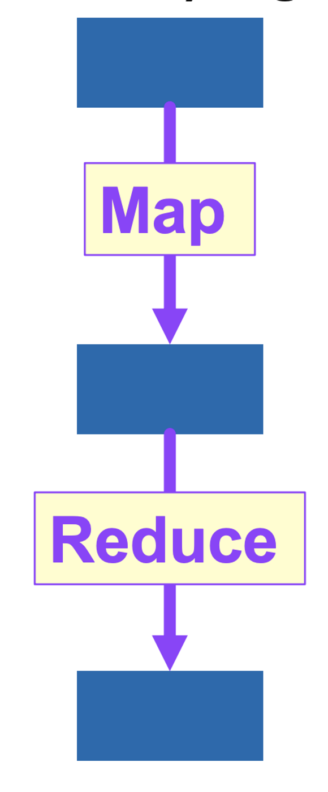{width=15%}  |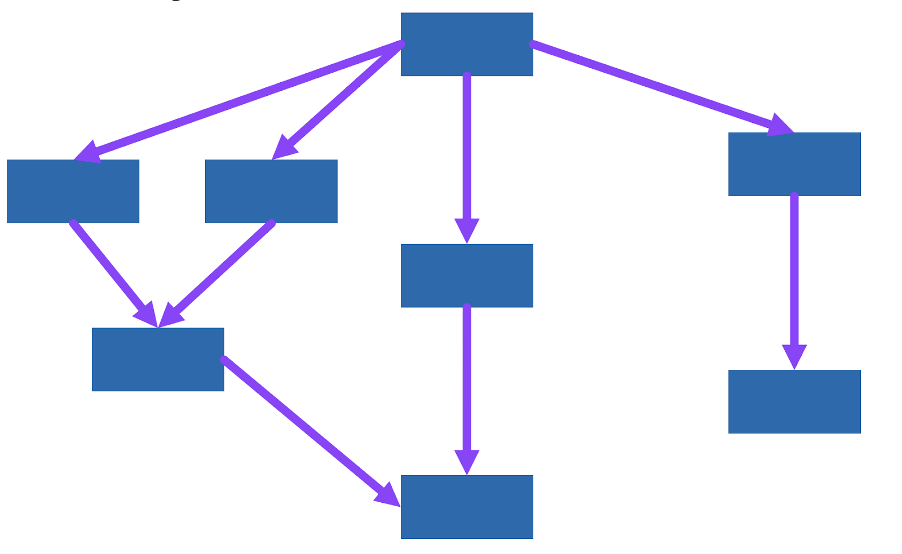{width=60%}

* There exist projects try to abstract Hadoop MR
    * Cascading
	```url
	https://www.cascading.org/projects/hadoop/
	```


# Problems with Hadoop MapReduce

* Relying on HDFS as a first level parallelized data storage
    * Many applications become IO bound
    * Not interactive
	* Iterative applications are not optimized as data gets written back
    to and read up from disks

# Problems with Hadoop MapReduce

* Not utilizing RAM
   * despite RAM is getting cheaper and cheaper, in fact. the bits per
     dollar nearly double every one year and a half.

{width=70%}


# Problems with Hadoop MapReduce

* Hadoop MapReduce is a subset of the MapReduce mini library
    * the Hadoop reducers are run under `reduceByKey2` instead of
      `reduceByKey`. A Reducer task is not parallelized internally.
    * further parallelization opportunities are lost
	* unbalanced / asymmetric reduce tasks.

# Spark

* It started of as an academic research project from UC Berkeley

**Resilient distributed datasets: a fault-tolerant abstraction for
in-memory cluster computing**
*Matei Zaharia,  Mosharaf  Chowdhury, Tathagata  Das, Ankur  Dave, 
Justin  Ma, Murphy  McCauley, Michael Jay Franklin, Scott J. Shenker, 
I. Stoica*, NSDI '12

* Now a multi-billions company, you can google who are the founders.
{width=30%}

# Spark core features

* Resilient distributed datasets (RDD)
* In memory parallel distributed data structure
     * It tries to fit dataset in RAM, if not fitting, spill over to disk
* MapReduce like programming interface (closer to our toy MapReduce
  library compared to the Hadoop MapReduce)
* Fault tolerance
     * datasets can always be re-computed in case of node failure   
* Dataframe and Dataset for high level abstraction
* Machine Learning Libraries, Graph computation libraries

# Spark programming interfaces

* Native interface to Scala
* Programming interfaces to Python, R, Java, SQL
    * with some constant overhead per job

# Spark RDD

* It is like a list/parallel sequence being distributed across
the cluster

* It inherits most of the API from the list/parallel sequence
counter-parts, (almost all!)

* RDDs are partitioned

{width=80%}


# Spark RDD

To create a Spark RDD,

* Convert a local data (mostly for debugging / testing, don't do this
for production)
```python
data = [1, 2, 3, 4, 5]
distData = sc.parallelize(data)
```
what is `sc`?


# Spark Context

What is a Spark context?

\ \ \  "Main entry point for Spark functionality. A SparkContext represents the connection to a Spark cluster, and can be used to create RDDs, accumulators and broadcast variables on that cluster." 


In Spark v1, there are Spark Context, Hive Context, SQL Context...

\ \ \ \ \ \ \ \ \ \ \ \ \ \ \ \ {width=40%}

# Spark Session - One session to rule them all!

From Spark v2 onwards, a Spark session unifies all the different contexts. The contexts can be derived from 
a session object.

{width=80%}


# Spark Session - One session to rule them all!


```python
from pyspark.sql import SparkSession

sparkSession = SparkSession.builder.getOrCreate()

sc = sparkSession.SparkContext
sqlc = sparkSession.SQLContext
hc = sparkSession.HiveContext
```


# Spark RDD

* Load from a file system, e.g. HDFS
```python
distData = sc.textFile("hdfs://127.0.0.1:9000/data.txt")
```

# Spark RDD

Two kinds of APIs

1. Transformations
2. Actions

Transformations are *lazy*, actions are *strict*.

What do you mean by lazy and strict?

# Lazy Evaluation


Lazy evaluation is one of the evaluation strategies, besides
call-by-value, call-by-reference. 
Let's pretend Python 3.10 support lazy evaluation.

```python
def filter(p, l):
    match l:
        case []: return []
        case [hd, *tl] if (p(hd)): return [hd] + filter(p,tl)
        case [hd, *tl]: return filter(p,tl) 

def takeOne(l):
    match l:
        case []: return error(" ... ")
        case [hd, *tl]: return hd 

l = filter(lambda x:x % 2 == 0, range(1,100))
fst = takeOne(l) # l is not computed here.
```

Note: you are not required to use Python 3.10 to pass the exam

# Lazy Evaluation

When `takeOne(l)` is called, the run-time reduces it with

```python
match (filter(lambda x: x % 2 == 0, range(1,100))):
   case []: error(" ... ")
   case [hd, *tl] : return hd 

```
then, since `1 % 2 != 0`

```python
match (filter(lambda x: x % 2 == 0, range(2,100))):
   case []: error(" ... ")
   case [hd, *tl] : return hd 
```

then
```python
match ([2] +  filter(lambda x: x % 2 == 0, range(3, 100))):
   case []: error(" ... ")
   case [hd, *tl]: return hd 
```

# Lazy Evaluation

Continued from last slide

```python
match ([2] +  filter(lambda x: x % 2 == 0, range(3, 100))):
   case []: error(" ... ")
   case [hd, *tl]: return hd 
```
Finally `2` is returned. Note that `filter(lambda x: x % 2 == 0, range(3, 100))`
will not be computed. 


# RDD Transformations

All Transformations take the current RDD as (part of) the input and
return some a new RDD as output.

Let `l` be a RDD / a distributed list, `f` be a function

|  RDDs  |  Desc | Toy MR |
|---|---|---|
| l.map(f) | | map(f,l) |
| l.flatMap(f) | | flatMap(f,l) |
| l.filter(f) | | filter(f,l) |
| l.reduceByKey(f) | | reduceByKey(f,l) |
| l.mapPartition(f) | similar to map | NA |
| | f has type iterator to iterator | |


Note it follows the builtin Scala library's convention, `map`,
`filter` and etc are methods of the List class


# RDD Transformations

All Transformations take the current RDD as (part of) the input and
return some a new RDD as output.

Let `l` be a RDD / a distributed list, 

|  RDDs  |  Desc | Toy MR |
|---|---|---|
| l.distinct() | all distinct elems | NA|
| l.sample(b,ratio,seed) | sample dataset | NA   |
|   | b: w/wo replacement |  |
|   | ratio: [0,1] |  |
| l.aggregateByKey(zv) | zv: acc. value | similar to  |
|    (sop,cop)          | sop: intra-part'n agg func  | reduceByKey(f,l,acc) |
|                            | cop: inter-part'n agg func | |

# RDD Transformations

All Transformations take the current RDD as (part of) the input and
return some a new RDD as output.

Let `l1` and `l2` be RDDs,

|  RDDs  | Desc |  Toy MR |
|---|---|---|
| l1.union(l2) | union l1 l2 | l1 + l2 |
| l1.intersection(l2) | the intersection of elements | NA |
|  |  from l1 and l2 |  |


# RDD Transformations

All Transformations takes the current RDD as (part of) the input and
return some a new RDD as output.

Let `l1` and `l2` be RDDs / distributed lists of key-value pairs,

|  RDDs  | Desc |  Toy MR |
|---|---|---|
| l1.groupByKey() | group elemnts by keys | shuffle(l1) |
| l1.sortByKey() | sort by keys | NA |
| l1.join(l2) |  join l1 l2 by keys |  we've done it in lab | 
| l1.cogroup(l2) | similar to join, it |  NA |
|  | returns RDDs of | |
|  |(key, ([v1,..], [v2,..])) | |
|  | [v1,...] are values from l1, | |
|  | [v2,...] are values from l2 | |


# RDD Actions

All Actions take the current RDD as (part of) the input and
return some value that is not an RDD. It forces computation to happen.


|  RDDs  | Desc | Toy MR |
|---|---|---|
| l.reduce(f) | | reduce(f,l) |
| l.collect() | converts rdd to
| | a local array |
| l.count() |  | len(l) |
| l.first()  |  |  l[0] |
| l.take(n) | returns an array | l[:n] |

* Common mistakes, don't do this

```python
def foo(rdd):
   d = rdd.collect()
   result = ... # do something with d
   return sc.parallelize(result)
```

# RDD Actions

All Actions take the current RDD as (part of) the input and
return some value that is not an RDD. It forces computation to happen.


|  RDDs  | Desc | Toy MR |
|---|---|---|
| l.saveAsTextFile(path) | save rdd to text file | NA  |
| l.countByKey() | return hash map of key and count | NA  |
| l.foreach(f) | run a function for | for x in l: ... |
|  | each elements in | |
|  | the dataset | |
|  | with side-effects | |

# RDD shuffle operations

Some transformation/operations will trigger a shuffle event, in which
Spark redistribute the data across partition.

* reduceByKey
* join
* groupByKey
* sortByKey

It is potentially expensive as it incurs extra I/Os, and extra heap
consumption and temp files.

We will discuss this shortly!

# An example - word count in Toy MR

```python
infile = open(sys.argv[1], 'r')
lines = []
for line in infile: lines.append(line.strip())

ws = flatMap(lambda line:line.split(" "),lines)
w1s = map(lambda w:(w,1), ws)
res = reduceByKey(lambda x,y:x+y,w1s,0)

with open(sys.argv[2], 'w') as out:
    for w,c in res:
        out.write(w + "\t" + str(c) + "\n")
```

# An example - word count in Spark

```python
import sys
from pyspark import SparkContext, SparkConf
conf = SparkConf().setAppName("Wordcount Application")
sc = SparkContext(conf=conf)

text_file = sc.textFile("hdfs://localhost:9000/input/")
counts = text_file.flatMap(lambda line: line.split(" ")) \
             .map(lambda word: (word, 1)) \
             .reduceByKey(lambda a, b: a + b)
counts.saveAsTextFile("hdfs://localhost:9000/output/")
sc.stop()
```


# An example - address extraction

\scriptsize
```python
import sys,re
from pyspark import SparkContext, SparkConf
pat = re.compile("^(.*) ([A-Za-z]{2}) ([0-9]{5})(-[0-9]{4})?$")

def is_addr(line):
    return not(pat.match(line.strip()) is None)

def get_zip(addr):
    return re.search("([0-9]{5})(-[0-9]{4})?",addr).group(1)

def get_state(addr):
    return re.search("([A-Za-z]{2})",addr).group(1)

conf = SparkConf().setAppName("ETL (Extract) Example")
hdfs_nn = "127.0.0.1"
input = sc.textFile("hdfs://%s:9000/data/extract/" % hdfs_nn)
addrs = input.filter(is_addr)
addrs.persist() # cache the intermediate results
zipcodes= addrs.map(get_zip).distinct()
states = addrs.map(get_state).distinct()
zipcodes.saveAsTextFile("hdfs://%s:9000/output/zipcodes" % hdfs_nn)
states.saveAsTextFile("hdfs://%s:9000/output/states" % hdfs_nn)
```

# Spark Execution Model


# Spark Execution Model

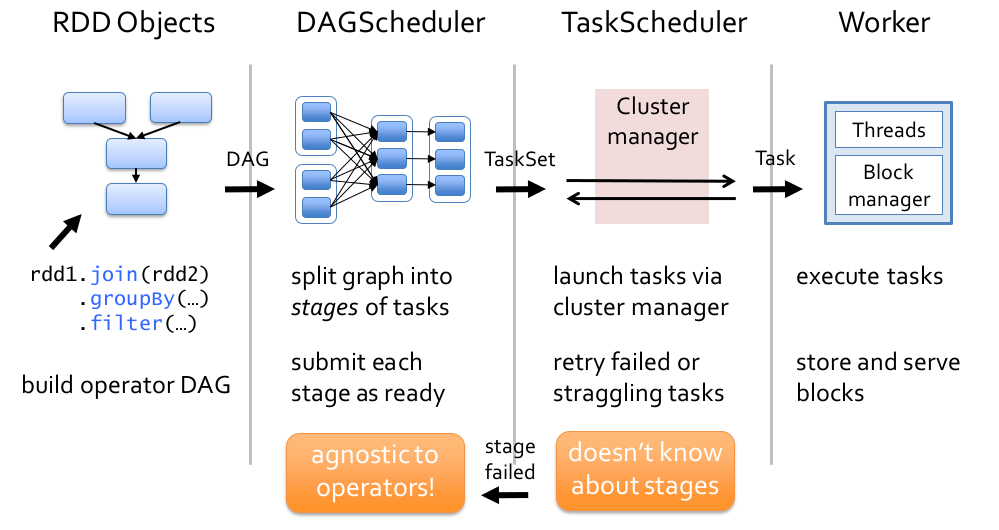

* How DAG is split into tasks?
    * It is based on the dependencies

# Spark Execution Model

The easy case

```python
r1 = sc.textFile("...")
r2 = r1.map(f) 
```

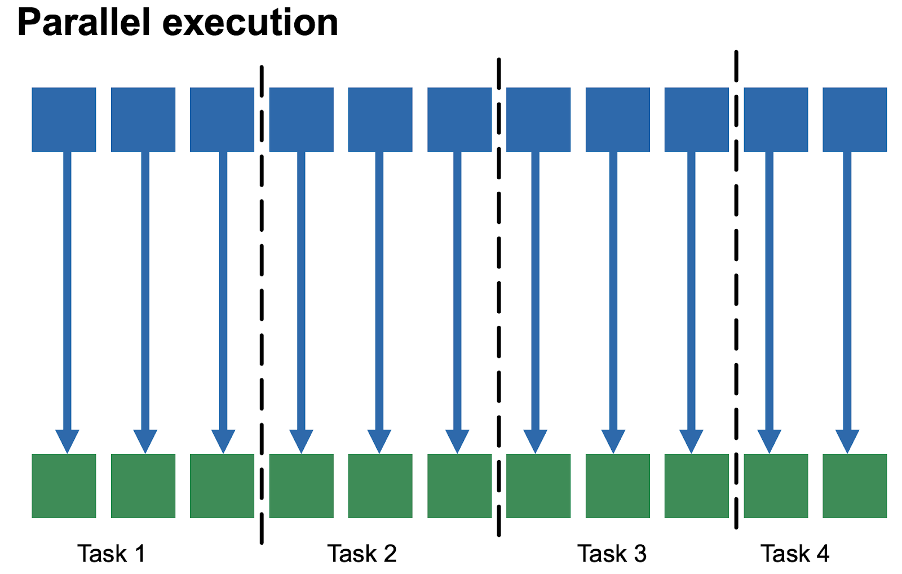{width=80%}

# Spark Execution Model

The easy case

```python
r1 = sc.textFile("...")
r2 = r1.map(f) 
```

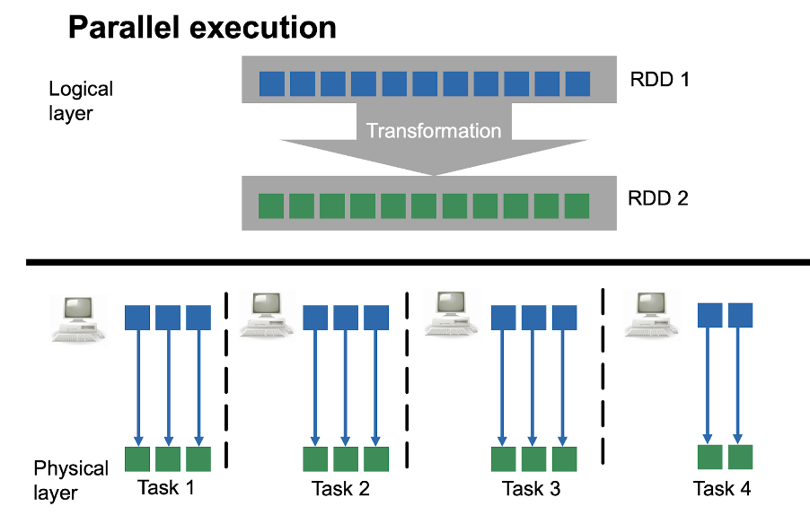{width=80%}

TaskScheduler allocate them to the workers.

# Spark Execution Model

The difficult case

```python
r1 =sc.textFile("...")
r2 = r1.map(f)
r3 = sc.textFile("...")
r4 = r3.map(g)
r5 = r2.join(r4)
r6 = r5.groupByKey()
r7 = r6.map(h)
r8 = r7.reduce(i)
```

# Dependencies

{width=80%}

* Narrow dependencies - Input partition used by at most 1 output
partition

* Wide dependencies - Input partition used by more than one output partitions

# Scheduler

Given a program, Spark infers the dependencies

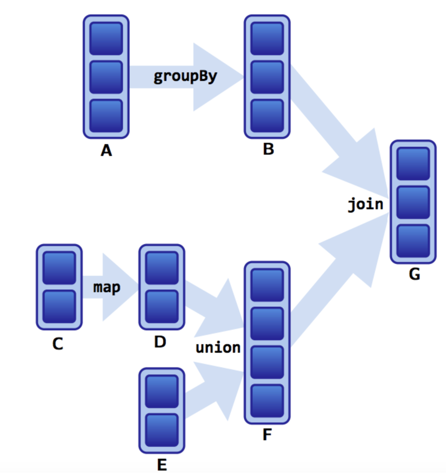{width=45%}$\Rightarrow$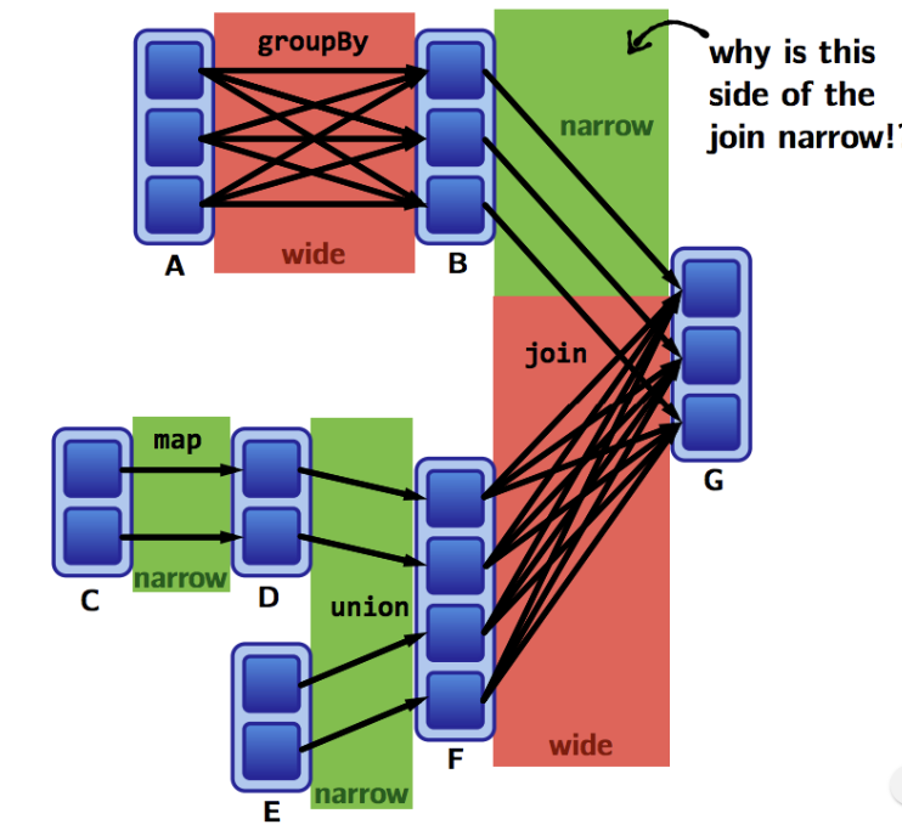{width=45%}


# Scheduler

```python
A = sc.parallelize([("apple",25), ("orange", 3),  # pa1
	               ("apple", 5), ("orange",10),   # pa2 
                   ("banana", 3), ("banana",20)]) # pa3

B = A.groupByKey()
#  [("apple", [25, 5]), #pb1
#   ("banana", [3,20]), #pb2
#   ("orange", [3,10])] #pb3
```

# Scheduler

```python
C = sc.parallelize([("durian",20), # pc1
               ("pineapple", 10)]) # pc2

D = C.map(lambda f:(f[0],f[1]*2))
#  [("durian",40),      # pd1
#   ("pineapple", 20)] # pd2

E = sc.parallelize([("apple", 30), # pe1
                   ("orange",10)]) # pe2

F = D.union(E)
#  [("durian",40),     # pf1
#   ("pineapple", 20), # pf2
#   ("apple", 30),     # pf3
#   ("orange",10)]     # pf4

G = B.join(F)
```


# Scheduler

* A stage - a set of computation requires no network I/Os
* We group operations into stages based on the the dependencies
    * Narrow dependencies should be in one stage
    * What about Wide dependencies?

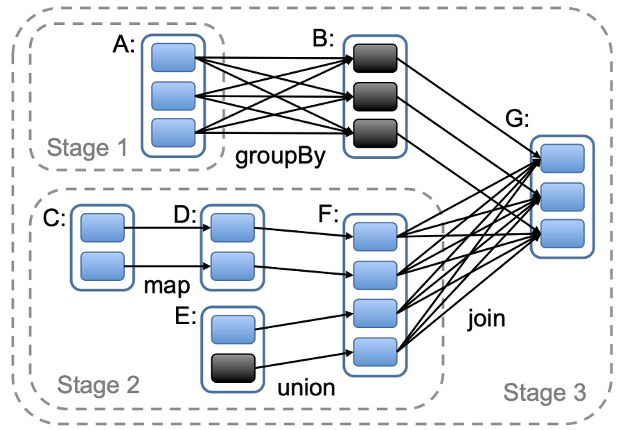{width=80%}

# Scheduler

* For Wide dependencies, a new stage is required

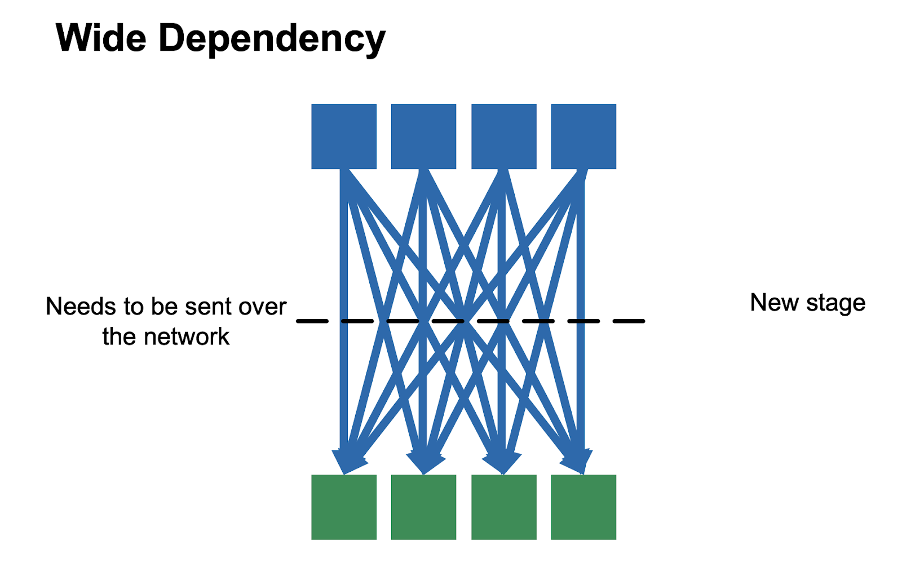{width=80%}

# Scheduler

* A job is a DAG of stages

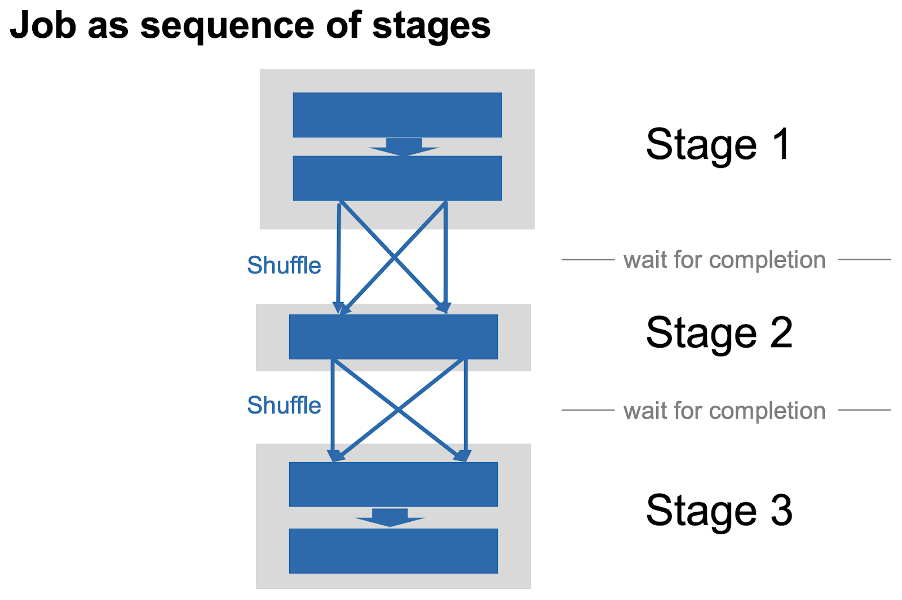{width=80%}


# Scheduler

* A job is a DAG of stages

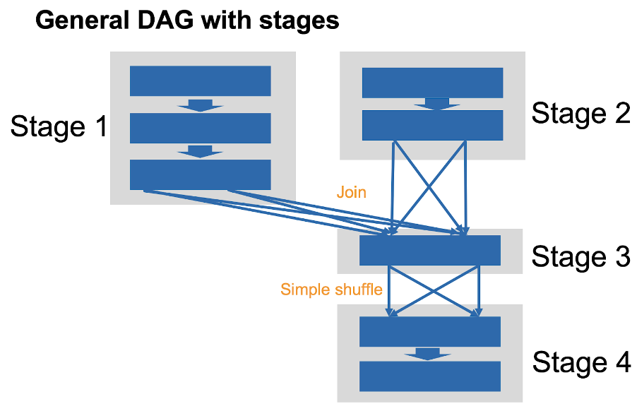{width=80%}

# Performance Tuning

* Re-partition to minimize shuffling

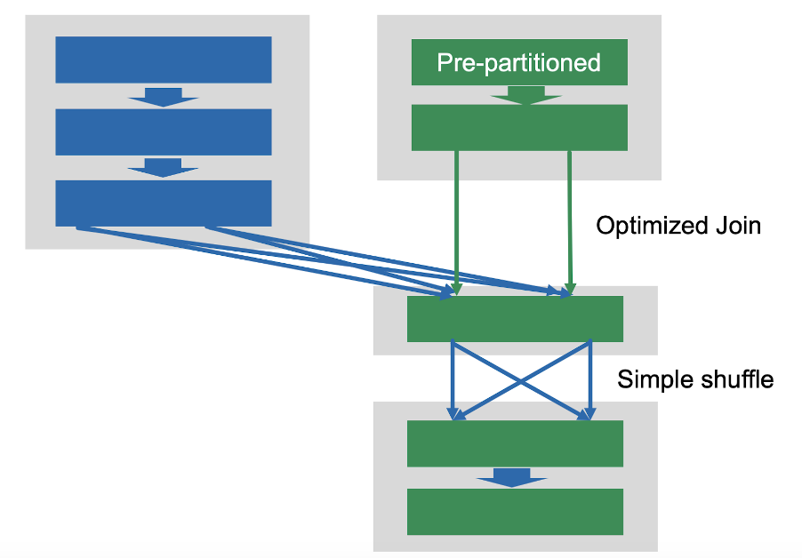{width=80%}

# Performance Tuning

* Cache the common input partition
  * `rdd.persist()` Cache using both memory and disk
  * `rdd.cache()` A variant that uses only memory

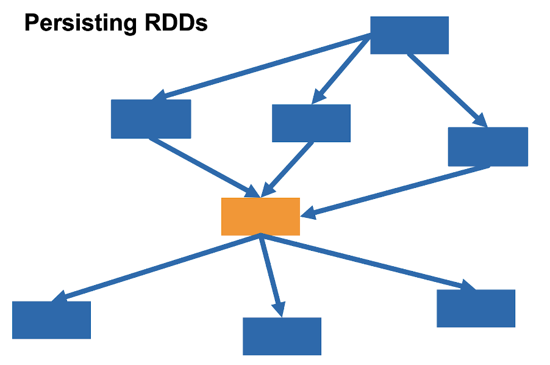{width=80%}

# Performance Tuning

* Reduce the number of data to be shuffled

```python
words = sc.textFile(...).map(lambda l:l.strip().split())
word_ones = words.map(lambda w:(w, 1))

wordCountsWithReduce = wordPairsRDD
     .reduceByKey(lambda x,y:x+y).collect()

wordCountsWithGroup = wordPairsRDD
    .groupByKey().map(lambda t:(t[0], sum(t[1])))
    .collect()
```

# Performance Tuning

* Reduce the number of data to be shuffled

{width=50%} {width=50%} 


# Performance Tuning

* Reduce the number of data to be shuffled

```python
# input: CSV with columns pid, sid, price
total_price = rdd.map(lambda t: (t[1], t[2])) \
                 .reduceByKey(lambda x,y: x + y)
num_items = rdd.map(lambda t: (t[1], t[2])) \
               .reduceByKey(lambda x,y: 1 + y, 0)
total_price.join(num_items).map(lambda t:(t[0], t[1] / t[2]))
```
vs
```python
rdd.map(lambda t: (t[1], t[2])).groupByKey() \
   .map(lambda t: (t[0], sum(t[1]) / len(t[1])))
```


# Failure recovery

* Spark keeps track of a lineage - operation history of each partition.

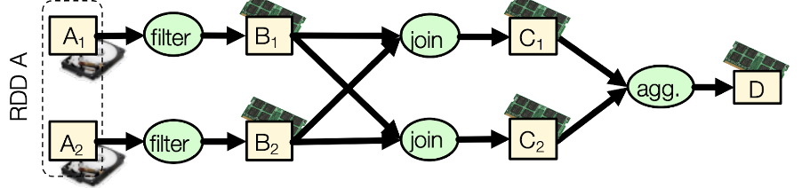


```text
D:    C1, C2, agg
C1:   B1, B2, join
C2:   B1, B2, join
B1:   A1, filter
B2:   A2, filter
```

# Failure recovery

* If C1 fails (due to hw failure) before the aggregation
   * Lineage has information for rebuilding C1 by joining B1 and B2
   * Pure computation ftw!

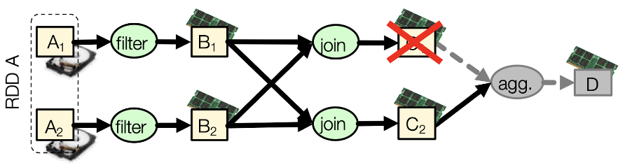

```text
D:    C1, C2, agg
C1:   B1, B2, join
C2:   B1, B2, join
B1:   A1, filter
B2:   A2, filter
```

# Spark SQL

It's a MapReduce-SQL correspondence.

Assuming `input.csv` has two columns, `dept` and `age`
```python
data = sc.textFile('input.csv')
rdd1 = data.map(lambda x: x.split(','))
rdd2 = rdd1.map(lambda x: (x[0], (x[1],1)))
rdd3 = rdd2
    .reduceByKey(lambda x,y: (x[0]+y[0], x[1]+y[1]))
res = rdd3.map(lambda x: (x[0], x[1][0]/x[1][1]))
```
same as
```sql
select dept, avg(age) from input
group by dept;
```


# Summary

* Spark is faster than Hadoop MapReduce, because
   * utilizing of RAM
   * lazy and memorization
   * more expressive map-reduce framework
* Spark is suitable for
   * Iterative and interactive data processing tasks    
* Spark job scheduling

#  Reference for API

```url
https://spark.apache.org/docs/latest/rdd-programming-guide.html
```
