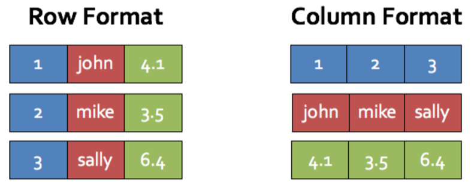
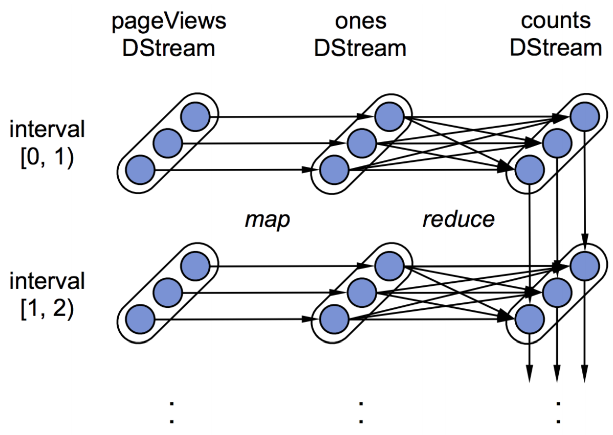

# Learning Outcomes

By the end of this lesson, you are able to

* Explain Spark Architecture
* Develop Data processing application using Spark Dataframe
* Develop Machine Learning application using Spark ML package
* Explain Spark Streaming

# Spark Architecture

{width=100%}

Looks familiar?

# Spark Architecture

Recall
{width=100%}


# Spark Dataframe

* Inspired by Panda's dataframe
* Built mainly for structured data
   * A main pipeline in Machine Learning, 
   * Unstructured data -> structured data -> models
* Schema + RDD
* Internally Columar Storage
{width=50%}


# Spark Dataframe and RDD

```python
df = rdd.toDF("colname1", "colname2")
df = sc.createDataFrame(rdd, schema)

rdd = df.rdd
```

# Spark Dataframe schema inference

Given
```csv
foo,bar
1,true
2,false
3,true
4,false
```
```python
df = sparkSession.read\
     .option("header", "true")\
	 .option("inferSchema", "true")\
	 .csv("hdfs://127.0.0.1:9000/foo.csv")
df.printSchema()
```
shows
```text
root
 |-- foo: integer (nullable = true)
 |-- bar: boolean (nullable = true)
```


# Spark Dataframe schema inference
Given
```json
{ "foo":1, "bar":true }
{ "foo":2, "bar":false }
{ "foo":3, "bar":true }
{ "foo":4, "bar":false }
```

```python
df2 = sparkSession.read\
      .option("inferSchema", "true")\
	  .json("hdfs://127.0.0.1:9000/foo.json")
df2.printSchema()
```
shows
```text
root
 |-- bar: boolean (nullable = true)
 |-- foo: long (nullable = true)
```


# Spark Dataframe schema inference
Given
```json
{ "foo":1, "bar":true }
{ "foo":2, "bar":false }
{ "foo":[3,4], "bar":true }
{ "foo":4, "bar":false }
```

```python
df3 = sparkSession.read\
      .option("inferSchema", "true")\
	  .json("hdfs://127.0.0.1:9000/foo2.json")
df3.printSchema()
```
shows
```text
root
 |-- bar: boolean (nullable = true)
 |-- foo: string (nullable = true)
```
`foo`'s type changes from `long` to `string`? hm....


# Spark Dataframe schema inference
```python
df3 = sparkSession.read\
      .option("inferSchema", "true")\
	  .json("hdfs://127.0.0.1:9000/foo2.json")
df3.show()
```
shows
```text
+-----+-----+
|  bar|  foo|
+-----+-----+
| true|    1|
|false|    2|
| true|[3,4]|
|false|    4|
+-----+-----+
```
Best effort only!


# Spark Dataframe API

* Column Projection
* Column Conversion
* Row Filtering
* Grouping and Aggregation
* Joining


# Spark Dataframe API

```python
data = [("100001", "Ace", "50043", 90), \
        ("100002", "Brandon", "50043", 95), \
        ("100003", "Cheryl", "50043", 80)]
distData = sc.parallelize(data)
df = distData.toDF(["studentid", "name", \
                 "module", "score"])
df.show(5)
```

```text
+---------+-------+------+-----+
|studentid|   name|module|score|
+---------+-------+------+-----+
|   100001|    Ace| 50043|   90|
|   100002|Brandon| 50043|   95|
|   100003| Cheryl| 50043|   80|
+---------+-------+------+-----+
```

# Spark Dataframe Column Projection

```python
df.select(df["studentid"], df["score"]).show() # or

from pyspark.sql.functions import col
df.select(col("studentid"), col("score")).show() 

```

```text
+---------+-----+
|studentid|score|
+---------+-----+
|   100001|   90|
|   100002|   95|
|   100003|   80|
+---------+-----+
```

# Spark Dataframe Column Proj w/ function

```python
from pyspark.sql.functions import concat, lit
df.select(concat(df["studentid"]\
         ,lit("@mymail.sutd.edu.sg"))\
   .alias("email")).show()
```

```text
+--------------------+
|               email|
+--------------------+
|100001@mymail.sut...|
|100002@mymail.sut...|
|100003@mymail.sut...|
+--------------------+
```

To see the full list of builtin funtcions.

* Python `pyspark.sql.functions`

```url
https://spark.apache.org/docs/3.0.1/api/python/pyspark.sql.html
```

# Spark Dataframe Column Modification and Creation

```python
df.withColumn("email",concat(col("studentid"),\
   lit("@mymail.sutd.edu.sg")))\
   .show()
```
```text
+---------+-------+------+-----+--------------------+
|studentid|   name|module|score|               email|
+---------+-------+------+-----+--------------------+
|   100001|    Ace| 50043|   90|100001@mymail.sut...|
|   100002|Brandon| 50043|   95|100002@mymail.sut...|
|   100003| Cheryl| 50043|   80|100003@mymail.sut...|
+---------+-------+------+-----+--------------------+
```

What happen when the newly created column's name clashes with an existing one?

# Spark Dataframe - Row filtering


```python
df.filter(col("studentid") == "100003").show()
```

```text
+---------+------+------+-----+
|studentid|  name|module|score|
+---------+------+------+-----+
|   100003|Cheryl| 50043|   80|
+---------+------+------+-----+
```

```python
df.filter(col("score") > 90).show()
```
```text
+---------+-------+------+-----+
|studentid|   name|module|score|
+---------+-------+------+-----+
|   100002|Brandon| 50043|   95|
+---------+-------+------+-----+
```

`lit()` is optional here, pyspark inserts it for us.


# Spark Dataframe - group by and aggregation

```python
df.groupBy("module").avg().show()
```

```text
+------+-----------------+
|module|       avg(score)|
+------+-----------------+
| 50043|88.33333333333333|
+------+-----------------+
```

# Spark Dataframe - join

```python
moddata = [("50043", "Database and Big Data Systems")]
distmodData = sc.parallelize(moddata)
moddf = distmodData.toDF(["module", "modname"])

df.join(moddf, df["module"] == moddf["module"], "inner")\
   .select(df["studentid"], df["name"], df["module"],\
   df["score"], moddf["modname"]).show()

```
```text
+---------+-------+------+-----+--------------------+
|studentid|   name|module|score|             modname|
+---------+-------+------+-----+--------------------+
|   100001|    Ace| 50043|   90|Database and Big ...|
|   100002|Brandon| 50043|   95|Database and Big ...|
|   100003| Cheryl| 50043|   80|Database and Big ...|
+---------+-------+------+-----+--------------------+
```

# Spark Dataframe to Spark SQL

```python
df.createOrReplaceTempView("students")
spark.sql("SELECT * FROM students").show()
```

```text
+---------+-------+------+-----+
|studentid|   name|module|score|
+---------+-------+------+-----+
|   100001|    Ace| 50043|   90|
|   100002|Brandon| 50043|   95|
|   100003| Cheryl| 50043|   80|
+---------+-------+------+-----+
```

With some notebook support, we can even use SQL to perform
data visualization.


# The Killer App for Spark

Machine learning!

* `MLLib` package
* `ML` package


# Spark MLLib

Spark MLLib is the original Machine Learning library that shipped with Spark

* supports RDD
* a simple set of data type and APIs


# Spark MLLib data types - Vector 

* Vector is one of the essential data structures for machine learning, 
* In Spark, vectors are local data collections
    * Dense vector - all values need to be
specified.
```python
from pyspark.mllib.linalg import * 
dv = Vectors.dense(1.0, 0.0, 3.0)
```
     * Sparse vector - specify the size of
the vector as well as the non-zero values.
```python
sv1 = Vectors.sparse(3, [0, 2], [1.0, 3.0]) # or
sv2 = Vectors.sparse(3, [(0, 1.0), (2, 3.0)])
```

# Spark MLLib data type - Label Points

Labeled points are vectors with an assigned/labeled values.
They are commonly used as the training data in algorithms such as
logistic regression and SVM. 

```python
from pyspark.mllib.regression import *
# Create a labeled point with a positive label
# and a dense feature vector.
pos = LabeledPoint(1.0, Vectors.dense(1.0, 0.0, 3.0))
# Create a labeled point with a negative label
# and a sparse feature vector.
neg = LabeledPoint(0.0, Vectors.sparse(3, \
      [(0, 1.0), (2, 3.0)]))
```


# Spark MLLib 

Assuming
```python
pos = ... # RDD of Labelpoints
neg = ... # RDD of labelpoints
```
Training the model
```python
from pyspark.mllib.classification import SVMWithSGD
training = pos + neg
numIteration = 20
model = SVMWithSGD.train(training, numIterations)
```
Inference
```python
newInstance = Vectors.dense(1.0, 2.0, 3.0)
model.predict(newInstance)
```


# Spark ML

Spark ML is more recent development Machine Learning library that shipped with Spark

* support dataframes and dataset
* higher level API


# Spark ML Pipeline


A Pipeline is a common name in machine learning frameworks. In Spark it represent a sequence of algos to process and/or learn
data. 

* Transformer - for data transformation, e.g. tokenization, TF-IDF
* Estimator - for model training, it **fits** weights in a model w.r.t to the training data and the objective functions


# Spark ML Pipeline

* Training


* Inference


# An example 
\scriptsize
```python
from pyspark.ml import Pipeline, PipelineModel
from pyspark.ml.classification import LogisticRegression
from pyspark.ml.feature import HashingTF, Tokenizer
data = spark.createDataFrame([
    (0, "a b c d e spark", 1.0),
    (1, "b d", 0.0),
    (2, "spark f g h", 1.0),
    (3, "hadoop mapreduce", 0.0),
    (4, "spark is scaling", 1.0),
    (5, "random stuff", 0.0)
], ["id", "text", "label"])

train, test = data.randomSplit([0.8, 0.2], seed=12345)
```

# Estimator Pipeline

\scriptsize
```python
# Configure an estimator pipeline, 
tokenizer = Tokenizer(inputCol="text", outputCol="words")
hashingTF = HashingTF(inputCol=tokenizer.getOutputCol(), outputCol="features")
lr = LogisticRegression(maxIter=10, regParam=0.001)
pipeline = Pipeline(stages=[tokenizer, hashingTF, lr])

# Fit the pipeline to traini
model = pipeline.fit(train)
```


# Transformer Pipeline (Inference)
\scriptsize
```python
# Configure an Inference pipeline
# Note now model include tokenizerm hashingTF, and lr
pipeline_model = PipelineModel(stages=[model]) 
prediction = pipeline_model.transform(test)
result = prediction.select("id", "text", "probability", "prediction").collect()
print(result)

```
More API references

```url
https://spark.apache.org/docs/latest/ml-guide.html
```


# Spark Streaming


* Why streaming?
  * One of the 3 Vs of big data
  * Near real-time
     * Online-ML, trend analysis
* Requirement
  * Scalable
  * Fault tolerance
  * Integration
  
  
  
# Spark Streaming - How it works?

* Data stream chopped up to small batches
* Feed batches to Spark
* Called Discretized Stream (DStream)


# Spark Streaming - pageview count stream

```python
from pyspark import SparkContext
from pyspark.streaming import StreamingContext
sc = SparkContext("local[2]", "PageView")
ssc = StreamingContext(sc, 1)

lines = ssc.socketTextStream("localhost", 9999)
pageViews = lines.map(lambda l:parse(l))
ones = pageViews.map(lambda x: (x.url, 1))
counts = ones.runningReduce(lambda x,y: x+y)
```

{width=200px}


# Summary

* Spark architecture
* Spark Dataframe
   * https://spark.apache.org/docs/latest/sql-getting-started.html
* Spark MLLib and ML package
   * https://spark.apache.org/docs/latest/ml-guide.html
* Spark Streaming 
   * https://spark.apache.org/docs/latest/streaming-programming-guide.html


