# YARN

By the end of this lesson, you are able to

* Articulate the purpose of Hadoop YARN
* Identify the shortcomings of JobTracker and TaskTracker in Hadoop V1
* Describe how YARN addresses the above issues
* List and differentiate the different YARN schedulers

# Background

We have seen

* HDFS
* Hadoop MapReduce

We are looking at Hadoop Resource Management

* Yarn


# What is resource management

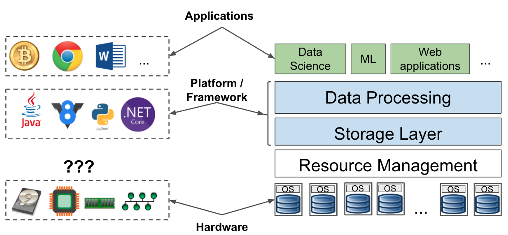


# What is resource management

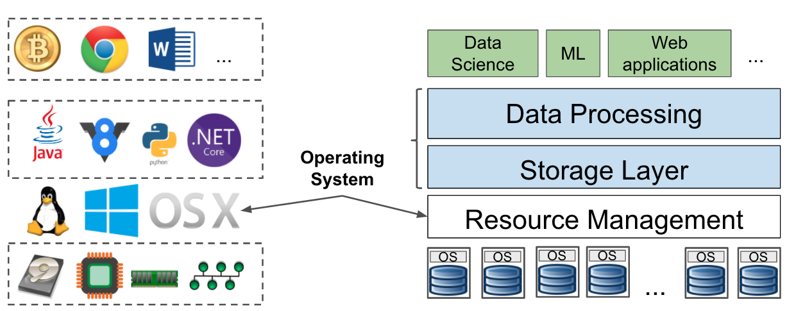


# Managing resource in a data center is 100x tougher than you thought

| | Your local OS | Data center resource mgmt sys |
|---|---|---|
| Goal | Easy to use, isolation | Utilization, isolation |
| Scale | 100 ~~chrome tabs~~processes  | >1000s jobs per day |
| Failure | together, easy to trace |  independently, hard to trace |
| Users | Single user | Multi-tenant, (concurrently) |
| Resources | Small set of resources | Large set of resources | 


# Hadoop v1 Resource Management

{width=80%}

# What was wrong with Hadoop v1 Resource Management

{width=100%}

# What was wrong with Hadoop v1 Resource Management

* Name node = master node = job tracker is overloaded
    * Resource Management
    * Scheduling
	* Job monitoring
	* Job lifecycle
	* Fault-tolerance

* It becomes the bottle neck
   * Only scales to < 4K nodes, 40K tasks


# What was wrong with Hadoop v1 Resource Management

* Task tracker = worker node = task tracker
    * Fixed mapper slots
    * Fixed reducer slots
	* Preset at the beginning 
	* Non-fungible 

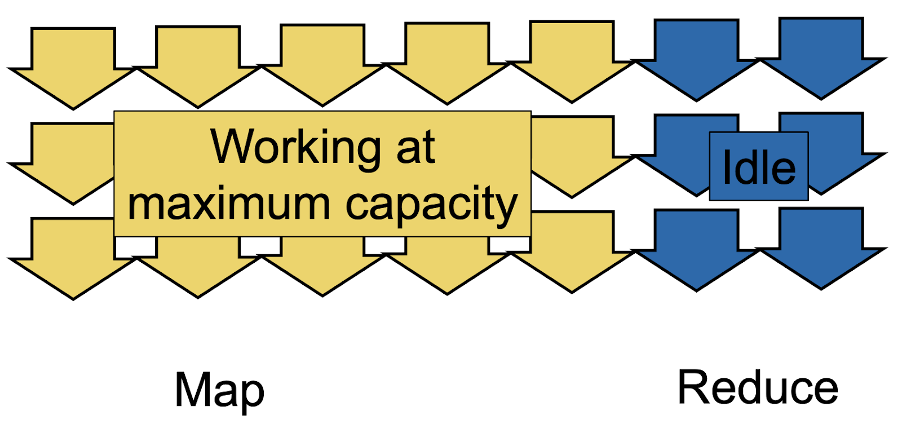{width=80%}

# YARN

**Y**et **A**nother **R**esource **N**egotiator

* A general resource management system shipped with Hadoop v2+
* Designed with Hadoop in mind
   * addresses many problems in Hadoop v1

# What YARN offers

{width=80%}

* Addresses the problems with Hadoop v1
* Supports not just Hadoop MapReduce jobs
* User-defined sharing policies


# YARN

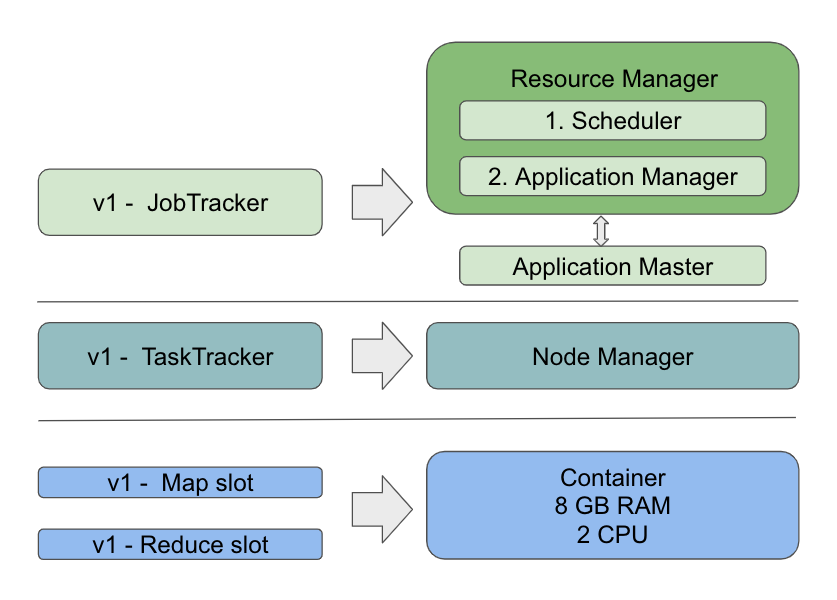{width=80%}


# YARN

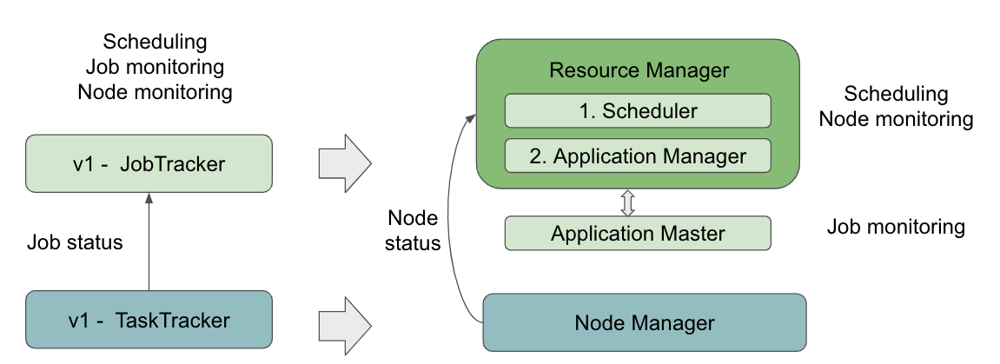{width=100%}

* Application Master is running on worker node.
    * What if it the worker node hosting the app master is dead?

# YARN

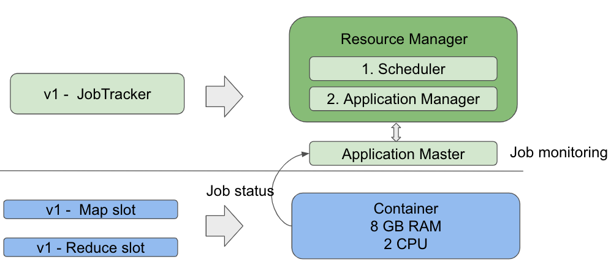{width=100%}

* Container can run both mapper and reducer tasks


# Hadoop v2 - YARN Resource Management


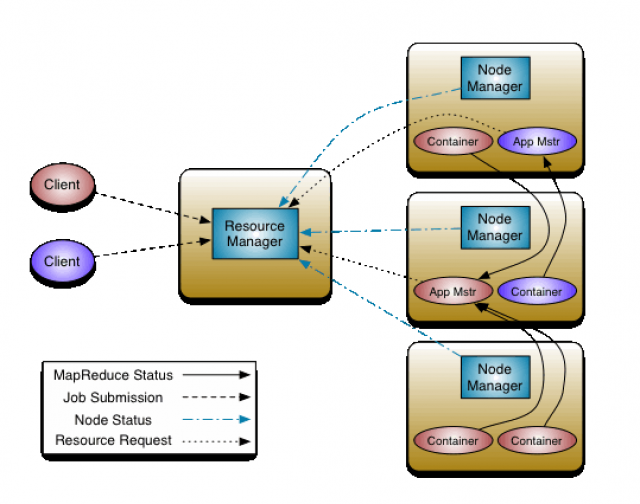{width=80%}


# YARN job submission work flow


# YARN job submission work flow

1. Client submits an application
2. Application Manager (RM) allocates a container to start Application Master
3. Application Master registers with Resource Manager
4. Application Master asks containers from Resource Manager
5. Application Master notifies Node Manager to launch containers
6. Application code is executed in the container
7. Client contacts Application Master to monitor application status
8. Application Master unregisters with Resource Manager

# What does a scheduler do?

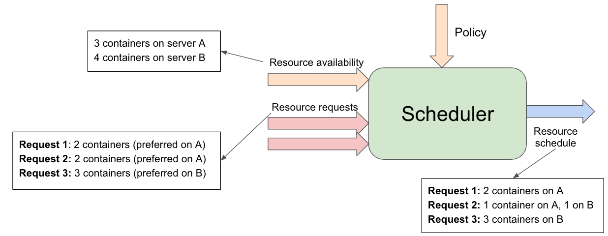

* Application Master asks for resources
    * It could be upfront
    * or during the execution.

* It is tough problem - a multi objective optimization problem
   * Capacity guarantee
   * SLA
   * Fairness
   * Cluster Utilization
   * ... 

# YARN shipped with a few schedulers (template)

* FIFOScheduler
* CapacityScheduler
* FairScheduler
* But users can define their own scheduler

# FIFO Scheduler


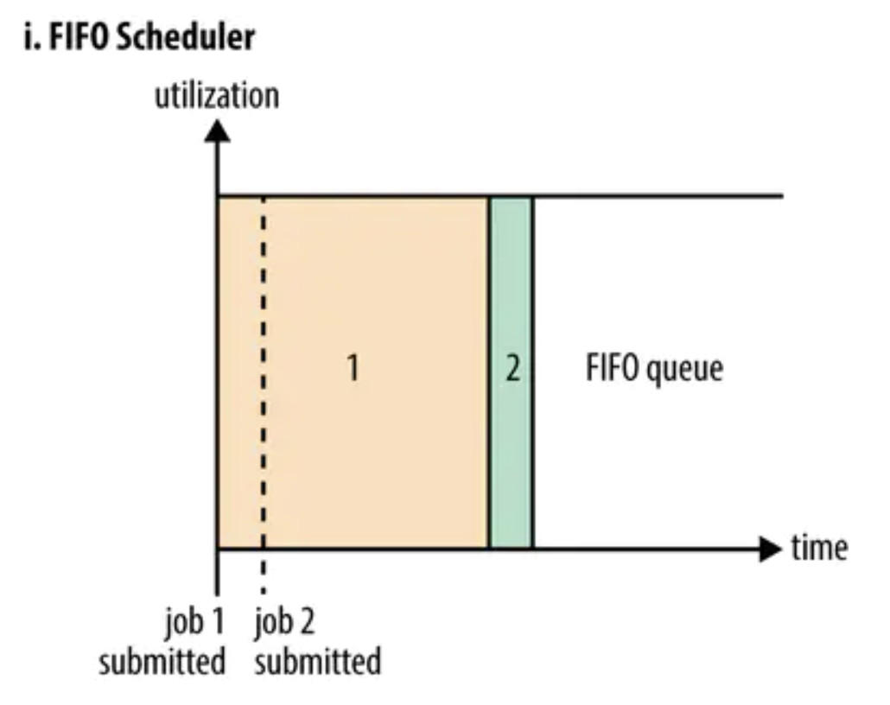{width=60%}

* Single queue
* One job takes up the entire cluster
* First come first serve
* Not good for short jobs queuing behind long jobs

# Capacity Scheduler

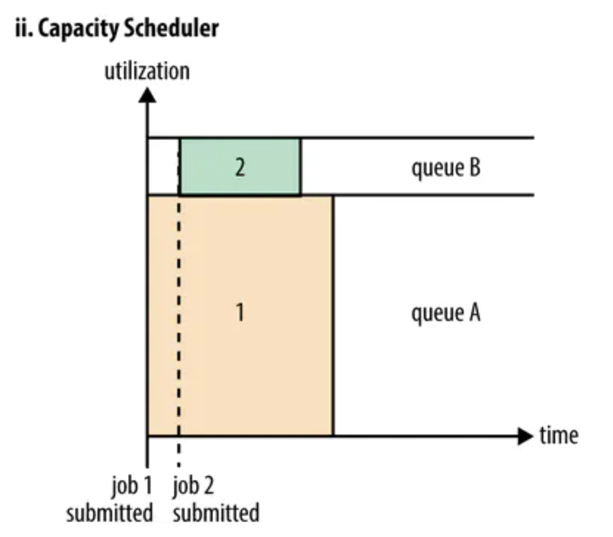{width=60%}

* Statically divided into multiple queues, e.g.
    * one for short jobs
    * one for long jobs
* A request is submitted to one queue
* Within the queue, FIFO


# Fair Scheduler

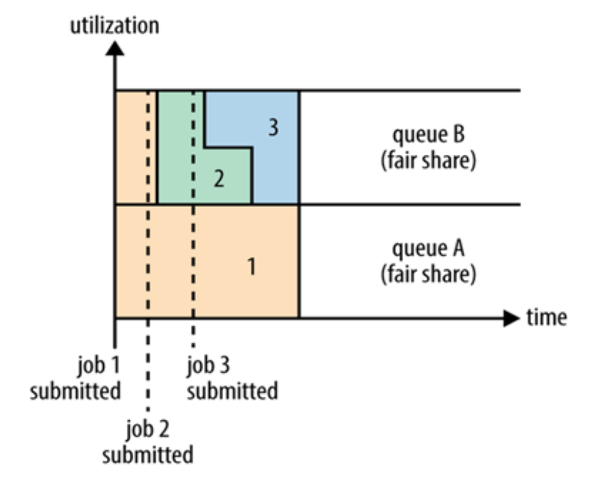{width=60%}

* Non-static queue
* Policies
    * Simple - All jobs have equal share
    * Advanced - Jobs in queue A have X% min, jobs in queue B have Y%
    min.
* When there is no other job running, a job can use up all resources
	

# Points to consider

* How to enforce fair share?
    * Pre-emption - kill resources of existing job

* How to define a metric for multi-resource request/share?
    * Total: 9 CPU, 18GB RAM
    * App A: 1 CPU, 4GB RAM
	* App B: 3 CPU 1GB RAM
    * Dominant Resource Fairness
        * Ali Ghodsi, Matei Zaharia, Benjamin Hindman, Andy Konwinski, Scott Shenker, Ion Stoica

```url
https://cs.stanford.edu/~matei/papers/2011/nsdi_drf.pdf
```


# Alternative to YARN

* Mesos
    * Static partitioning of resources
    * Mesos master and Mesos Agent
    * Multi-framework support through Mesos Agents
	* Framework agent ask for resource from mesos master and schedules
      its own jobs
* Google's Borg
    * Large-scale cluster management at Google with Borg, Abhishek
      Verma Luis Pedrosa Madhukar R. Korupolu David Oppenheimer Eric
      Tune John Wilkes
	  ```url
	  https://research.google/pubs/pub43438.pdf
	  ```
 * There is always a new kid on the block
```url
https://preview.tinyurl.com/y3rabllb
https://tinyurl.com/y3rabllb
```

# Summary

* Resource Management layer is like your OS
* High utilization is its most important goal
* YARN fixes existing issues with Hadoop v1 resource management
* YARN offers different scheduler policies
