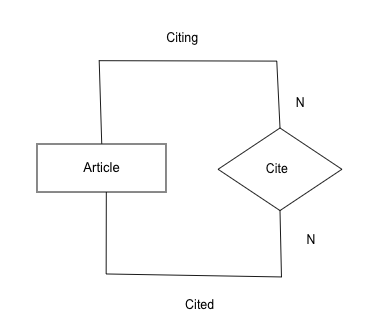

# 50.043 Entity Relationship Model

## Learning Outcomes

By this end of this unit, you should be able to 

1. Identify components of an Entity Relationship Diagram
2. Interpret the design requirements given an ER diagram
3. Draw ER diagrams based on user requirements

## Components of an ER Diagram

In the most common scenario, an Entity Relationship Model is described in a form a diagram, AKA ER Diagram. 

An ER Diagram may consists of some of the following

1. Entity set. An entity set captures a set of objects or items to be stored. It is represented as a rectangular box with the entity name inside. 
2. Attribute. An attribute describe a property of an entity. An attribute is represented as an oval shape with the attribute name inside. Attribute serves as (part of) the primary key of the entity will be underlined.
3. Relationship. A relationship defines the relationship between entities. It is represented as a diamond shape with the relationship name inside. Relationships are often annotated with cardinality constraints. We will discuss it shortly.

For example in the above ER diagram, we find two entities, i.e. `Student` and `Class`. Each `Student` entity has three attributes, `NRIC`, `Name` and `DoB`, with `NRIC` as the primary key. Likewise, each `Class` entity has three attributes, `Number` (as primary key), `Name` and `Location`. 

There exists a binary relationship between `Student` and `Class` entities, `Enrolled in`. It describes a business constraints that students can be enrolled into classes.  The annotation `N` describes that each class may have more than 1 students. The annotation `M` defines that each student may take more than one modules.  Note that in this module, for simplicity, we only require the upper bound to be specified in cardinality constraints, which could be either `1` or `N` (or `M`). Note that `N` and `M` are just meta terms to represent "many". 

### Self-referencing relationship

There is an edge case in which a relationship may be self-rerencing w.r.t to an entity. 

In the above ER diagram, we omit the attributes of the Article entity for simplicity. Each article can be referenced by many other articles. Each article can reference many other articles. The extra annotation `Citing` and `Cited` label the role of the article involved in the relationship.

### Tertiary relationship

There are situations in which a relationship involves more than two entities. 

In the above ER diagram, the `publish` relationship involves three entities, `Article`, `Book` and `Publisher`.
The cardinality constraints should be interpeted by pairing up two *source* entities and one *taret* entity. In the above example, we have 

1. Given an article and a book, they can only be published by 1 publisher. 
2. Given an article and a publisher, the article can only appeared one book (published by that publisher).
3. Given a book and a publisher, the book may contain many different articles.