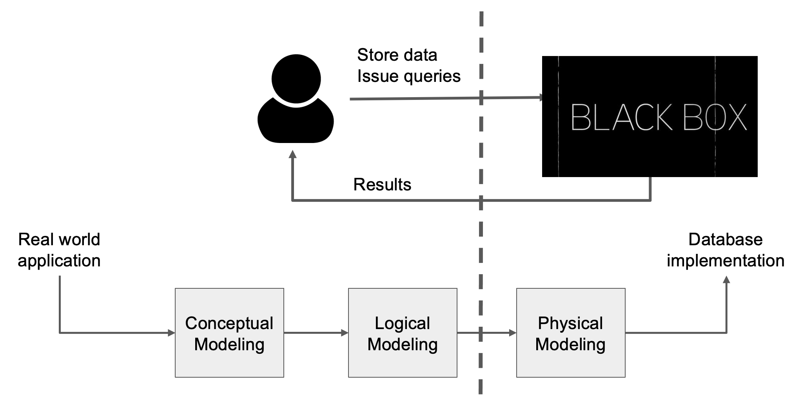
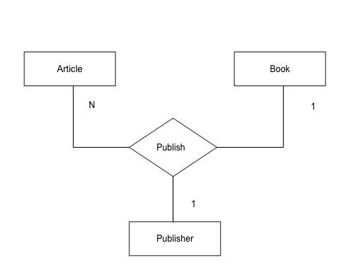

# 50.043 - Relational Model

## Learning Outcomes

By the end of this unit, you should be able to 

1. Describe the components of a relational model
2. Translate an ER model into a relational model

## Relational Model

Recall the following diagram

Relational Model is an instance of Logical Modelling. Unlike Conceptual Modelling, Logical Modelling focuses on how data are being stored and processed in the abstraction level. The implementation details can be decided at a latter stage. It is analogous to software development, we could decide the data structure and algorithms without thinking about how the code should be written. 

### What are the other options?

Relational Model is not the only logical model available. Alternatively we find graph model and key-value model are the other popular options. 

### Gist of Relational Model

Relational Model defines data in `Relation`. 

1. Each `Relation` is an unordered set containing relationship of attributes. Attributes in Relational Model are sometimes referred to as *fields*.
2. Note that we should not confuse them with the relationship and attributes mentioned in ER model. 
    * Relational model is a logical model, describing how data are stored and queried. ER model is a conceptual model, describing what data the application have / need.
    * `Relation` in Relational model is mathmatical relation, while the relationship in ER model is the connection in business domain. 
3. `Relation` is an set of `Tuple`s. Each `Tuple` is a sequence of attribute values in the `Relation`. 

For instance

|Student Number|Name | Email | DoB|
|---|---|---|---|
|1234|James|james@istd|1/1/2000|
|5678|Vansesa|vanessa@epd|2/4/1999|
|3093|David|david@esd|3/7/2000|

The above table is an instance of a `Relation`, of student profile.
* The first row in the *Schema* of the `Relation`. The second rows onwards are tuples. 
* Each column defines an attribute (or a field).

### Formal Definitions

#### Definition (Relation)
Let $D_1$, ..., $D_n$ be domains (of attribute values).
We define a relation $R$ as follows

$$
R \subseteq D_1 \times D_2 \times ... \times D_n
$$

#### Definition (Tuple)
Let $R$ be a relation $R \subseteq D_1 \times D_2 \times ... \times D_n$. Then a tuple $t$ is an element of $R$
$t = (d_1,...,d_n) \in R$ where for all $i\in [1,n]$ we have $d_i \in D_i$.

#### Definition (Schema)
Let $R$ be a relation $R \subseteq D_1 \times D_2 \times ... \times D_n$. Then the schema of $R$, denoted as $S_R$ is a mapping of attribute names to domains (i.e. $D_1, ..., D_n$)

For instance, recall the earlier example, the student profile relation $R \subseteq (Int \times String \times String \times Date)$. where $S_R = \{Student Number : Int, Name : String, Email : String, DoB : Date \}$.
The tuples in the above example forms an **instance** of the student profile relation. 
$$
I_R = 
\left \{ \begin{array}{cccc} 
    (1234,& James,& james@istd,& 1/1/2000 ), \\ 
    (5678,& Vanessa,& vanessa@epd, & 2/4/1999), \\ 
    (3093,& David, & david@esd, &3/7/2000) 
    \end{array} \right \} 
$$

#### Mapping Relational Model to Tables
There are many ways of translating a relatonal model into a set of database tables (from logical model to phyiscal model).

One simplest way is to 
1. translate each relation into a table
2. translate each domain into a table column, having the domain constraint being satisfied by the table column type.
3. traslate tuples of the relation instance into a row of a table.
4. relationa schema can be converted into table schema (directly derived from step 2).
5. translate additional constraints into table constraints or foreign key constraints.

## ER to Relational translation

Converting an ER model (conceptual) to a relation model (logical) is more invovled.  

The translation is iteratively defined by the following rules.

* Rule 1: map an entity set to a relation and preserve its primary key and fields.
* Rule 2: translate a relationship to a relation by 
  1. combining all keys from entity sets to make the new primary key for the result relation.
  2. the final composite primary key is determined by the cardinality constraints of the relationship.
* Rule 3: merge multiple relations with the same key into a single relation
  1. It avoids data redundancy
  2. It introduces NULL values

Let's consider an example, recall the following ER diagram

Let's assume each entity has a primary key id, and a non-primary-key attribute name. All fields are of type String.

We apply the first rule to obtain relations

1. Article(<ins>id</ins>, name) 
2. Book(<ins>id</ins>,name)
3. Publisher(<ins>id</ins>, name)

Next we apply the second rule to translation the `publish` relationship to 

4. Publish(<ins>article_id, book_id, publisher_id</ins>)

Note that by default we take all three ids to form a composite primary key. 

The cardinality constraint suggests that
* an article_id and a book_id can determine a publisher_id 
* an article_id and a publisher_id can determine a book_id 

Hence we can reduce the primary key composition of 4. to be 

* Publish(<ins>article_id, book_id</ins>, publisher_id); or
* Publish(<ins>article_id</ins>, book_id, <ins>publisher_id</ins>)

It is a common mistake to think of fixing article_id as a primary key would suffice. Note that the above ER diagram provides no cardinaltiy information between Book and Publisher alone. And the following instance is a counter example to the argument

|article_id|book_id|publisher_id|
|---|---|---|
|a1 | b1| p1|
|a2 | b1| p1|
|a1 | b2| p2|

The Rule 3 is not applicable in this example, hence we are done.