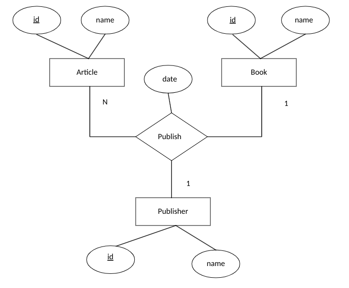

# 50.043 - Functional Dependency

## Learning Outcomes

By the end of this unit, you should be able to

* explain functional dependencies existing in data
* compute the closure of a set of functional dependencies
* compute the canonical cover of a set of functional dependencies
* identify candidate keys from a relation

## Data Anomalies

One of the challenges in designing database (not DBMS) is to eliminate data anomalies.

The following are the most common kinds of data anomalies:

1. update anomalies
2. insert anomalies
3. delete anomalies

### A motivating scenario

From this point onwards, we treat the terms "relation" and "table" interchangable.

Let's recall the example of article-book-publisher

In the above we reuse the running example from the earlier class, with one adjustment. Your client suggests that
they want to include the date of publish whenever an article is published. Hence naturally you include a date attribute to the 
`publish` relationship.

Apply the same steps of ER-to-Relational translation, we have the following relations

1. Article(<ins>id</ins>, name) 
2. Book(<ins>id</ins>,name)
3. Publisher(<ins>id</ins>, name)
4. Publish(<ins>article_id, book_id</ins>, publisher_id, date)

We create the tables based on the above relational model and load up the data. 

Specifically the table `Publish` looks like the following

|article_id|book_id|publisher_id|date|
|---|---|---|---|
|a1 | b1| p1|11/5/2019|
|a2 | b1| p1|11/5/2019|
|a1 | b2| p2|21/3/2020|

Then we realized something awkward and verified its validity with the client. The date of publish is tied to the book being published. That means, we will have some duplicate dates in the `Publish` table. 

This sounds a bit unfortunate, we may shrug it off. However, something far more serious immediately follows.

* Suppose we would like to update the date of publish of a book, say `b1`, we need to update all entries in `Publish` table with `book_id` as `b1`. This is known as the update anomaly.  
* Suppose we would like to insert a new book to `Book` table. However, we have nowhere to set its date until we find an `article_id` and a `publisher_id` to insert that info into the `Publish` table. This is known as the insert anomaly.
* Suppose we would like to delete all entries from the `Publish` table with `book_id` as `b1`. After that, we lose the publishing date of `b1` entirely. This is known as the delete anomaly.

In summary, in-proper relation model design results in data anomalies. To avoid that, we need a proper method to capture this kind of business requirement, i.e. the publish date is tied to a book. 

## Functional Dependencies

Functional dependencies define a relationship among data in a relation. It is a representation of certain business requirement as we encountered in the earlier example.

Formally speaking, a functional dependency is a *constraint* between two sets of attributes. 

### Definition of FD

Let $X_1,...,X_m$, $Y_1, ..., Y_n$ be attributes. we write 
$$ X_1,...,X_m \rightarrow Y_1, ..., Y_n$$ 
to denote a functional dependency between $X_1, ..., X_m$ and $Y_1, ..., Y_n$. 

We refer $X_1,...,X_m$ as the *antecedent* and $Y_1, ..., Y_n$ as the *consequent*.

### Mathematic Meaning of FD

Given a FD $X_1,...,X_m \rightarrow Y_1, ..., Y_n$, we conclude that values of $X_1,...,X_m$ functionally determine the values of $Y_1, ..., Y_n$. 

Let $t$ be a tuple, we write $t[X]$ to refer to the value of attribute $X$ in tuple $t$.

Formally speaking, an FD $X_1,...,X_m \rightarrow Y_1, ..., Y_n$ holds in a relation $R$ iff 
$\forall t,t' \in R$ we have  $t[X_1] = t'[X_1] \wedge ... \wedge t[X_m] = t'[X_m]$ implies $t[Y_1] = t'[Y_1] \wedge ... \wedge t[Y_n] = t'[Y_n]$.

For example in the article-book-publisher example, for any tuples `t1` and `t2` in `Publish` table, `t1[book_id] = t2[book_id]`  implies `t1[date] = t2[date]`.

### Validity of FDs

Since we are applying relation model to business problems. It is insufficient to observe and validate whether a FD holds in an instance of a relation (i.e. by observing the values in a table!). To verify the validity of FDs, we need to check with the domain expert, project stack holders and end users. In otherwords, FDs must come from the busines requirements, not be inferred from the data.

## Functional Dependency Closure

Given a relation $R$ and a set of FDs $F$ that holds on $R$. There are many other sets of FDs that are equivalent to $F$.

For instance, let $F = \{ X \rightarrow YZ \}$, we find that $F' = \{ X \rightarrow Y, X \rightarrow Z\}$ and $F \equiv F'$. 

Some points to take note. 
* For brevity, we omit the commas when there is no confusion, i.e. $YZ$ is a short hand of $Y,Z$. 
* Informally, we say $F \equiv F'$ if $F$ and $F'$ impose the same set constraint on the values in $R$.

Similarly, if we let $F'' = F \cup F'$, we have $F \equiv F' \equiv F''$. 

Now we consider finding the greatest *superset* $F^+$ such that $F \equiv F$  and for any other $G$ that is $F \equiv G$, we have $G \subseteq F^+$. $F^+$ is called the *closure* of $F$.

###  Computing $F^+$ 

To compute $F^+$ we need some rule-based rewriting system. 

#### Reflexivity rule

Let $Y$ and $X$ be sets of attributes, such that $Y \subseteq X$. Then $X \rightarrow Y$.

For instance, \{`date`\} $\subseteq$ \{ `book_id, date` \}, thus we have `book_id,date` $\rightarrow$ `date`

#### Augmentation rule

Let $Y$, $Z$ and $X$ be sets of attributes, such that $X \rightarrow Y$. Then $XZ \rightarrow YZ$. (Note $XZ$ is shorthand for $X\cup Z$). 

For instance, given `book_id` $\rightarrow$ `date`, we have `book_id,publisher_id` $\rightarrow$ `date,publisher`.

#### Transitivity rule

Let $Y$, $Z$ and $X$ be sets of attributes, such that $X \rightarrow Y$ and $Y \rightarrow Z$. Then $X \rightarrow Z$. 

#### Question - Split rule

Given the above three rules, can you prove $X \rightarrow YZ$ implies $X \rightarrow Y \wedge X \rightarrow Z$? 

This derived rule is also known as the split rule.

#### Algorithm

1. At the start, let $F^+ = F$.
2. Find pick one of the three Axioms to apply, to generate a FD, let's say $X\rightarrow Y$. Let $F^+ = F^+ \cup \{X\rightarrow Y\}$.
3. repeat step 2 until $F^+$ does not change any more.

For example, given $F = \{ book\_id \rightarrow date \}$, we compute $F^+$ as follows,

| step | new FD | rule |
|---|---|---|
| 1 |$article\_id, book\_id, publisher\_id, date \rightarrow article\_id $ | Ref |
| 2 |$article\_id, book\_id, publisher\_id, date \rightarrow book\_id $ | Ref |  
| 3 |$article\_id, book\_id, publisher\_id, date \rightarrow publisher\_id $ | Ref |  
| 4 |$article\_id, book\_id, publisher\_id, date \rightarrow date $ | Ref |  
| 5 |$article\_id, book\_id, publisher\_id \rightarrow article\_id $ | Ref |  
| 6 |$article\_id, book\_id, publisher\_id \rightarrow book\_id $ | Ref |  
| 7 |$article\_id, book\_id, publisher\_id \rightarrow publisher\_id $ | Ref |  
| 8 |$book\_id, publisher\_id, date \rightarrow book\_id $ | Ref |  
| 9 |$book\_id, publisher\_id, date \rightarrow publisher\_id $ | Ref |  
| 10 |$book\_id, publisher\_id, date \rightarrow date $ | Ref |  
| 11 | $article\_id, publisher\_id, date \rightarrow article\_id$ | Ref |
| 12 | $article\_id, publisher\_id, date \rightarrow publisher\_id$ | Ref |
| 13 | $article\_id, publisher\_id, date \rightarrow date$ | Ref |
| 14 | $article\_id, book\_id, date \rightarrow article\_id$ | Ref |
| 15 | $article\_id, book\_id, date \rightarrow book\_id$ | Ref |
| 16 | $article\_id, book\_id, date \rightarrow date$ | Ref |
| 17 | $article\_id, book\_id \rightarrow article\_id$ | Ref | 
| 18 | $article\_id, book\_id \rightarrow book\_id$ | Ref | 
| 19 | $article\_id, publisher\_id \rightarrow article\_id$ | Ref |
| 20 | $article\_id, publisher\_id \rightarrow publisher\_id$ | Ref |
| 21 | $article\_id, date \rightarrow article\_id$ | Ref |
| 22 | $article\_id, date \rightarrow date$ | Ref |
| 23 | $book\_id, date \rightarrow book\_id$ | Ref |
| 24 | $book\_id, date \rightarrow date$ | Ref |
| 25 | $publisher\_id, date \rightarrow publisher\_id$ | Ref |
| 25 | $publisher\_id, date \rightarrow date$ | Ref |

No other rules are applicable, then we are done.

## Canonical Cover

A **canonical cover** of $F$ is the smallest possible subset of $F$ such that its closure is $F^+$. 

The above statement is intuitive but not precise. To be precise, we need to define the standard form of FDs. 

### Standard form definition

An FD is in standard form iff its RHS is a single attribute.

It follows that for any set of FDs, we can convert it into an equivalent set with standard form FDs. (Hint: we know $X\rightarrow YZ$ implies $X \rightarrow Y$ and $X \rightarrow Z$ holds.)

### Formal definition
Let $F$ denote a set of FDs, we say $F_c$ is the canonical cover iff 
1. All FDs in $F_c$ are in standard form; and
2. $F_c^+ \subseteq F^+ \wedge F^+ \subseteq F_c^+$; and
3. $\neg \exists G \subset F_c$ such that  $ G^+ \subseteq F^+ \wedge F^+ \subseteq G^+$

### Algorithm to compute $F_c$

1. Convert $F$ to standard form.
2. Minimize the lhs of each FD, by applying Reflexitivity, Augmentation and Transitivity.
3. Remove redundant FDs, by applying Reflexitivity, Augmentation and Transitivity.

For example, consider 

$$
F = \left \{ \begin{array}{ccc} 
    AB & \rightarrow & C & (1) \\
    A & \rightarrow & BC & (2) \\
    B & \rightarrow & C & (3) \\
    A & \rightarrow & B & (4)
    \end{array}
    \right \}
$$

First applying split rule to (2)

$$
F = \left \{ \begin{array}{ccc} 
    AB & \rightarrow & C & (1) \\
    A & \rightarrow & B & (2) \\
    A & \rightarrow & C & (2') \\
    B & \rightarrow & C & (3) \\
    A & \rightarrow & B & (4)
    \end{array}
    \right \}
$$

Then we apply Augmentation and Transitivity rules to (1) and (2) to minimize LHS of rule (1)

$$
F = \left \{ \begin{array}{ccc} 
    A & \rightarrow & C & (1) \\
    A & \rightarrow & B & (2) \\
    A & \rightarrow & C & (2') \\
    B & \rightarrow & C & (3) \\
    A & \rightarrow & B & (4)
    \end{array}
    \right \}
$$

Now we find that (2') is a duplicate of (1) and (4) is a duplicate of (2).

$$
F = \left \{ \begin{array}{ccc} 
    A & \rightarrow & C & (1) \\
    A & \rightarrow & B & (2) \\
    B & \rightarrow & C & (3) 
    \end{array}
    \right \}
$$

Finally we find that (1) is derivable by applying transitivity to (2) and (3).

$$
F = \left \{ \begin{array}{ccc} 
    A & \rightarrow & B & (2) \\
    B & \rightarrow & C & (3) 
    \end{array}
    \right \}
$$

The above is minimal.

Note that the algorithm described above is non-confluent, i.e. dpending on the order of FDs being picked a different canonical cover might be generated. 

### Application of canonical cover

Canonical cover is very useful. We can use it to reduce the number of constraints (which is expensive to verified). We leverage on Canonical cover to identify candidate key for a relation.

#### Some extra terminologies - different kinds of keys

In database, we call a set of attribute of a relation as a
* Super key if it functionally determines all other attributes 
* Candidate key if it is a minimal set of attributes that functionally determines all other attributes.
* Primary key if it is one of the candidate key. (We just fix one.)
  