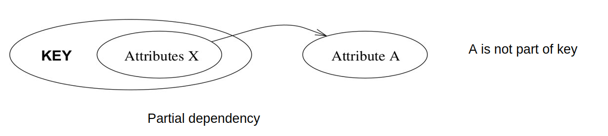
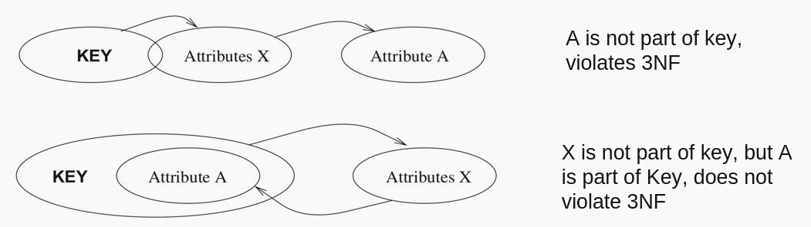

# 50.043 - Normal Forms

## Learning Outcomes

By the end of this unit, you should be able to 

* apply lossless decomposition to a relation
* verify a relation is in 1NF/2NF/BCNF/3NF
* decompose a relation into 2NF/BCNF/3NF

## Decomposition 

By now, we know that having an FD in which the LHS of the constraint is not a the primary key of the relation imposes data anomalies. 

Recall the relation Publish(<ins>article_id, book_id</ins>, publisher_id, date)

with the fillowing data

|article_id|book_id|publisher_id|date|
|---|---|---|---|
|a1 | b1| p1|11/5/2019|
|a2 | b1| p1|11/5/2019|
|a1 | b2| p2|21/3/2020|

There exists an FD book_id $\rightarrow$ date. Note that `book\_id` is not the primary key (though it is part of the primary key).

To fix the issue, we need to decompose `publish` into two smaller relations. But how?

The idea is to decompose it based on the FD. From the FD, we find that book_id determines date. We should move book_id and date into another relation. At the same time we should keep the book_id in `publish` so that the relationship between author_id, book_id and publisher_id is not lost. 

### Lossless decomposition

Give a relation $R$, a decompsition of $R$, say $R_1$ and $R_2$ is lossless, iff $R_1 \bowtie R_2 \equiv R$.

To ensure a decomposition is lossless, we pick an FD constraint $X \rightarrow Y$ of $R$ then let $R_1 = R_1(XY)$ and $R_2 = R_2( attr(R) - Y)$, assuming $X \cap Y = \emptyset$. We write $attr(R)$ to compute the set of attributes of $R$. It follows that $X$ is the common attributes among $R_1$ and $R_2$, the natural join between $R_1$ and $R_2$ will leverage $X$ hence $R_1 \bowtie R_2 \equiv R$.

For instance, in the `Publish` relation above, we may decompose it by the FD book_id $\rightarrow$ date. 

* Publish1(<ins>article_id, book_id</ins>, publisher_id)
* Publish2(<ins>book_id</ins>, date)

|article_id|book_id|publisher_id|
|---|---|---|
|a1 | b1| p1|
|a2 | b1| p1|
|a1 | b2| p2|

|book_id|date|
|---|---|
|b1 | 11/5/2019|
|b2 | 21/3/2020|

Note that we eliminate the data anomalies. (Eventually, we might merge `Publish2` with the `Book` relation, which is a seperate topic.)

## Normal Forms

The next question we need to consider is how far should we decompose relation?

Normal forms define a set of criteria which allows us to check whether the result of decomposition is *good enough*.

### 1NF

A relation is in 1NF iff its schema is flat, (i.e. contains no sub-structure) and there is no repeating group (i.e. there is no repeating column).

For example the following relations are not in 1NF

|student_id|name|phones|
|---|---|---|
|1234|Peter Parker| [95598221, 82335354]|

This relation's schema is not flat.

|student_id|name|phone1|phone2|
|---|---|---|---|
|1234|Peter Parker|95598221|82335354|

This relation has a set of repeating columns, `phone1`, `phone2`. (Though in reality, we could be lenient here, maybe we could rename it to `primary contact`, `secondary contact`.)

### 2NF

A relation is in 2NF iff 

1. it is in 1NF and 
2. all non-key attributes are fully dependent on candidate key. 

In other words, the relation is at least 1NF and there should be no partial dependency.

For example, in the running example 

Publish(<ins>article_id, book_id</ins>, publisher_id, date) 

is in 1NF but not in 2NF, because the attribute `date` is not fully dependent on the primary key `article_id,book_id`. It is partially dependent on `book_id`. 

### Boyd-Codd Normal Form (BCNF)

Given a relation $R$ with FDs $F$, $R$ is in BCNF iff for all non-trivial dependency $X \rightarrow Y \in F^+$, $X$ is a super key. 

An FD is *trivial* iff its lhs is a superset of the rhs.

For example, 

* Publish1(<ins>article_id, book_id</ins>, publisher_id)
* Publish2(<ins>book_id</ins>, date)

are in BCNF, because the only non trial FDs are 
1. `article_id,book_id` $\rightarrow$ `publisher_id`
2. `article_id,publisher_id` $\rightarrow$ `book_id` (recall the ER diagram)
3. `book_id` $\rightarrow$ `date`. 

Note that FD #2 does not violate the BCNF requirement, because `article_id,publisher_id` is a candidate key of `Publish1` hence also a super key.

#### Lemma: A relation $R$ is in BCNF implies $R$ is in 2NF. 

The proof is omitted. You are encouraged to try proving it.

#### Algorithm to decompose into BCNF

Given a relation $R$ and a set of FDs $F$. The algorithm of decomposing $R$ into BCNF is described as follows. 

1. Compute $F^+$
2. Let $Result = \{R\}$
3. While $R_i \in Result$ not in BCNF, do 
  3.1. Choose $X\rightarrow Y \in F^+$ such that $X$ and $Y$ are attribtues in $R_i$ but $X$ is not a super key of $R_i$.
  3.2. Decompose $R_i$ into $R_{i1}$ $R_{i2}$ with $X\rightarrow Y$.
  3.3. Update $Result = Result - \{ R_i\}  \cup \{ R_{i1}, R_{i2} \}$

#### A slightly more optimized algorithm

1. def $normalize(R)$
1.1. Let $C = attr(R)$
1.2. find an attribute set $X$ such that $X^+ \neq X$ and $X^+ \neq C$.
1.2.1. if $X$ is not found, then $R$ is in BCNF
1.2.2. else 
1.2.2.1. decompose $R$ into $R_1(X^+)$ and $R_2(C-X^+ \cup X)$
1.2.2.2. $normalize(R_1)$
1.2.2.3. $normalize(R_2)$
2. $normalize(R)$

Consider $R(A,B,C,D)$ with FDS $\{AB \rightarrow C, A\rightarrow D, C\rightarrow B\}$.

First we find all attribute closures.

* $A^+ = AD$
* $B^+ = B$
* $C^+ = CB$
* $D^+ = D$
* $AB^+ = ABCD$
* $ABC^+ = ABCD$
* ...
We find that $AB$ is a candidate key of $$.

At step 1.2, we found $A^+$, since $A^+ = AD \neq ABCD$. We decompose 
$R$ into 
* $R_1(A,D)$
* $R_2(A,B,C)$

$R_1$ is already in BCNF. $R_2$ is not, because found $C^+ = BC$. We decompose $R_2$ into

* $R_{21}(B,C)$
* $R_{22}(A,B)$

Then we are done.

### 3NF

Given a relation $R$ with FDs $F$, $R$ is in 3NF iff for all non-trivial dependency $X \rightarrow Y \in F^+$, 
1. $X$ is a super key or
2. $Y$ is part of a candidate key

The following diagram shows some example

In the first diagram, $X \rightarrow A$, assuming $KEY$ is the only candidate key, hence $X$ is not a super key. Further more $A$ is not part of a candidate key. Thus it is a counter example of 3NF.

In the second diagram, $X\rightarrow A$, $X$ is not a supere key and $A$ is part of a candidate key. Thus it is in 3NF.

#### Lemma: A relation in 3NF is also in BCNF.

It can be proven from by the definitions. 

#### BCNF vs 3NF

BCNF is easier to compute, we just keep finding a FD that violates the definition and keep decomposing until none is found.

Though BCNF decomposition is lossless, it is *not* dependency preserving.

A FD set $F_i$ is preserved by $R_i$ iff for each $X_1...X_n \rightarrow Y \in F_i$, $X_1,...,X_n,Y$ are attributes of $R_i$.

Recall the previous example $R(A,B,C,D)$ with FDS $\{AB \rightarrow C, A\rightarrow D, C\rightarrow B\}$.

Applying BCNF-decomposition will yield $R_1(A,D), R_{21}(B,C), R_{22}(A,B)$ which do not preserve $AB\rightarrow C$.

#### Algorithm to compute 3NF 

With that difference in mind, we present the algorithm to compute 3NF as folows. 

1. Apply the BCNF algorithm to decompose $R$, let's say the result is a set of relations $R_1, ..., R_n$.
2. Let $F_1,...,F_n$ be the list of FDs preserved by $R_1, ..., R_n$.
3. Compute $(F_1 \cup ... \cup F_n)^{+}$. Let $\bar{F} = F - (F_1 \cup ... \cup F_n)^{+}$.
4. For each $X_1...,X_n\rightarrow Y \in \bar{F}$, create a new relation $R'(X_1,...,X_n,Y)$

For example, recall the previous example $R(A,B,C,D)$ with FDS $\{AB \rightarrow C, A\rightarrow D, C\rightarrow B\}$.

After the BCNF decomposition, we realize $R_1(A,D), R_{21}(B,C), R_{22}(A,B)$ do not preserve $AB\rightarrow C$. We create (or restore) $R_2(A,B,C)$. 

$R_2$ subsumes $R_{21}(B,C)$ and $R_{22}(A,B)$, hence we remove $R_{21}$ and $R_{22}$ and keep $R_2$. 

Alternatively, we could have used the BCNF algorithm but do not decompose $R_2$ since it does not violate 3NF.

