# 50.043 - Access Method

## Learning Outcomes

By this end of this unit, you should be able to

1. Describe the different layout options of a Heap Page
2. Describe the different layout options of a Heap File
3. Explain the purposes of a database index.
4. Explain the different collision handling mechanisms of Hash Table
5. Explain the structure of a B+ Tree
6. Explain the lookup / insert / delete operations over a B+ Tree.
7. Describe the difference between a clustered B+ Tree index and a unclustered B+ Tree index.

## Data Access Methods

As discussed in the earlier classes, through SQL (and relational algebra), we scan data in a table, search for data based on filtering condition, update data, insert and delete data.

We consider the actual implementation of these access methods.

Like any other software implementation, we need to consider the data structure together with the algorithm.


## Page Internal

Recall inside a data page, we find 

* a set of tuples/records
* a header 
* the index 
* the log

Let's consider the first two components.  

### Layouts of Page

There are few options of how tuples are organized in a page.

#### Option 1 - Unordered sequential layout

Tuples are stored inside a page, one after another, like a fixed size array. Elements inside the array, i.e. the pages, are unordered. We often call this page structue as a *Heap Page*.

One advantage is that sequential layout is easy to implement, especially for sequential scanning, and insertion.

The clear disadvantage is that after some tuples being deleted

1. we see holes in between tuples
2. the space utilization is unclear


#### Option 2 - Heap Page with bit array header

In this version we improve over the previous version of Heap Page by including a header. The header is an array of bits whose size equals to the maximum number of tuples in a page (with the meta-data discounted). The i-th bit is 0 implies the i-th tuple slot is unused, otherwise, the slot is used.

With this approach we address the deletion issue. To insert a tuple, we need to scan through the header array to look for free slot.

There are still some issues to be addressed. 
1. we have to assume that tuples are all in a single fixed size 
2. it is hard to search for a particular tuple except sequential scan.

The first issue can be addressed by allowing long tuple spanning across multiple slots. We need to store extra header information.

The second issue will be addressed altogther when we consider the internal layout of a database file


## File Internal 

From the earlier section, we note that a database file stores data belonging to a particular table. In the database file, we find a collection of pages.

### Layout of Files

The issues related to layout of database files are similar to those with pages. We have a few options.

#### Option 1 - Unordered sequential layout

Simple approach. We store one page after another. The good news is that all pages are of the same size. 

A similar issue with this approach is that it is not easy to find pages with free space. 

#### Option 2 - Linked list

In this approach, we maintain two linked lists in the file as meta data. One of the list stores all pages which are full. The other one stores all pages which are not yet full.

#### Option 3 - Directory 

An alternative to the linked lists approach is to use a set of directories. Each directory contains a fixed set of slots. Each slot contains a pointer to (i.e. the location of) a page and a freespace bit. Directory slot may also point to another directory if expansion is required. Directories are small in size so that they could fit in the memory. As a file grows with more pages, a new directory could be created just like a data page. 

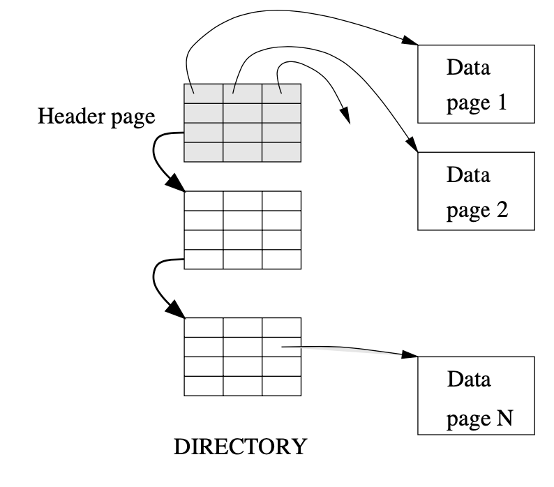

In the event that we would like to keep track of how much free space per page has, we could change the freespace bit into a freespace integer field. This change supports the need of having variable length tuple. 

### Columnar Layout

Another alternative we could consider is that instead of storing data as tuple, we could store them based on column, which is known as columnar storage. We omit the detail here and defer the discuss during the cohort lesson. 

### A Quick Summary so far

We have consider the internal layout of a page and the internal layout of a file. To maintain the free/occupied slots information, we maintain the meta data in pages, as well as files. 

It is clear that storing pages sequentially in a file has certain advantage in particular for sequential scan. The following table sumarizes the average cost of data operation performed on data file with sequential layout and one with random layout. Let $t_{r+s}$ denote rotation and seek time, $t_{tf}$ denote the transfer time and $D$ denote the number of pages in the file.

| | sequential | random | 
|---|---|---|
|Insert a record | $t_{s+r} + 2 \cdot t_{tf}$ | $t_{s+r} + 2  \cdot t_{tf}$ | 
|Lookup a record | $t_{s+r} + t_{tf}  \cdot D / 2$ | $(t_{s+r} + t_{tf}) \cdot D / 2$ | 
|Insert a record | $t_{s+r} + t_{tf}  \cdot D $ | $(t_{s+r} + t_{tf})  \cdot D $ | 


One issue yet to be addressed is to enable searching for a tuple without resort to sequential scanning which is expensive.

## Index 

A way to resolve to search issue with Heap file is to incorporate indices.  For instance, we want to search for books that are publish in the year of 2019. 

An index maps values of the searching criteria into a set of record ids. Each record id stores the exact location of a tuple, i.e. page id and tuple slot number.

A table may have multiple indices. 

The idea of indices is similar to adding labels to a thick phyiscal text book. The labels enable us to quickly "jump" to a section of interest. 

There many different options of index. 

### Hash table

A hash table maps values of searching criteria into the target set via a hash function. The input to the hash function is the value, and the output is the set of locations of the records. 

#### Desired Properties of a hash function

The perfect hash function should be 

1. efficient - takes no time to compute the hash
2. low (or better to be no) collision. For all $x_1 \neq x_2$, $hash(x_1) \neq hash(x_2)$.


#### Dealing with collision

In reality, collision can't be eliminated. 

To deal with collision, there are two approaches on the storage level
1. Open Hashing (a.k.a. separate chaining) we store collided objects in linked-list pointed by the same key. 
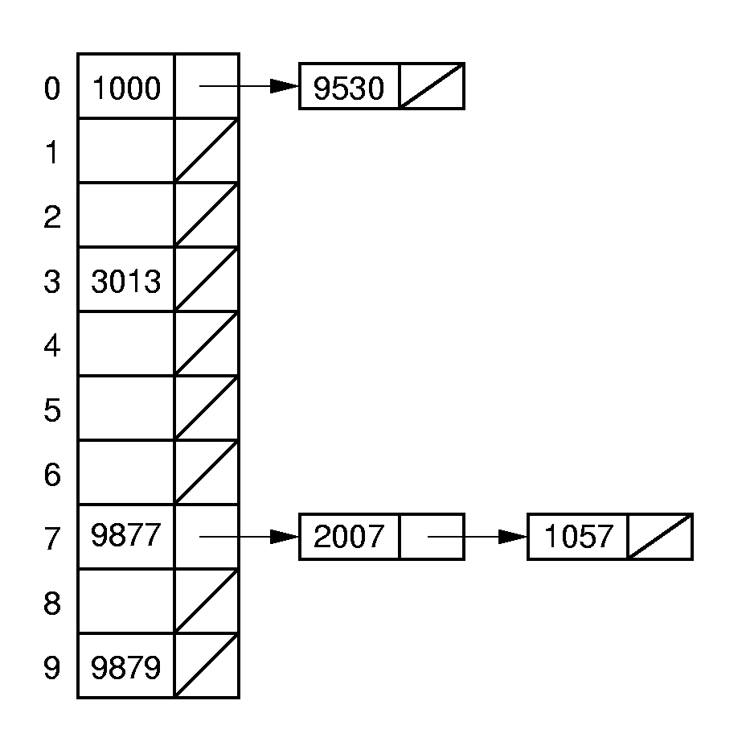
In the above diagram the values 1000 and 9530 are hashed into the same cell of the hash table, hence 9530 is stored in a chain. 
2. Closed Hashing (a.k.a. open addressing) we try to store collided objects in the same hash table.

We discuss a few more alternatives of closed hasing

#### Linear Probing

Linear Probing is a close hashing collision resolution. The idea is that if both values are hashed to the same cell of the hash table, one of them will be stored in the next available slot. 

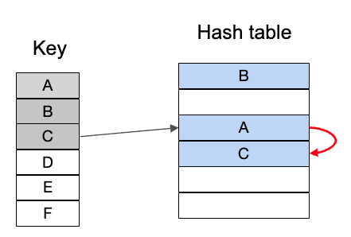

In the diagram above, both values A and C are hased into the same cell of the hash table. When we try to insert C, we have to place C to the cell available right after the cell where A resides. 

First of all, for this to work, we need to know the max size of the table, in case the current collided cell is the last element of the table.  Secondly the search time of the value given a key, is linear to the size of the hash table in the worst case. 


#### Cuckoo Hashing

This hashing technique is given this name because it behaves like how parent birds feed their chicks. They often have multiple young chicks in the same nest. When feeding, they often forget which one had been fed before, so they just keep trying one by one. 

The cuckoo hashing operates with multiple hash functions ($n$ functions) and multiole hash tables ($n$ tables). It goes as follows,

1. Give a value $v$ to be stored, we hash it with all the hash functions.
2. Given the hashed values $cell_1,...,cell_n$, we search for the first $cell_i$ such that $cell_i$ in $table_i$ is free. 
    1. If found, we put $v$ at $cell_i$ in $table_i$.
    2. otherwise, we pick one $cell_j$ which is currently occupied by value $u$.
        1. we replace $u$ by $v$
        2. we go to look for a new cell for $u$. (recursive call)


We illustrate the idea using the following example. Let $n = 2$

* Step one we would like to insert $A$.
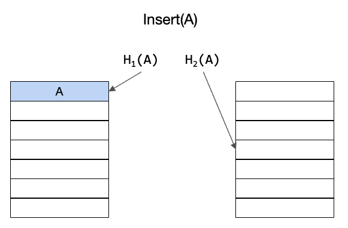
We put $A$ in table 1 at cell $H_1(A)$.
* Step two we want to insert $B$.
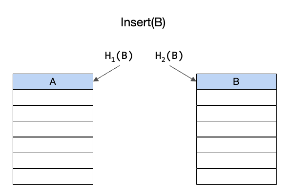
We put $B$ in table 2 at cell $H_2(B)$, because $H_1(B)$ collides with $H_1(A)$.
* Step three we want to insert $C$.
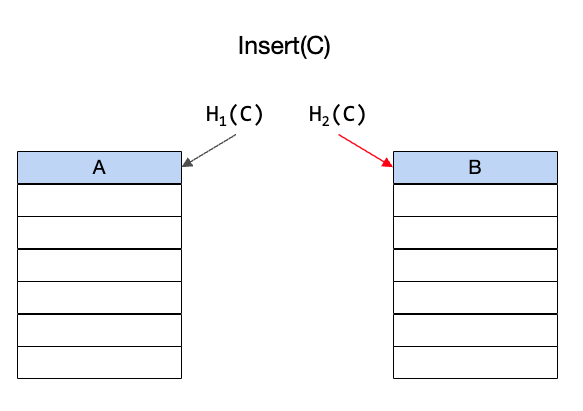
We realized that both $H_1(C)$ and $H_2(C)$ are occupied due to collision. We vacate $B$ and insert $C$.
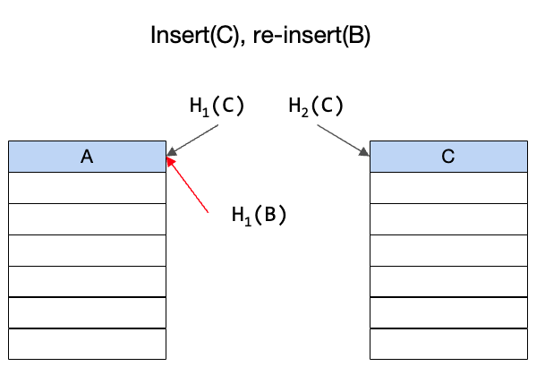
We need to re-insert $B$. We put it at cell $H_1(B)$, and vacate $A$.

We re-insert $A$ at $H_2(A)$.
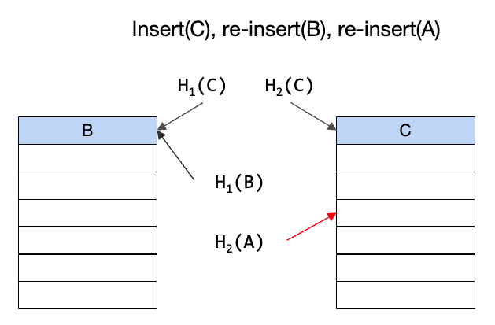
The all values are in the hash table(s).
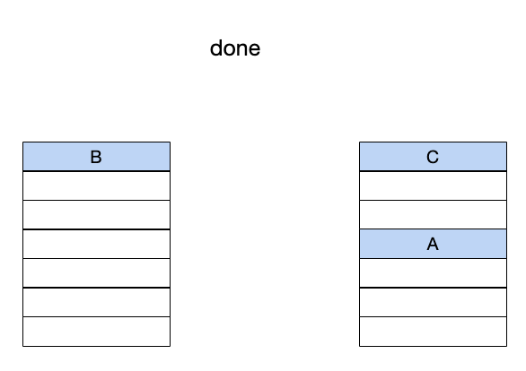


The advantage of this approach is that the lookup cost is always $O(1)$.
The downside is that we might run into infinite vacate-insert loop. We need to some mechanism to detect the loop, and rehash everything with a new set of hash functions, or add more tables (and new hash functions).

#### Bucket Hashing

One issue with Cuckoo Hashing is that eventually, we need to rehash everything. 

The idea behind Bucket Hashing (a.k.a extensible hashing) is to 
* store hashed values in buckets (relative small fixed size arrays, so that the sequential search is not expensive). All buckets have the same size.
* use the $n$ least significant bits (LSB) of the hashed value to decide in  which bucket it should be placed.
* increase $n$ and add new bucket gradually as some bucket becomes full.

The Bucket Hashing algorithm starts with a global slot array, a bucket.
It maintains a set of integer values of $n$ LSB. $G$ denotes the global value of $n$ LSB, there is one and only one. $L$ denotes the local values of $n$ LSB, there is one $L$ per bucket. For all buckets, $L \leq G$. The algorithm start with some small numbers of $G$ and $L$. 


##### Bucket Hashing Insertion
To insert a value $X$ (for simplicity, we treat $X$ same as $hash(X)$)

1. lookup the bucket for $X$ based on the last $G$ bits of $X$.
    1. if the bucket $i$ is not full, insert $X$ there.
    2. otherwise
        1. if the bucket $i$ having $L < G$
            1. add a new bucket $j$ having same $L$ as $i$, 
            2. redistribute data from $i$ to $i$ and $j$. 
            3. increase $L$ for both buckets $i$ and $j$.
            4. update the slot array
        2. otherwise
            1. double the slot array
            2. add a new bucket $j$ having same $L$ as $i$
            3. redistribute data from $i$ to $i$ and $j$. 
            4. increase $L$ for both buckets $i$ and $j$.
            5. increase $G$ 
            6. update the slot array

For example, we start with the following empty table

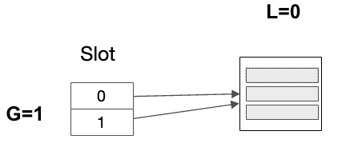

First, we insert hashed values `00000`, `01100` and `11010`.

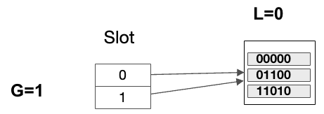

Next, we insert a hashed value `10001`, but the bucket is full. We need to create a new bucket with $L=0$ and redistribute the data, and update slot array, and increase the $L$ values for both buckets.

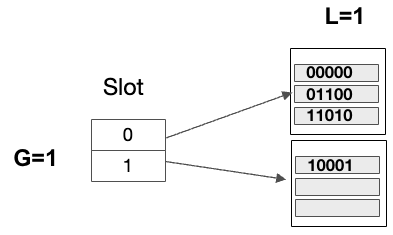

In the third step, we insert hashed values `01011` and `01111`.
Both values go to the new bucket

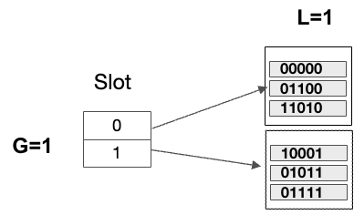

In the fourth step, we insert another value `01110`. Both the bucket store the 1-LSB as `0` is full. We add double the slot array, add a new bucket with $L=1$. We redistribute the data into the new bucket and update the references in the slot array. 
We set $G = 2$ and increase $L$ for the two affected buckets.

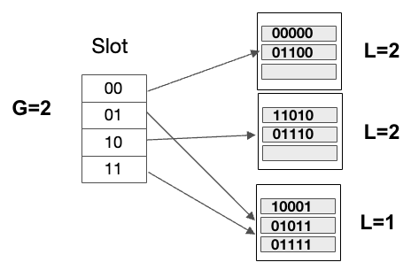


##### Bucket Hashing Lookup

To lookup a value $X$

1. lookup slot array given $G$ LSB of (hash of) $X$. 
    1. if the bucket is found
        1. scan through the bucket for $X$ sequentually
    2. otherwise, report not found


##### Time complexity

The insertion time and lookup time are both $O(1)$.


#### B+ Tree

One disadvantage of Hash table is that it only supports point query. 
For example, it works well with query 

```sql
select * from book where book_id = 'b1';
```
because we could hash `book_id`.

Hashing does not help to speed up range search query

```sql
select * from book where date >= '2019-01-01' and date <= '2019-12-31';
```
Even if we hash all `date`, there is no guarantee the values are store in the same bucket/page/block.


#### Recap Binary Search Tree

A binary search tree is a binary tree in which all nodes from left sub-tree are smaller than the current node's value and all nodes from right sub-tree are larger than the current node's value.


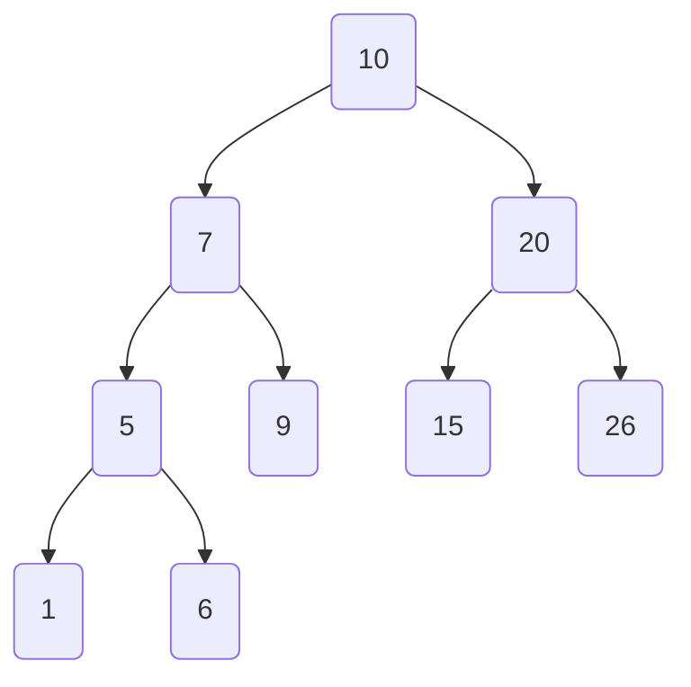

#### Recap a balanced tree

A binary tree is balanced iff for any non-leaf node, n, the height difference between the left and the right sub-trees should not exceed 1. 

A binary tree is perfectly balanced iff for any non-leaf node, n, the height difference between the left and the right sub-trees should be 0. 


#### B+ Tree

A B+ Tree is a generalization of a perfect balanced binary search tree, with the following adjustment

1. Let $d$ denotes the order.
2. The root node may have $1$ to $2*d$ entries.
3. Each non-root node may have $d$ to $2*d$ entries (half-full).
4. The each in a node consist of a key and a value, except for the first entry i.e. $v_1, (k_2, v_2), (k_2, v_2), ... , (k_{n}, v_n)$. 
5. The values in non-leaf nodes are reference to the children.
6. The values in the leaf nodes are reference to records in the data file/page/block.
7. Given two consecutive entries $(k_i, v_i), (k_{i+1}, v_{i+1})$, where $v_{i}$ is a reference to a subtree, for all values in subtree, their index values must be in between $k_i$ and $k_{i+1}$. For the first entry, its lower bound is definedby the key coming from the parent. (Similar observation applies to the last entry.)
8. All the leaf nodes for a doublely linked list, which enables the range search operation.


For example, the following figure shows a B+Tree with $d=2$

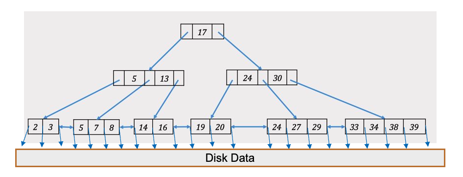


##### Look-up

To search for a value with key $k$ in a B+ Tree, we start from the root node

1. find the value $v$ between $k_1$ and $k_2$ such that $k_1 \leq k < k_2$. Note that $k_1$ might not exist if $k_2$ is the first entry's key, $k_2$ might not exist if $k_1$ is the last entry's key.
    1. if the current node is a non-leaf node, we move the current node to the node pointed by $v$, we repeat the process recursively
    1. if the current node is a leaf node, we return the disk data pointed by $v$.

It is clear that the time complexity is $O(log(N))$

##### Insertion

To insert a value with key $k$ into a B+ Tree, we follow the algorithm as follows

1. find the leaf node $L$ with the current interval where $k$ should fit, (same as the look-up operation). 
2. insert_to_leaf($L$, $k$)
3. def insert_to_leaf($L$,k)
    1. if $L$ is not full, just insert, we are done!
    2. otherwise
        1. create a new node $L'$. 
        2. (update linked list, only for leaf node), let $L'' = succ(L)$,  then $succ(L) = L'$ and $succ(L') = L''$.
        3. redistribute entries evenly between $L$ and $L'$. 
        4. copy up the middle key, with the value as a pointer to $L'$, that is to insert a new data entry in the parent node. insert_to_nonleaf(parent($L$), middle_key)
4. def insert_to_nonleaf($N$, k)
    1. if $N$ is not full, just insert, we are done!
    2. otherwise
        1. create a ne wnode $N'$.
        2. redistribute entries evenly between $N$ and $N'$.
        3. push up (note, not copy) the middle key, with the value as a pointer to $N'$. 
            1. if $N$ is not a root node, insert_to_nonleaf(parent(N), middle_key)
            2. otherwise, create an empty node as the new root node, insert_to_nonleaf(parent(N), middle_key)


For example, we would like to insert the entry `8` into the following B+ Tree with $d=2$. For breivity we omitted the disk refernce associated with `8`.

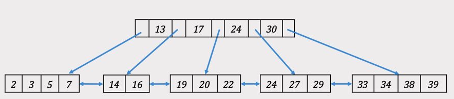

We locate the leaf node. However it is full, it has 4 entries, $4 = 2*d$.
We create a new leaf node and redistribute the entries and re-join the linked list. 

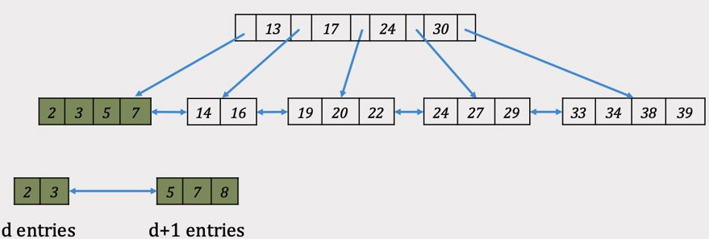

We copy up the middle key to the parent. Now we need to insert `5` to the root node.

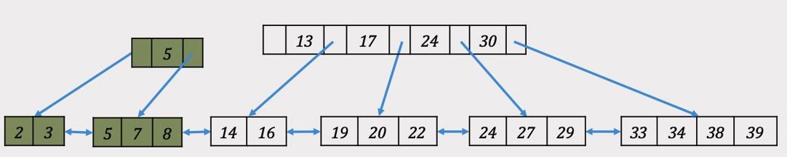

The root node is full, we must create a new root child node, redistribute the entries, and create a new root node and push the middle key `17` to the new root node.


The time complexity of the insertion algorithm is $O(log(N))$

##### Deletion
Given a node $N$, let $|N|$ denote the number of entries in $N$.

To delete a value with key $k$ from a B+ Tree, we follow the algorithm as follows

1. find the leaf node $L$ with the current interval where $k$ should fit, (same as the look-up operation). 
2. delete_from_leaf($L$, $k$)
3. def delete_from_leaf($L$, $k$)
    1. remove the entry with $k$
        1. if $L$ is at least half-full (i.e. $|L -\{k\}| \geq d$), we are done!
        2. otherwise
            1. if $L$ has a sibling $L'$, and $k'$ is the key from the parent that divides $L$ and $L'$, such that $|L \cup \{k'\} \cup L'-\{k\}| \geq 2*d$ (Notes:if both left and right siblings having sufficient entries, we favor the left sibling)
                1. find the new middle key in $L \cup \{k'\} \cup L'-\{k\}$, say $k''$, replace $k'$ by $k''$ in $parent(L)$
                2. if $|L \cup \{k'\} \cup L'-\{k\}|-1 \geq 2*d$
                    1. re-distribute $L \cup \{k'\} \cup L' - \{k,k''\}$ among the two leaf nodes.
                    2. otherwise, re-distribute $L \cup \{k'\} \cup L'- \{k\}$ among the two leaf nodes, i.e. $k''$ is copied up.
            2. otherwise
                1. merge $L$ with its sibling $L'$ into a new node as $L \cup \{k'\} \cup L' - \{k\}$, where $k'$ is the key from the parent dividing $L$ and $L'$.
                2. delete_from_nonleaf($parent(L)$, $k'$)

4. def delete_from_nonleaf($N$, $k$)
    1. remove the entry with $k$
    2. if $N$ is a root node and $|N -\{k\}| > 0$, we are done!
    3. if $N$ is a root node and $|N -\{k\}| == 0$, we remove $N$ entirely.
    4. if $N$ is not a root node and $N$ is at least half full, we are done.
    5. otherwise
        1. if $N$ has a sibling $N'$, and $k'$ is the key from the parent that divides $N$ and $N'$, such that $|N \cup N' - \{k\}| \geq 2*d$, 
            1. find the new middle key in $N \cup \{k'\} \cup N'$, say $k''$, replace $k'$ by $k''$ in $parent(N)$, redistribute $|N \cup N' - \{k\}|$ among the two nodes. 
        2. otherwise
            1. merge $N$ with its sibling $N'$ into a new node as $N \cup \{k'\} \cup N' - \{k\}$, where $k'$ is the key from the parent dividing $N$ and $N'$.
            2. delete_from_nonleaf($parent(N)$, $k'$)


For example, continueing from what we have from the previous example, 

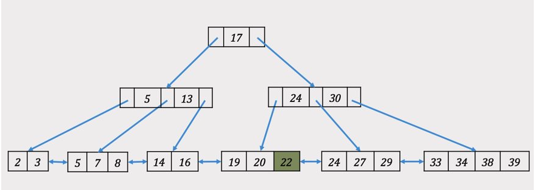

We delete the key `22`. Since the node is still half full, not merging or redistribution occurs.

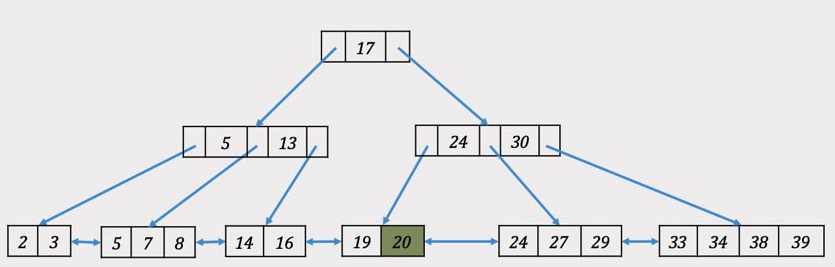

Next we delete key `20`, which makes the leaf node no longer half-full. We borrow entry `24` from the sibling on the right. The key `24` from the parent node is replaced by the new middle key `27`.


In the third step, we delete key `24`. Merging the remaining entry `19` with `27`,`29` into a single leaf node. 

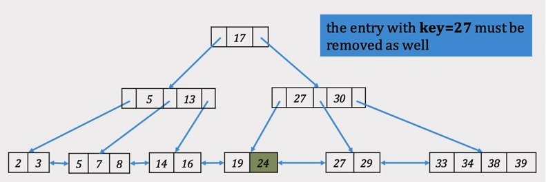


As a consequence, we need to delete `27` from the parent node.

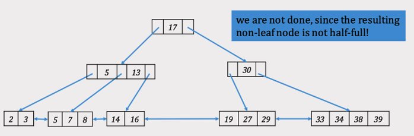

The merging effect cascade up, since the non-leaf node containing `30` is not half-full.

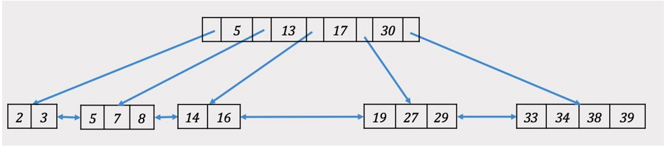

The time complexity of deletion is also $O(log(N))$.


#### Clustered vs Unclustered B+ Tree

A B+ Tree is *clustered* iff data in the heap file are sorted according to the index attribute (keys in the B+ Tree).

Due to its physical storage nature, there is only one clustered index per table. We may have many unclustered indices per table. 

Clustered index in general out-performs unclustered indices when being applied in range queries.