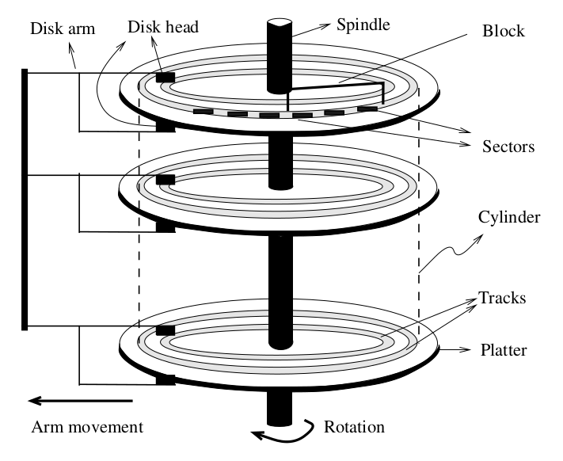

# 50.043 - Storage

## Learning Outcomes

By this end of this unit you should be able to

1. Explain the internal structure a hard disk
2. Compute the estimated cost for a data operation
3. Explain the roles and functionality of a disk manager
4. Explain the roles and functionality of a Buffer Pool
5. Describe the LRU and Clock Replacement Policy

## Motivation 

Starting from this week onwards, we look deep into the internal of the database manage systems. 

In particular, we want to find out is how queries are executed and how data are fetched from and updated back to the database.

The answer the question, we first need to understand how data are stored in the database. 

## Hardware

For simplicity, we only consider the mechanincal hard disk storage. 

We do not consider in memory database because it is not common, due to its cost. 

We do not consider SSD and non-volatile memory because they similar to hard disk storage except that there is no rotational delay and seek time delay is marginal, but the general cost computation model is still applicable. 

### Mechanical Rotational Harddisk 

(image from Database Management Systems, R. RamaKrishnan and J. Gehrke)

The figure above illustrate the internal of a mechanincal harddisk, which is a cylindical structure. It consists of multiple platter of disks stacked up vertically. Each platter consists of multiple tracks. Each track is divided into multiple sectors. Disk heads read from/write to disk track. Only one head is allowed to operate at any point in time. Data are organized into blocks (which is determined by the governing system, DBMS storage or OS file system). A block might span across multiple consecutive sectors. Different system use different block size.

We break down the time needed for each type of disk head movement that related to disk I/O.

* Seek time $t_s$: to move arm to correct platters & track​, it is roughly  20ms​.
* Rotate time $t_r$ : to rotate to correct sector​, roughly 10ms​
* Transfer time $t_{tf}$ : to read/write a block of data​, 0.1ms​

#### Random vs squential access cost

Given $D$ number of blocks of data, the cost of accessing the data randomly is 

$$
T_1 = D * (t_s + t_r + t_{tf})
$$

and the cost of accessing the data sequentially is 

$$
T_2 = t_s+t_r + D * t_{tf}
$$

#### Note

For SSD, seek time is a lot faster and there is zero rotate time. Transfer time is also magnitude faster. But the basic components of the breakdown remain the same. Typically we see significant improvement in random access time when upgrading to SSD.

## Database Storage 

Given the estimated cost of data access, it is clear that we should minimize the factor being multipled with $t_s$ and $t_r$ as much as we can. 

For most the DBMS storage system, we favor a larger block size as it reduces the number of blocks given the same set of data in size and data related to each other tend to be fetched together in one block. 

When some records (or tuples) are needed, the entire block of data is read from the disk. Same idea applies when the records needed to be written back to the disk. 

To minimize the overhead of reading/writing the data blocks back and forth and to boost the performance of the data processing, the DBMS need to 
1. have some logical mapping over the physical storage - disk manager
2. have some in memory cache - buffer pool

## Disk Manager

Different DBMSes have different ways of managing the logical mapping. One common approach is to store data as a collection of files. The disk manager keeps track of the mapping from database tables to files, which is known as the system *catalogue*. These database files are no ordinary ones which can be accessed by other software in the OS. They have to be access through the Disk Manager.

Each file managed by the Disk Manager is organized as a set of *page*s. 

### Page vs Block

Page is the basic unit of data storage from the memory (RAM) perspective, determined by the DBMS configuration. 

Block is the basic unit of data storage from the physical disk (hard diks) perspective, determined by the OS configuration. 

These two might or might not be in sync in terms of size. 

From now onwards, for the ease of reasoning, we assume a page is of the same size of a block unless we specifically define otherwise.

### Inside a Page

Besides a set of tuples/records, a page contains 

* the meta information (also known as the header, which be discussed in a few paragraphs away in this unit)
* the index and the log, which be discussed in the upcoming unit. 

## Cache system - Buffer Pool

Knowing that fetching data block (or page) to and fro is expensive. We need a fixed set of working space in the RAM, which serves as the Buffer Pool. 

Any read operation from the DBMS must check whether the target page is in the Buffer Pool, if it is in the pool, the operation should be performed on the cached copy.  When the cached copy needs to be evicted, it will be only be written to the disk if it is *dirty*, i.e. some data has changed. Otherwise, it will be discarded. 

The Buffer Pool has a fixed set of slots (known as frames). Each page is loaded into a frame when it is fetched from the disk.

The Buffer Pool maintains the following information,

1. Page to frame mapping
2. Whether a page is *pinned*. A page is pinned means it is being accessed currently. When a data operation (query/insert/update/delete) is performed it will pin all the required paged. When the operation is completed, the pages are unpined. Note that in a full system, we see concurrent access to pages, thus, in most of the situation, the Buffer Pool maintains a pin counter per slot.
3. Whether a page is dirty.
4. Extra information to support the eviction policy.

### Eviction Policy

When a new page needs to be fetched from the disk but the Buffer Pool is full, we need to free up some slot. An eviction policy helps to decide which frame slot should be freed. 

In the ideal situation, the (dream) eviction policy should evict the cached page requested farthest in the future, because we won't need it again so soon compared to the rest. In reality, such policy does not exist as we can't see the future.

Instead, we use several policies based on the situation

#### LRU Policy

The Least Recently Used (LRU) Policy works as follows,

1. pinned frames should not be evicted
2. keep track of the timestamp when frame's pin was set to 0. 
3. evict the page in the frame with the smallest (oldest) timestamp.

In details steps.

Initialize all frames to be empty with pincount 0

1. when a page is being pinned
    1. if the page is already in the pool, increase the pincount, return the page in the frame.
    2. otherwise, 
        1. find the frames with 0 pincount, find the one oldest timestamp, write it to disk if it is dirty.
        2. load the new page to this vacant frame, set pincount = 1
1. when a page is being unpinned, decrease the pincount and update the timestamp to the current time.

##### Example

For example, consider the a buffer pool with 3 frame slots. The folloing sequence of pages are requested in order (pin, then unpin immediately)

$$ 1,2,3,4,1,2 $$

pg = page, pc = pincount, ts = timestamp

|time|page req'ed| frame 0 | frame 1 | frame 2 
|---|---|---|---|---|
| 1 | 1 | **pg:1, pc:0, ts: 1** | | |
| 2 | 2 | pg:1, pc:0, ts: 1 | **pg:2, pc:0, ts:2** | |
| 3 | 3 | pg:1, pc:0, ts: 1 | pg:2, pc:0, ts:2 | **pg:3, pc:0, ts:3** |
| 4 | 4 | **pg:4, pc:0, ts: 4** | pg:2, pc:0, ts:2 | pg:3, pc:0, ts:3 |
| 5 | 1 | pg:4, pc:0, ts: 4 | **pg:1, pc:0, ts:5** | pg:3, pc:0, ts:3 |
| 6 | 2 | pg:4, pc:0, ts: 4 | pg:1, pc:0, ts:5 | **pg:2, pc:0, ts:6** |

#### Clock Replacement Policy

While LRU works, its implementation could be less complex. 

The Clock Replacement Policy is a simpler approach which approximates LRU. (The formal proof is not discussed in this module.)

The Clock Replacement Policy does keep track of timestamps, instead it keep track of the reference bit (0 or 1) per frame and a hand (index to frame slots). During the initialization phase, all frames are empty with pincount and reference bit set to 0, the hand is set to 0.

The Clock Replacement Policy works as follows, 

1. when a page is being pinned
    1. if the page is already in the pool, set the frame's reference bit to 1, increase the pincount, return the page in the frame.
    2. otherwise, we need to find a slot for it, by checking the frame pointed by the hand
        1. if it is pinned, (somebody is using it), advance hand to the next frame
        2. otherwise
            1. if the frame's reference bit is 1, set it to 0, advance hand
            2. otherwise
                1. write the current payload to disk if it is dirty
                2. load the new page to this slot
                3. set reference bit to 1, and set pincount to 1
                4. advance the hand to the next frame
2. when a page is being unpinned, decrease the pincount.

Compared to LRU, the Clock Replacement Policy uses less memory, reference bit vs timestamp. The Clock Replacement Policy is more efficient, because there is no need to search for the oldest timestamp.

#### Example 

Let's re-run the same example 
$$ 1,2,3,4,1,2 $$ 

with Clock Replacement Policy

pg = page, pc = pincount, ref = reference bit

|time|page req'ed| frame 0 | frame 1 | frame 2 | hand |  
|---|---|---|---|---|---|
| 1 | 1 | **pg:1, pc:0, ref: 1** | | | 0 |
| 2 | 2 | pg:1, pc:0, ref: 1 | **pg:2, pc:0, ref: 1** | | 0 
| 3 | 3 | pg:1, pc:0, ref: 1 | pg:2, pc:0, ref: 1 | **pg:3, pc:0, ref: 1** | 0 |
| 4 | 4 | pg:1, pc:0, **ref: 0** | pg:2, pc:0, ref:1 | pg:3, pc:0, ref:1 | **1** | 
| 5 | 4 | pg:1, pc:0, ref: 0 | pg:2, pc:0, **ref:0** | pg:3, pc:0, ref:1 | **2** |
| 6 | 4 | pg:1, pc:0, ref: 0 | pg:2, pc:0, ref:0 | pg:3, pc:0, **ref:0** | **0** |
| 7 | 4 | **pg:4, pc:0, ref: 1** | pg:2, pc:0, ref:0 | pg:3, pc:0, ref:0 | 1 |
| 8 | 1 | pg:4, pc:0, ref: 1 | **pg:1, pc:0, ref:1** | pg:3, pc:0, ref:0 | 2 |
| 9 | 2 | pg:4, pc:0, ref: 1 | pg:1, pc:0, ref:1 | **pg:2, pc:0, ref:1** | 0 |

### Other optimization

There is no one size fit all solution here. Modern databases often employ some heuristics, called prefetching. The idea is to anticipate subsequent pages will soon be needed when an operation requests for a page (say, a sequential scan of table). This eliminates some of the cost of rotation time and seek time. 

