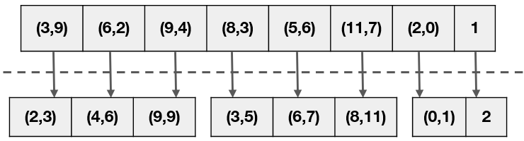
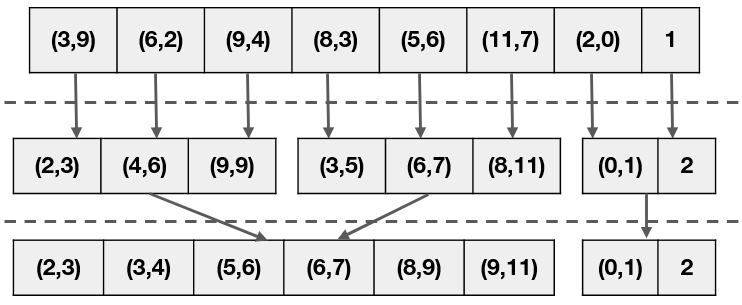
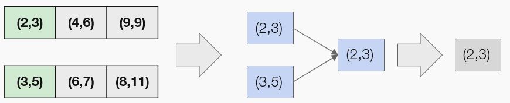
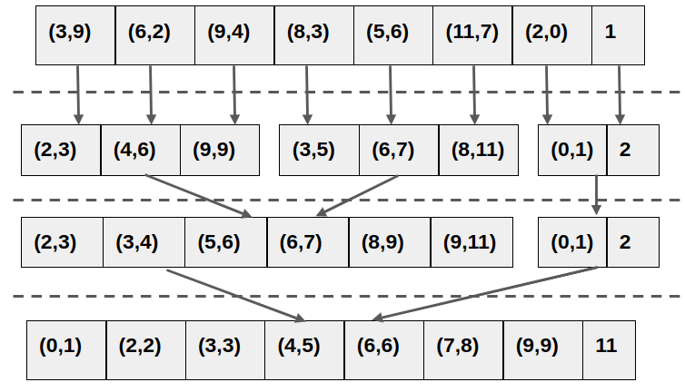

# 50.043 Query Operations

## Learning Outcomes

By the end of this unit, you should be able to 
* assess estimated cost of database operation, namely, select, sort and join
* describe the external sort algorithm
* describe nested loop join, sort merge join and hash join

## Recap Relational Algebra

Recall that in week 2, we investigated into relation model and relational alegbra. We argue that relational algebra is a good abstraction to describe data processing operation over a relational model. 

Given that we know a bit more of the internal implementation of a physical database, (the data structure aspect) we start look into possible ways of implemeting the relational algebra operations in a physical datase (the algorithm aspect).

## Selection Operation

Let $R$ denote a relation (or in other words, a table), we consider the selection operation $\sigma_{C}(R)$ where $C$ is a logical predicate. The result of this operation is a new relation whose tuples are those coming from $R$ and satisfying the predicate $C$. 

There are several ways to implement this operation. 

### Sequential Scanning

Knowing that the data in $R$ are stored in a Heap file as a set of Heap pages, we could scan $R$ by reading the data from $R$ page by page. For each tuple in the page, we remove it when it does not satisfy $C$ and retain it otherwise. 

The cost (in terms of number of Disk I/Os) of using the sequential scanning approach is
$$ 
B(R)
$$

where $B(R)$ denotes the number of pages storing $R$.

### Scanning with B+ Tree index

A *smarter* (but not always) way is to make use to the B+ tree index created over the attributes mentioned in $C$. 

#### Case 1: Clustered index

In this case the B+ Tree index is not clustered, i.e. the data in the pages are not stored according to the order of the index attribute. 

We have to traverse down the B+ Tree to find the boundaries of $C$, and for each leaf node value (reference) we retrieve the page storing that tuple and check whether that tuple satisfies $C$.

Assuming each node in the B+ Tree occupies a page, the cost of this approach is 

$$
log_d(|R|/d) + \alpha(C,R) \cdot B(R)
$$

Where $|R|$ denotes the number of tuples in $R$, $d$ denotes the order of the B+Tree. $(|R|/d)$ is number of leaf nodes in the B+ Tree, which is the worst case, every node is just half-full. For simplicity, we assume root node is having at least $d$ entries. $\alpha(C,R)$ denotes the selectivity of the predicate $C$ over $R$, i.e. the number of tuples $R$ satisfying $C$ divided by $|R|$.

The first term $log_d(|R|/d)$ estimates the cost of traversing the B+ Tree to find the correct starting leaf node. $ \alpha(C,R) \cdot B(R)$ estimates the cost of scanning the tuples of $R$. Since the index is clustered, tuples that are stored in the order of the index attributes, we can fetch adjacient tuple w.r.t the attribute referred in $C$ in a single page.

#### Case 2: Unclustered Index

When the B+ Tree is not clustered, the estimated cost becomes

$$
log_d(|R|/d) + \alpha(C,R) \cdot | R |
$$

A page read is needed for every tuple (in the worst case). 

As we can see that when $\alpha(C,R) > (1 / pagesize)$, it is definitely more viable to abandon the index and go for the sequential scan.

One possible improvement of using unclustered index is 

1. traverse down the B+ Tree to find the correct starting and ending tuple locations (i.e. page id and slot id), 
2. sort all the tuple locations by page ids before 
3. reading the sorted pages and filter.

This will bring us back to the same estimated cost as the clustered index (modular the cost of sorting).

## Sort Operation

Sorting is essential. 

From Data Driver World and Algorithms, we learned various sorting algorthms. All of these algorithms assumes that the data can fit in the RAM. In the settings of database operations, this assumption is no longer valid. 

### External Sort

The external sorting algorithm is an instance of the merge sort. 

#### Recap Merge sort

The merge sort algorithm is as follows

1. def merge_sort(input)
    1. if input size < 2
        1. return input, it is already sorted
    2. otherwise
        1. divide input into halves, say, i1 and i2
        2. call merge_sort(i1) to get s1
        3. call merge_sort(i2) to get s2
        4. combine(s1,s2) to get sorted
        5. return sorted
2. def combine(s1, s2)
    1. create an empty list out
    2. while s1 is not empty and s2 is not empty
        1. let e1 be the first element of s1
        2. let e2 be the first element of s2
        3. if e1 < e2
            1. add e1 to out
            2. remove e1 from s1
        4. otherwise
            1. add e2 to out
            2. remove e2 from s2
    3. if s1 is not empty
        1. concatenate s1 to out
    4. if s2 is not empty 
        1. concatentate s2 to out
    5. return out 

#### External sort

The external sort algorithm is a generalized version of merge sort, which operates without loading the full set of data into RAM.

##### External sort by example

The algorithm makes use of the buffer pool.

Let's consider an example. Suppose we have a buffer pool of 3 frames and would like to sort the following 8 pages of data. Each page contains two tuples. 

###### Phase 0

In this phase, we divide the input pages into $\lceil8/3 \rceil = 4 $ runs and sort each run.
  

From the next phase onwards, we merge each the sorted runs into larger runs, until all are merged into a single one run.

###### Phase 1

We merge 3 runs into two runs. 

Firstly we merge the two runs on the left into one.

When merging two runs into one, we divde the buffer pool's frames into the input frames and output frame. There is only one output frame, the rest are inputs. 

In this running example, we have two input frames and one output frame. 

We merge the run `[(2,3), (4,6), (9,9)]` with `[(3,5), (6,7), (8,11)]`.
We use list notation to denote a run, and a tuple to denote a page.
1. We load the page `(2,3)` into an input frame and `(3,5)` into another input frame.
2. We find the smallest leading tuple from both frames, i.e. `2` and move it in the output frame
3. We repeat the same operation, and find `3`, which is moved to the output frame
4. The output frame is full and write it to disk.
5. The first input frame is not empty (because, we assume both `2` and  `3` are moved to the output frame). We load the second page `(4,6)` into this frame.
6. The process is repeated until both runs are processed.

The 3rd run `[(0,1), (2,)]` is alone, hence there is no merging required.

At the end of phase 1, we have a new set of runs

`[ [(2,3), (3,4), (5,6), (6,7), (8,9), (9,11)],  [(0,1), (2,1)] ]`

###### Phase 2 

In this phase we merge the output from the phase into a single run

##### External sort algorithm

We consider the pseudo-code of the exernal sort algorithm. 
The algorithm is defined by a pseudo function ext_sort(in_pages, bpool), which has the following input and output.

- input 
    * bpool - the buffer pool (in RAM)
    * in_pages - the pages to be sorted (on disk)
- output
    * sorted results (on disk)
    
We find the pseudo code as follows
1. def ext_sort(in_pages, bpool)
    1. let runs = divide_n_sort(in_pages, bpool)
    2. while size_of(runs) > 1
        1. let runs = merge(runs, bpool)
    3. return runs

At step 1.1, we call a helper function divide_n_sort(in_pages, bpool) to generate the initial runs, (phase 0). 
Steps 1.2 to 1.3 define the merging phases (phase 1, phase 2, .., etc). We repeatly call the helper function `merge(runs, run_size, bpool)` to merge the current runs set until all runs are merged into a single run.

###### Helper function divide_n_sort

Next we consider the helper function divde_n_sort(in_pages, bpool), which has the following input and output
- input
    * bpool - the buffer pool (in RAM)
    * in_pages - the pages to be sorted (on disk)
- output
    * runs - list of lists (on disk). Each inner list (a run) consists of a set of sorted data. (on disk)

2. def divide_n_sort(in_pages, bpool)
    1. let count = 0
    2. let m = size_of(bpool)
    3. initialize runs to be an empty list (on disk)
    4. while (m * count) < size_of(in_pages)
        1. load the m pages from in_pages at offset (m * count)
        2. sort data in bpool
        4. group these m sorted pages into one run (on disk)
        5. append run to runs (on disk)
        6. increase count by 1 
    5. return runs

###### Helper function merge
We consider the pseudo code of the function merge, merge(runs, bpool)
- input 
    * bpool - the buffer pool (in RAM)
    * runs - the list of lists (on disk), each inner list (a run) consists of a set of sorted data. (on disk)
- output
    * next_runs - the runs in next phase (on disk)

3. def merge(runs, bpool)
    1. initialize next_runs to be an empty list (on disk)
    2. let m = size_of(bpool)
    3. let l = size_of(runs)
    4. divide bpool into m-1 and 1 frames
        1. let in_frames = m-1 frames of bpool for input 
        2. let out_frame = 1 frame of bpool for output
    5. let count = 0
    6. while (m-1)*count < l
        1. let batch =  extract m-1 runs from runs at offset (m-1) * count
        2. let out_run  =  merge_one(batch, in_frames, out_frame)
        3. append out_run to next_runs
        4. increment count by 1
    7. return next_runs

The merge function processes the runs by merging every batch (consist of b-1 runs) into a larger run for the next phase, where b is the size of the buffer pool. It utilizes another helper function merge_one(runs, bpool) to merge a batch, which has the following signature and definition
- input
    * batch - a segment from global runs. In variant, size_of(batch) <= size_of(in_frames)
    * in_frame - frames set aside for input pages
    * out_frame - output frame set aside for output.
- output
    * output_run (on disk)

4. def merge_one(batch, in_frames, out_frame)
    1. initialize output_run to be an empty collection
    2. let m = size_of(in_frames)
    3. while (batch is not empty) and not (all in_frames isempty)
        1. for i in (0 to m)
            1. if in_frames[i] is empty and batch[i] is not empty 
                1. load a page batch[i] to in_frames[i]
        2. find the smallest record from the leading tuples from in_frames[0] to in_frames[m], move it to out_frame
        3. if out_frame is full, write it to output_run
    4. return output_run

#### Cost estimation for External sort

Assuming the size of in_pages is $n$, and the buffer pool size is $m$, we consider the estimated cost (disk I/Os) of external sort algorithm.

The ext_sort function has two main parts. The phase 0, the divide_n_sort function call and the while loop, i.e.  phase i where i>0.
* In divide_n_sort, we read each page to be sorted once and write back to disk once. Hence the cost is $2 \cdot n$.
*  In each iteration of the while loop in ext_sort function, we merge every $m-1$ runs into a single run, until all runs are merged. There should be $\lceil log_{(m-1)}(\lceil n/m \rceil) \rceil$ iterations. For each iteration, we read and write each page once. Hence the cost is $2 \cdot  n \cdot  \lceil log_{(m-1)}(\lceil n/m \rceil)\rceil$.

## Join Operation

Lastly, we consider the implementation of the join operation.

Let $R$ and $S$ be relations. There are several ways of implementing $R \bowtie_{c} S$. 
* The most naive implementation is to compute $\sigma_{c}(R \times S)$. It is costly, because of the computation of cartesian product.
* Alternatively, we may use a nested loop

### Nested Loop Join

One possible approach is to use nested loop 

1. for each tuple $t$ in $R$
    1. for each tuple $u$ in $S$
        1. if $t$ and $u$ satisfy $c$, output $t$ and $u$.

The cost of this approach is $B(R) + |R| \cdot B(S)$. The $B(R)$ is total cost of loading all tuples from $R$ once. For each tuple of $R$, it will be compared with every tuple in $S$, hence $|R| \cdot B(S)$.

If we flip the outter/inner relation roles of $R$ and $S$, we get the following cost $B(S) + |S| \cdot B(R)$.

### Block Nested Loop Join

One obvious issue with the nested loop join is that it only utilizes three frames of the buffer pool, 1 frame for $R$ and 1 frame for $S$ and 1 frame for the output. The frame of $S$ is evicted everytime a tuple in $R$ is checked. 

We could speed up nested loop join by utilizing all frames of the buffer pool. 

Assuming the buffer pool is of size $m$, we divde the buffer pool into $m-2$ frames for loading $R$ and 1 frame for loading $S$ and 1 frame for output
1. for each $m-2$ pages in $R$, we extract each tuple $t$
    1. for each tuple $u$ in $S$
        1. if $t$ and $u$ satisfy $c$, output $t$ and $u$.

The cost of this approach is $B(R) + \lceil B(R) / (m - 2) \rceil \cdot B(S)$.
The cost will be $B(S) + \lceil B(S) / (m - 2) \rceil \cdot B(R)$ if the outer/inner relations are swapped.

### Sort Merge Join

The third alternative is to sort merge join. 

1. Sort $R$ by the attribute used in $c$
2. Sort $S$ by the attribute used in $c$
3. Merge the sorted $R$ and sorted $S$ like external sort

The cost of step 1 is 
$$2\cdot B(R) \cdot (1 + \lceil log_{m-1}(\lceil B(R) / m \rceil)\rceil)$$

The cost of step 2 is 
$$2\cdot B(S) \cdot (1 + \lceil log_{m-1}(\lceil B(S) / m \rceil)\rceil)$$

The cost of step 3 is 
$$B(R) +  B(S)$$

### Hash Join

The fourth altenrative is to make use of a in memory hash table.

Assuming we hash the join attribute used in $c$ of $S$ and stored it in a hash table, and the hash table is fitting in the RAM, (one big assumption), we can compute join by

1. for each tuple $u$ in $S$
    1. add $u$ (projected attributes) to HT
2. for each tupel $t$ in $R$
    1. lookup $t$'s attribute in HT
        1. output $t$ and the value in HT

The cost of this approach is $B(R) +B(S)$ because we scan both tables exactly once.

### Grace Hash Join

The Hash Join is perhaps impractical, as in most of the cases, the hash table can't fit in the RAM. 

The assumption - there exists a hash function $h$ such that 
1. $R$ can be partitioned into $n$ partitions by $h$ and $n \leq m - 1$, and none of the partitions have more than $m-1$ pages, or 
1. $S$ can be partitioned into $n$ partitions by $h$ and $n \leq m - 1$, and none of the partitions have more than $m-1$ pages.

The algorithm works as follows

1. partition $R$ and $S$ by $h$
2. If $S$ is the relation that satisfies that assumption
    1. for each partition $p_i$ in $S$, 
        1. load pages in $p_i$ into the buffer pool, and build a in-memory hashtable using a different hash function $h_2$
        2. load data (page by page) from partition $q_i$ in $R$ (values in $q_i$ and $p_i$ should share the same hash values of $h$)
        3. look up the data in the hash table with $h_2$, output if a match is found.

The total cost of the Grace Hash Join is 

$$ 3 \cdot (B(R) + B(S)) $$
                
