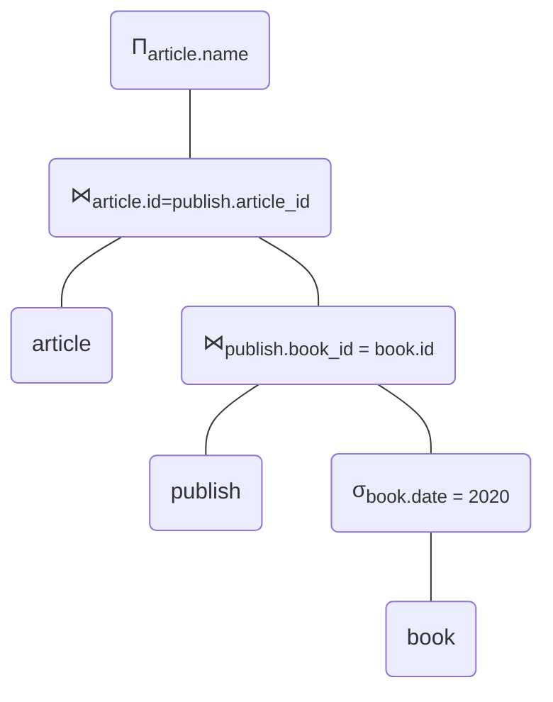
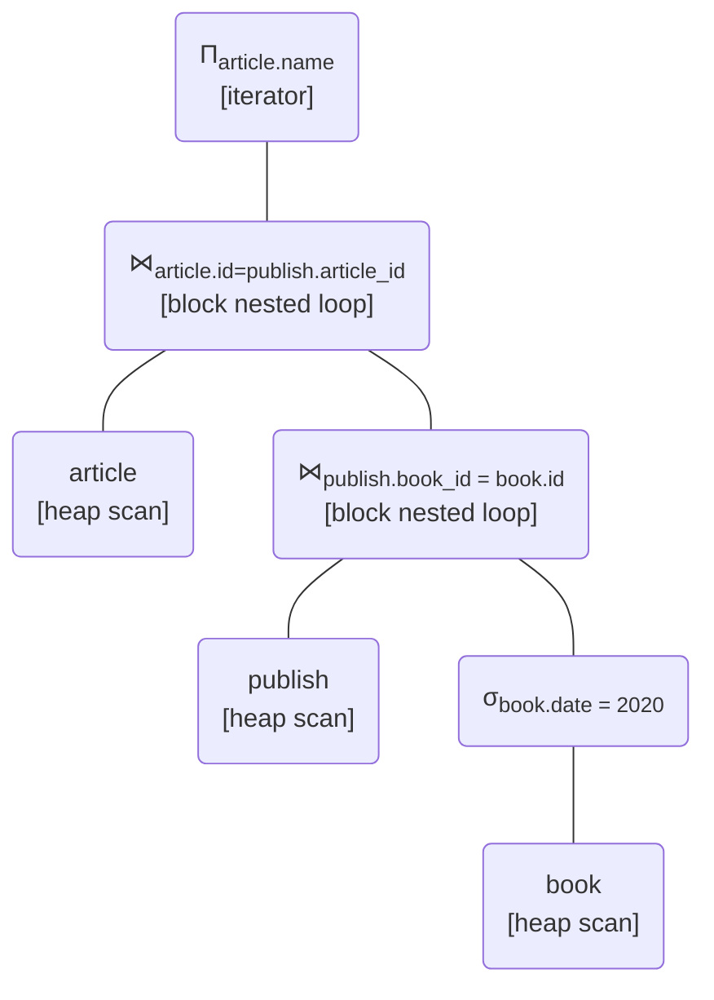
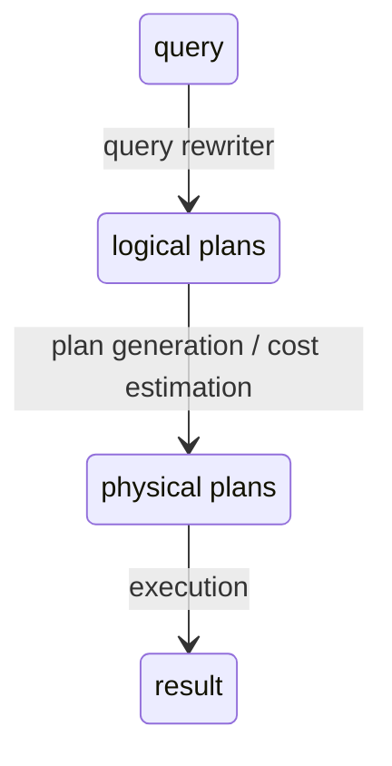
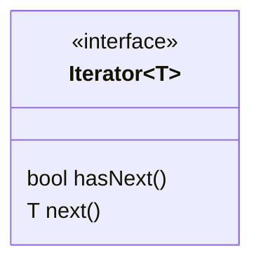

# 50.043 - Query Optimization

## Learning Outcomes

By the end of this unit, you should be able to

1. name the stages in a query life cycle
2. identify the process invovled in different stages of a query life cycle
3. identify the different execution model
4. explain the process of query optimization

### Query Life Cycle 

From the previous lessons, we learn how to implement the primitive relational algebra operation in a physical database system, namely, select, join and sort.

However in real word applications, we often encounter queries far more complex. 
Recall the article/book/publisher example

- article(<ins>id</ins>, name)
- book(<ins>id</ins>, name, date)
- publisher(<ins>id</ins>, name) 
- publish(<ins>article_id, book_id, publisher_id</ins>)

We would like to find out article names that are published in year `2010`
$$
\Pi_{article.name} (\sigma_{book.date = 2010}(article \bowtie_{article.id=publish.article\_id} (publish \bowtie_{publish.book\_id = book.id} book)) ~~~~ {\tt (E1)} 
$$

Note that the above relation algebra expression is equivalent to the following thanks to the associativity of the $\bowtie$ operator.

$$
\Pi_{article.name} (\sigma_{book.date = 2010}((article \bowtie_{article.id=publish.article\_id} publish) \bowtie_{publish.book\_id = book.id} book) ~~~~ {\tt (E2)}
$$

Besides these two alternatives, we also find the following expression producing the same result by "pushing" the selection operation down to the book relation, since it is only constrainted by the book's attribute.

$$
\Pi_{article.name} (article \bowtie_{article.id=publish.article\_id} (publish \bowtie_{publish.book\_id = book.id} \sigma_{book.date = 2020}(book))) ~~~~ {\tt (E3)}
$$

We call them different **logical query plans** of the same query. We might argue that (E3) might perform better as we push down the selection operator and reduce the size of the joined relation. 

Sometimes for ease of reasoning we might consider representing the relational algbra expression in a tree structue, for instance, (E3) can be represented as

In reality, we also need to consider the selectivity of selection condition, the size of the relations,  the different join algorithms, availability of indices, as well as the sortedness of the relation. Each intermediate operation can be computed "on-the-fly" or "materalized." Each possible combination performs differently. We refer to these combinations as **physical query plans**. For instance,

The physical plan above scan the heap file to filter books with date = 2020, then a block nestd join is performed on publish and the immediate results coming from the filter. Finally, we apply another block nested loop to join the article with the immediate results coming from the nested join. The top level project is performed "on-the-fly". 

Alternatively, we might have a slightly different phyiscal query plan,

In the above physical query plan, we assume following indices are preesent
* article.id (it's a primary key anyway)

The physical plan applies the index nested loop to the outer join by using article as the inner relation. Though we preform a heap scan on the article relation, article is having primary key index on id, it is also a clustered index scan.

Note that there could be many physical query plans generated from a logical plan. Given a set of physical query plans, we need to find the "best" one (with the lowest I/O cost). It turns out that it is very challenging problem, and we will discuss about this shortly. This step is called **query optimization**.

Suppose we identify a good physical query plan, we translate it into actual code to be executed in the database host machine. This final step is called **query execution**.

## Execution Model

The input of an execution model is the logical query plan. Every operation in the query plan can be executed differently.

There are several options

1. Iterator Model (seen in our project!)
2. Materialization Model
3. Vector Model

### Iterator Model

The main idea of the iterator model is "on the fly" or "lazy", i.e. tuples are not retrieved/computed until they are needed. The idea is actualized by implementing the physical access operation, filter operation, join operation and etc has iterators. One possible implementation in Java is to use the `Iterator` interface, in which 

The `hasNext()` method checks whether the iterator is currently not empty. The `next()` method advances the internal pointer and produces the next item.

For instance $\sigma_{book.date = 2020}(book)$, the table access of `book` is an instance of `Iterator<Tuple>`, The filter operator $\sigma$ takes the `book` iterator and returns an iterator instance `Iterator<Tuple>`, too. When the top most iterator is executed, it calls its children's iterators to produce the next value. 

One strong advantage of the iterator model is that it is memory efficient. For instance, in the running example, we don't need to load all the tuples from the book table into the buffer pool before the filtering takes place. There might be worst case scenarios in which the intermediate results are too huge for the RAM and needed to be written back to the disk and be reloaded when required.

The downside of the iterator model is that sometimes we need to re-compute some common sub-queries, e.g. $(\sigma_{book.date = 2020}(book)) \bowtie (\sigma_{book.date = 2020}(book))$, we need to compute $\sigma_{book.date = 2020}(book)$ twice. 

We would be in the worst situation if an immediate result is needed as a whole, e.g. need to build a hash table, need to sort the immediate data first. In these situation, we have to block and consume all the children's data first.

### Materialization Model

In materailization model, immediate results are fully computed and emit before the outer operation starts its computation. We can think of each operator having its own local storage holding the immediate results.

The advantage of this model is that we can re-use immediate results if they needed more than once and we ca use the immediate results to build immediate index, hash table, etc. It performs better when the immediate results are eventually part of the final results.

### Vectorized Model

The vectorized model, (AKA the batch model) is a hybrid of iterator and materialization model. Every operator in the vectorized model implements the `next()` method. The `next()` method returns a batch of tuples instead of a single one. 

The advantage of this model is to strike a balance between iterator and materialization. It is memory efficient, as we don't compute and store the entire immediate result, yet we can compute Hash table (e.g. grace hash join) when needed.

## Query Planning 

The process of query planning involves enumerating a large enough subset of all possible equivalent query given the input expression. 

Two relaional algebra expressions are consider equivalent if they produce the same set of results.

### Equivalence rules

Let $R$, $R'$ and $R''$ be relations, the subset of requivalence rules is as follows,

1. $\sigma_{c_1}(\sigma_{c_2})(R) \equiv \sigma_{c_1 \wedge c_2}(R)$ 
2. $\sigma_{c_1}(\sigma_{c_2}(R)) \equiv \sigma_{c_2}(\sigma_{c_1}(R))$
3. $\Pi_{a_1}(\Pi_{a_2} ... (\Pi_{a_n}(R))) = \Pi_{a_1}(R)$ if $a_1 \subseteq a_2 \subseteq ... \subseteq a_n$
4. $\sigma_{c}(R \times R') \equiv R \bowtie_{c} R'$.
5. $R \bowtie_{c} R' \equiv  R' \bowtie_{c} R$.
6. $R \bowtie_{c_1} (R' \bowtie_{c_2} R'') \equiv (R \bowtie_{c_1} R') \bowtie_{c_2} R''$
7. $\sigma_{c}(R) \equiv R$ if $c \not \subseteq attr(R)$
8. $\sigma_{c_1}(R\bowtie_{c_2} R') \equiv \sigma_{c_1}(R) \bowtie_{c_2} \sigma_{c_1}(R')$
9. $R \cap R' \equiv R' \cap R$
10. $R \cup R' \equiv R \cup R$
11. $R \cap (R' \cap R'') \equiv (R \cap R') \cap R''$
12. $R \cup (R' \cup R'') \equiv (R \cup R') \cup R''$
13. $\Pi_{a_1 \cup a_2} (R \bowtie_{c} R') \equiv \Pi_{a_1}(R) \bowtie_{c} \Pi_{a_2}(R')$  if $attr(c) \equiv a_1 \cup a_2$.
14. $\Pi_{a_1 \cup a_2} (R \bowtie_{c} R') \equiv \Pi_{a_1 \cup a_2}(\Pi_{a_1\cup a_3}(R) \bowtie_{c} \Pi_{a_2\cup a_4}(R') )$ if $a_3 \cup a_4 \equiv attr(c)$
15. $\Pi_{a}(R \cup R') \equiv \Pi_{a}(R) \cup \Pi_{a}(R')$
16. $\sigma_{c}(R - R') \equiv \sigma_{c}(R) - \sigma_{c}(R') \equiv \sigma_{c}(R) - R'$
17. $\sigma_{c}(R \cap R') \equiv \sigma_{c}(R) \cap \sigma_{c}(R')$
18. $\sigma_{c}(R \cup R') \equiv \sigma_{c}(R) \cup \sigma_{c}(R')$

With this subset of rules, we can already enumerate a substantially large set of alternative logical query plans from the original plan.

## Cost Estimation

Recall that given a logical query plan, there are still multiple alternatives of physical query plans depending on the choice of access method, execution model, index and etc.

The ultimate goal is to find the physical plan that has the lowest I/O cost. Without running the plans, we could only estimate the cost.

From the previous lesson, we learned how to estimate the I/O cost for different access methods, selection, join and etc. The cost is subject to two extra information.

1. the sizes of the relations
2. the selectivity of the predicate.

In DBMS, the sizes of the relations are recorded periodically in the catalog. The catalog sub-system keeps track of the following the statistics which can be used to approximate the selectivity.
1. $N(R)$ the number of tuples in $R$
2. $V(a,R)$ the number of unique values of attribute $a$ in $R$.
3. $min(a,R)$ the minumum value of attribute $a$ in $R$
4. $max(a,R)$ the maximum value of attribtue $a$ in $R$.

### Cardinality Estimation

Given the above catalog statistics, we can estimate the selectivity ratio, $\alpha(c, R)$.

#### Equality Predicate

In case $c$ is $a = v$ where $a$ is an attribute of $R$ and $v$ is a value, $\alpha(a = v, R) = 1 / V(a,R)$.

#### Range Equality Predicate

In case $c$ is $a > v$ where $a$ is an attribute of $R$ and $v$ is a value, $\alpha(a > v, R) = (max(a,R) - v) / (max(a,R) - min(a,R) + 1)$ assuming values of $a$ in $R$ follow a uniform distribution.

In case the distribution is not uniform, we may use a histogram with binning to obtain a better estimation. However building historgram for a large table could be expenive. In case of large data set, DBMS often collect a small sample to build the histogram.

#### Conjunction Predicate

In case $c$ is $c_1 \wedge c_2$, assuming values constrained by $c_1$ are independent of those constrained by $c_2$, $\alpha(c_1 \wedge c_2, R) = \alpha(c_1, R) \cdot \alpha(c_2, R)$. 

## Search Algorithm

The last piece of the query optimization is to search for the best physical plan given 
* a method to enumerate alternative
* a way to estimate the I/O cost given a plan

### The challenge
A naive approach would generate all possible plans, apply estimation to all of them and find the best one. However enumerating all possible plans could be expensive. For instance, enumerating all plan of a $n$-way join will yield $4^{n}$ possibilities. 

Recall from our algorithm class that the number of possible Binary Search Trees with $n$ different keys is catalan number 

$$C_n = (2\cdot n)! / ((n + 1)! \cdot n!)$$

As $n$ grows, catalan numbers grow as 

$$4^n / (n^{3/2} \cdot \sqrt{\pi}) $$

A set of possible query plans with $n$-way join shares the same size!

### Selinger Algorithm

The selinger algorithm is one of the classic algorthm for searching for optimal plan. 

The idea behind is to apply the following heuristics
1. Only consider the left-skew trees.
    1. This is because in many different physical plans, we need to scan the right sub-tree multiple times in join. It is better to keep the right sub-tree as simple as possible.
    2. If we apply this heuristic, we cut down the search based to 
    $$
    \left (\begin{array}{c}
            n \\
            n - 1
            \end{array}
    \right ) \cdot
    \left (\begin{array}{c}
            n - 1 \\
            n - 2
            \end{array}
    \right ) \cdot ... \cdot  
    \left (\begin{array}{c}
            2\\
            1
            \end{array}
    \right ) =       n!
         $$
2. Considering the left-skew trees with $n$ relations still computing $n!$ possible plans. To further cut down the search, the algorithm assumes the best overall plan consists of best sub-plans. It proceeds by finding the best plans for leaf nodes, then "walk-up" the trees by finding the best plans to combine intermediate steps.  For example, 
    * Pass 1. find the best plans for each relations (leaf nodes)
    * Pass 2. find the best plans to join any 2 relations
    * Pass 3. find the best plans to join any 3 relations
    * ...
For each pass $i$ where $i>1$, the best plans are computed based on the result from pass $i-1$. Overall this cut down the final search space of an $n$-way join to
$$
\left (\begin{array}{c}
 n \\
 n-1
 \end{array}
\right ) 
$$
And the overall time-complexity of 
$$
\left (\begin{array}{c}
            n \\
            n - 1
            \end{array}
    \right ) +
    \left (\begin{array}{c}
            n  \\
            n - 2
            \end{array}
    \right ) + ... +  
    \left (\begin{array}{c}
            n\\
            1
            \end{array}
    \right ) = O(2^n) 
$$

For instance, recall our running example, 

$$
\Pi_{article.name} (article \bowtie_{article.id=publish.article\_id} publish \bowtie_{publish.book\_id = book.id} \sigma_{book.date = 2020}(book))
$$

For simplicity, we only focus on the join expression

$$
article \bowtie_{article.id=publish.article\_id} publish \bowtie_{publish.book\_id = book.id} \sigma_{book.date = 2020}(book)
$$

Assuming there is no index created on $book.date$.

* Pass 1 
    * we find the cheapest way to access $\sigma_{book.date = 2020}(book)$, (because $\sigma$ is not a join), is an heap scan.
    * the cheapest way to acccess $publish$ is heap scan.
    * the cheapest way to accesss $artcle$ is heap scan.
* Pass 2 
    * immediate relation 1: 
        * we join $publish$ and $article$ by taking the cheapest access methods from Pass 1, hence the cheapest way to join $publish$ and $article$ is an index nested join on $article.id$, let's say the cost is 1000.
    * immediate relation 2:
        * we join $publish$ and $\sigma_{book.date = 2020}(book)$, let's say the cheapest way to join is an block nested join with $\sigma_{book.date = 2020}(book)$ materialized, the cost is 2750.
    * immediate  relation 3:
        * we join $article$ and $\sigma_{book.date = 2020}(book)$. There is no common attribute, hence it is a cross product. The cost is 25000.
* Pass 3
    * alternative 1:
        * we join $\sigma_{book.date = 2020}(book)$ with immediate relation 1 from Pass 2. Let's say the cheapest cost is 5000 with a block nested loop.
    * alternative 2:
        * we join $article$ with immediate relation 2 from Pass 2. Let's say the cheapest cost is 6000 with an index nested loop.
    * alternative 3:
        * we join $publish$ with the immediate rlation 3, with an index nested loop, the cost is 50000.

Overall, the cheapest plan is alterantive 1. 

Note that in real world DBMS, the query optimizer would prepare two best plans for each relation for all passes, an unordered plan and a best index plan. With these adjustment, we have double the size of the top-level search space and the overall time complexity.

### Optional Reading - Translating SQL into relational algebra

- [Translating SQL into the Relational Algebra](https://cs.ulb.ac.be/public/_media/teaching/infoh417/sql2alg_eng.pdf)