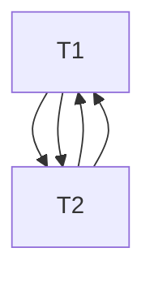
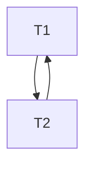

# 50.043 - Transactions and Concurrency Control

## Learning Outcomes

By the end of this unit, you should be able to

1. Explain serializability, confict serializability.
1. Apply conflict serializability check to schedule.
1. Explain Strict 2PL and 2PL
1. Apply Strict 2PL and 2PL to generate conflict serialiable schedules.


## Recall Isolation

Recall from the previous unit, we learn that the isoliation property ensures that multiple concurrent transactions must not be dependent on one another. In other words, if the DBMS executing these concurrent transactions by interleaving, the result be the same as executing them in a sequential order. 


### Serializability

Suppose we have a set of tasks $t_1,...,t_n$, each task $t_i$ consists of a sequence of instructions $c^i_1,..., c^i_{m_i}$. 

#### Schedule
We call a sequence of distinct instructions $c_1,...,c_k$ a schedule of tasks $t_1,...,t_n$, iff 
1. for all $i\in\{1,n\}$, for all $p \in \{1, m_i\}$, we find $c^i_p \in \{c_1,...,c_k\}$.
2. for all $q \in \{1,k\}$, there exist $i\in\{1,n\}$ and $p \in  \{1, m_i\}$ such that $c_q = c^i_p$.
3. for all  $q \in \{1,k\}$ and $q' \in \{q,k\}$, there not exist $i\in\{1,n\}$ and $p \in  \{1, m_i\}$ and $p' \in \{p, m_i\}$ such that $c_q = c^i_{p'}$ and $c_{q'} = c^i_p$.

The first rule enforces all instructions in the tasks can be found in the schedule. 
The second rule enforces all instructions in the schedule can be found in the tasks.
The third rule enforce that the relative order between instructions from the same task are maintained in the schedule.


#### Serial Schedule
Given tasks $t_1,...,t_n$ and a schedule  $c_1,...,c_k$, we say $c_1,...,c_k$ is a *serial schedule* of $t_1,...,t_n$ iff
1. there not exists a sub-sequence $c_{q-1}, c_{q}, c_{q+1}$ of $c_1,...,c_k$ such that $c_{q-1}$ and $c_{q+1}$ are instructions from task $t_j$ and $c_q$ is an instruction from task $t_i$, for some $i$ and $j$ in $\{1,n\}$.

In other words, a schedule is *serial* iff there is no interleaving.

Note that given a set of tasks $t_1,...,t_n$, there are in total $n!$ serial schedules.


#### State and Instruction

Given two database states $s_1$ and $s_2$, and an instruction $c$, 
we say $s_1\vdash c \rightarrow s_2$ to denote execution $c$ in the database with in state $s_1$ results in state $s_2$. 

Inductively, we can define 

$s_1 \vdash c_1,c_2,...,c_n \rightarrow s_n$ iff $s_1 \vdash c_1 \rightarrow s_2$ and  $s_2 \vdash c_2,...,c_n \rightarrow s_n$.

#### Serializable Schedule

Given tasks $t_1,...,t_n$ and a schedule  $c_1,...,c_k$, we say  $c_1,...,c_k$ is *serializable* iff there exists a serial schedule of  $t_1,...,t_n$, i.e. $c_1',...,c_k'$ such that $s_1 \vdash c_1,...,c_k \rightarrow s_2$ and $s_1 \vdash c_1',...,c_k' \rightarrow s_2'$ and $s_2 = s_2'$.

In other words, a schedule is serializable if its effect is the same as a serial schedule after execution.


For example, consider the following transaction

```sql
-- transaction 1
begin;
select @bal1 := bal from saving where id=1001;    -- c1
update saving set bal = @bal1-100 where id=1001;  -- c2
commit;
```

```sql
-- transaction 2
begin;
select @bal2 := bal from saving where id=1001;    -- c1'
update saving set bal = @bal2*1.05 where id=1001; -- c2'
commit;
```

The schedules `c1,c2,c1',c2'` and `c1',c2',c1,c2` are serializable schedules, but `c1,c1',c2,c2'` is not a serializable schedule, we illustrate the state and instruction execution as follows

|state before | instruction | state after |
|---|---|---|
|100| c1 | 100, bal1 = 100 | 
|100,bal1 = 100| c1' | 100, bal1 = 100, bal2 = 100|
|100, bal1 = 100, bal2 = 100| c2 | 0, bal1 = 100, bal2 = 100 |
|0, bal1 = 100, bal2 = 100| c2' | 105, bal1 = 100, bal2 = 100 |

At the end of execution, we found the balance of account `1001` is 105 though we withdraw 100 from this account in transaction1.


### Serializability Check

Our dream approach is to be able to check whether the given schedule is serializable without executing it. However such a check is very expensive because

1. there are $n!$ possible serial schedules we need to verify the given one against.
2. we need to model the set of possible operations and the value domains (without executing them).

Our second best approach is to use a conservative approximation check, say $C(s)$ where $C$ is the approximation check and $s$ is a schedule, such that $C(s)$ yields true implies $s$ is serializable. 

Note that we don't need to guarantee the inverse direction still holds (since $C$ is a conservative approximation).

#### Conflict Serializability Check

One possible of consevative approximation is *Conflict Serializability Check*.


#### Update of terminologies

From this point onwards, we sometimes refer

* an instruction $c$ as an operator, which could be $R(A)$ or $W(A)$ where $R(\cdot)$ stands for the read operator, and $A$ is the object that being read, $W(\cdot)$ denotes a write operator.
* a task $t$ as an transaction $T$.
* a state $s$ is a mapping from objects, such as $A$, $B$, etc to values.


#### Operator Conflict


Two instructions $c_1$ and $c_2$ are conflict iff

* $c_1$ and $c_2$ belong to different transactions and 
* $(c_1 = R(A) \wedge c_2 = W(A))$ or $(c_1 = W(A) \wedge c_2 = R(A))$ or $(c_1 = W(A) \wedge c_2 = W(A))$ for some common object $A$ in the state.


#### Execution Order

Given a schedule $X = c_1,...,c_n$, we say $c_i \prec c_j$ iff  $1 \leq i \wedge  i < j \wedge j \leq n$

Intuitively, $c_i \prec c_j$ means $c_i$ is executed before $c_j$ in a schedule $X$.

#### Conflict Equivalence

Given two schedules $X = c_1,...,c_n$ and $X' = c_1',...,c_n'$ are *conflict equivalent* iff

1. both schedules belong to the same set of transactions. 
2. for any pair of conflicting operators $(c_i, c_j)$ in $X$, such that $c_i \prec c_j$, we find $(c_k', c_l')$ in $X'$ such that $c_k' \prec c_l'$ and $c_i = c_k'$ and $c_j = c_l'$.

In other words, the second condition in the above definition says that all conflicting operators in $X$ have the same relative execution order (within the conflicting pair) in $X'$.

#### Conflict Serializable

Given a set of tasks $t_1,...,t_n$, a schedule $X$ is conflict serializable iff it is conflict equivalent to some schedule $X'$ of tasks $t_1,...,t_n$ such that $X'$ is serial.

#### An example

Consider the following example with two transactions 
* `T1: R(A), W(A), R(B), W(B)`
* `T2: R(A), W(A), R(B), W(B)`

Let's say 

* `T1:R(A), W(A)` is to increment `A`'s value by 10.
* `T1:R(B), W(B)` is to increment `B`'s value by 10.
* `T2:R(A), W(A)` is to double `A`'s value.
* `T2:R(B), W(B)` is to double `B`'s value.


Note that there are 2! = 2 possible serial schedules.

* Serial schedule 1

| T1 | T2 |
|---|---|
|R(A)|  |
|W(A)|  |
|R(B)|  |
|W(B)|  |
| |R(A)|
| |W(A)|
| |R(B)|
| |W(B)|

assuming the initial state is `{A:10, B:10}`, the final state of the above is `{A:40, B:40}`.

* Serial schedule 2 

| T1 | T2 |
|---|---|
| |R(A)|
| |W(A)|
| |R(B)|
| |W(B)|
|R(A)|  |
|W(A)|  |
|R(B)|  |
|W(B)|  |

assuming the initial state is `{A:10, B:10}`, the final state of the above is `{A:30, B:30}`.

Now let's consider the following schedule (let's call it schedule 3)

| T1 | T2 |
|---|---|
|R(A)|  |
|W(A)|  |
| |R(A)|
| |W(A)|
| |R(B)|
| |W(B)|
|R(B)|  |
|W(B)|  |


Note that the above schedule is not conflict serializable, because 
1. conflicting operator pair $T2:W(B) \prec T1:R(B)$ cannot be reordered to obtain serial schedule 1, and 
2. conflicting pair $T1:W(A) \prec T2:R(A)$ cannot be reordered to obtain serial schedule 2.

If we were to execute the above non-conflict serializable schedule with the init state `{A:10, B:10}`, we get `{A:40, B:30}`.

Recall that conflict serialiability is a conservative approximation of serialzability. Suppose we change the operation of `T2` 
* `T2:R(A), W(A)` is to increase `A`'s value by 20.
* `T2:R(B), W(B)` is to increase `B`'s value by 20.

Given the init state `{A:10, B:10}`,  serial schedule 1, serial schedule 2 and schedule 3 generate `{A:30, B:30}`, which means that after the change of the operation of `T2`, schedule 3 becomes serializable, but still not conflict serializable.


#### Conflict Serializable Check Algorithm

In the above example, we illustrate the Conflict Serializable check via a table and manual checking. 

To implement the idea as an algorithm we could leverage on a directed graph, called precedence graph.

The precedence graph is generated from a schedule $X$ as follow.

1. For each transaction $t$, create a node $n_t$.
2. For each pair of transactions $t$ and $t'$, if there exists a conflicting pair of operators $t:c \prec t':c'$ in $X$, we draw an directed arc from $n_t$ to $n_{t'}$.

A schedule $X$ is conflict serialzable if its precendence graph is acyclic.

For instance, the precendence graph of the schedule 3 in the previous example is as follows




### Two Phase Locking

Generate schedule in a bruteforce way then check for conflict serializablity is still impractical. DBMSes use *Two Phase Locking* (2PL) to generate conflict serializable schedule.


#### Strict 2PL 

Let's consider a strict version of two phase locking is called Strict 2PL. It is governed by the following two rules.

1. When a transaction need to read an object $A$, it needs to acquire a shared lock $S(A)$; when it need to write an object $A$, it needs to aquire an exclusive lock $X(A)$. A shared lock can be shared by multiple reader transactions. An exclusive lock cannot be shared.
2. All locks are only released $U(A)$, when the transaction commit.


The requests for lock $S(A)$, $X(A)$ and release of lock $U(A)$ are inserted by the DBMSes as schedule being generated.

Let's consider the earlier example with  with two transactions 

* `T1: R(A), W(A), R(B), W(B)`
* `T2: R(A), W(A), R(B), W(B)`

Suppose `T1` starts slightly earlier than `T2`. A schedule is generated with strict 2PL as follows

| Timestep | T1 | T2 |
|---|---|---|
| 1 |X(A)|  |
| 2 |R(A)|  |
| 3 |W(A)|  |
| 4 |X(B)|  |
| 5 |R(B)|  |
| 6 |W(B)|  |
| 7 |U(A), U(B), Commit|  |
| 8 | |X(A)|
| 9 | |R(A)|
| 10 | |W(A)|
| 11 | |X(B)|
| 12 | |R(B)|
| 13 | |W(B)|
| 14 | | U(A), U(B), Commit|

1. At timestep 1, `T1` acquires the exclusive lock on `A` since it needs to read and write to it. `T2` is blocked as it would also need to acquire an exclusive lock on `A` to start. 
2. At timestep 4, `T1` acquires the exclusive lock on `B`.
3. At timestep 7, `T1` is commited, hence both locks are released.
4. At timestep 8, `T2`  acquires lock on `A` and starts.  


#### 2PL

Once issue with Strict 2PL is that a transaction holds on to the locks it acquires until it commits, this blocks off other possible concurrent execution opportunity, hence throughput might be affected.

A variant of Strict 2PL, known as 2PL, is governed by the following two rules. (First rule is the same as Strict 2PL, the second rule is different).

1. When a transaction needs to read an object $A$, it needs to acquire a shared lock $S(A)$; when it needs to write an object $A$, it needs to aquire an exclusive lock $X(A)$. A shared lock can be shared by multiple reader transactions. An exclusive lock cannot be shared.
2. A transaction releases the lock right after usage. A transaction cannot acquire new lock once it releases some lock.

The reason why this is called a two phase locking is that there is a phase of lock acquisition, the number of locks being acquired by a transaction grows until it starts to release some lock, then it will release all the locks gradually.


Given the same example, a schedule is generated with 2PL as follows


| Timestep | T1 | T2 |
|---|---|---|
| 1 |X(A)|  |
| 2 |R(A)|  |
| 3 |W(A)|  |
| 4 |X(B)|  |
| 5 |U(A)|  |
| 6 | |X(A)|
| 7 | |R(A)|
| 8 | |W(A)|
| 9 | R(B)|  |
| 10 | W(B)|  |
| 11 | U(B), Commit|  |
| 12 | |X(B)|
| 13 | |U(A)|
| 14 | |R(B)|
| 15 | |W(B)|
| 16 | | U(B), Commit|

1. At timestep 1, `T1` acquires an exclusive lock on `A` and starts, `T2` is blocked and waits.
2. At timestep 4, `T1` is done with `A`, but needs to acquire an exclusive lock on `B` before releasing `A`.
3. At timestep 6, `T2` acuiqres an exclusive lock on `A` and starts and runs until timestep 8, it needs to acquire an exclusive lock on `B` but it is blocked.
4. At timesteps 9-10, `T1` operates on `B`.
5. At timestep 11, `T1` releases lock on `B` and is commited.
6. At timestep 12, `T2` is unblocked and acquires the exclusive lock on `B`, it then releases lock on `A` and continues with the rest of operations.


Note that schedules generated by both Strict 2PL and 2PL are *conflict serializable*. (Proof omitted.)

#### Conservative 2PL 

Another variant of Strict 2PL is called *Conservative 2PL*. It is same as Strick 2PL except that a transaction acquires all the locks it needs at the very begining. 

For instance, given the previous example, a schedule is generated with conservative 2PL as follows


| Timestep | T1 | T2 |
|---|---|---|
| 1 |X(A),X(B)|  |
| 2 |R(A)|  |
| 3 |W(A)|  |
| 4 |R(B)|  |
| 5 |W(B)|  |
| 6 |U(A), U(B), Commit|  |
| 7 | |X(A),X(B)|
| 8 | |R(A)|
| 9 | |W(A)|
| 10 | |X(B)|
| 11 | |R(B)|
| 12 | |W(B)|
| 13 | | U(A), U(B), Commit|


Note that all the locks are acquired by a transaction in an atomic operation, i.e. all or none. This is a way to prevent deadlock. 


#### Deadlock

Let's consider how deadlock can be caused by 2PL (and Strict 2PL).

Consider the following transactions

* `T1: R(A), W(A), R(B), W(B)`
* `T2: R(B), W(B), R(A), W(A)`

and a schedule

| Timestep | T1 | T2 |
|---|---|---|
| 1 |X(A)|  |
| 2 |R(A)|  |
| 3 |W(A)|  |
| 4 | |X(B)|
| 5 | |R(B)|
| 6 | |W(B)|
| 7 | try X(B) but blocked|  try X(A) but blocked |

1. At timestep 1, `T1` acquires an exclusive lock on `A` and starts
2. At timestep 4, `T2` acquires an exclusive lock on `B` and starts
3. AT timestep 7, `T1` tries to get a lock on `B` but it gets blocked. `T2` tries to get a lock on `A` but it is blocked too. A deadlock arises.


#### Deadlock detection

A way to detect deadlock is that when transactions waiting for locks, the lock manager (part of DBMS) generate a wait-for graph. 

In a wait for graph, 

* each active transaction $t$ is a node $n_t$.
* an arc going from $n_t$ to $n_t'$ if transaction $t$ is waiting for a lock which is being held by $t'$.

For insance, the wait-for graph from the previous example is 



#### Deadlock prevention

To prevent deadlock, there are several approaches

1. Use conservative 2PL, but throughput will be affected.
2. Set priorities. Transactions with higher priorty get the lock. Transaction wth lower prioerty get aborted and retry.


